# Business Requirements Document (BRD)
## Enterprise Knowledge Base Platform (KBS)

---

### Document Control
- **Document Title:** Enterprise Knowledge Base Platform — Definitive End-to-End Business Workflows, Detailed Sub-Flows & Cloud Data Mobility
- **Document Identifier:** BRD-KBS-005 (Part 5: Master Operational Business Workflows)
- **Document Location:** `BRD_documents/05_key_business_workflows_v3.md`
- **Target Audience:** Product Management, Engineering Leadership, Solution Architects, UI/UX Designers, QA Automation, Enterprise Stakeholders
- **Document Status:** Approved Master Product Baseline
- **Version:** 3.5.0 (Fully Visualized Enterprise Business Workflow Suite)

---

## 1. Executive Summary & Workflow Topology

This document details the **14 foundational business workflows** and their constituent **sub-flows** for the Enterprise Knowledge Base Platform (KBS). Every sub-flow is specified with clear operational objectives, human actor actions, backend business rules, and dedicated visual diagrams.

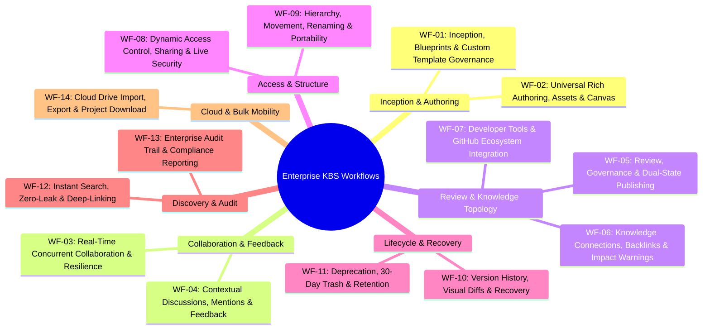

---

## 2. Master Workflows Summary Matrix

| Workflow ID | Workflow Name | Primary Initiator | Core Operational Engines | Primary Output |
| :--- | :--- | :--- | :--- | :--- |
| **WF-01** | Inception, Blueprints & Templates | Author / Lead | Template Engine, Container Service | Private Working Draft / Blueprint |
| **WF-02** | Universal Rich Authoring & Canvas | Author / Architect | TipTap Editor, Mermaid Renderer, Media Guard | Formatted Rich Document Canvas |
| **WF-03** | Real-Time Concurrent Collaboration | Multi-User Teams | Yjs CRDTs, WebSocket Gateway | Synchronized Multi-Caret State |
| **WF-04** | Contextual Discussions & Mentions | Reviewer / Author | Discussion Hub, Notification Service | Anchored Thread & Alert Dispatch |
| **WF-05** | Review Chains & Dual-State Publishing | Author / Lead / Reviewer | Governance Engine, Snapshot Service | Immutable Published Milestone (v1.0) |
| **WF-06** | Knowledge Connections & Impact Analysis | Author / Architect | Graph Topology, Dependency Analyzer | 2-Way Backlinks & Risk Warnings |
| **WF-07** | Developer Tools & GitHub Sync | Software Engineer | GitHub API, Webhook Worker, Monaco | Live PR Embeds & Synced Snippets |
| **WF-08** | Dynamic Access Control & Live Security | Document Co-Owner | Dynamic RBAC Engine, WebSocket Demoter | Enforced Permission Grants |
| **WF-09** | Hierarchy, Moves & Portability | Author / Admin | PostgreSQL `ltree` Router, Link Rewriter | Reorganized Tree & Dynamic Links |
| **WF-10** | Version Snapshots & Safe Rollback | Author / Auditor | Snapshot Engine, Visual Diff Comparator | Non-Destructive Restored Version |
| **WF-11** | Deprecation, Archival & 30-Day Trash | Document Owner | Lifecycle Service, Retention Scheduler | Replacement Warning & Soft-Deleted Item |
| **WF-12** | Instant Search & Zero-Leak Discovery | Any Employee | Hybrid Search (`tsvector` + `pgvector`) | Permission-Filtered Deep-Links |
| **WF-13** | Enterprise Audit Trail & Compliance | System Admin / SecOps | Immutable Audit Ledger, Event Stream | Forensically Verifiable Audit Trail |
| **WF-14** | Cloud Drive Import, Export & Download | Author / Project Lead | Cloud OAuth (G-Drive, OneDrive), Packager | Ported Cloud Assets / Complete ZIP |

---

---

## 3. Detailed Workflows & Visual Sub-Flow Breakdowns

---

### WF-01: Document Inception, Blueprint Templates & Custom Template Governance

#### Business Purpose
Standardize document inception across all departments via curated blueprints while empowering teams to govern custom templates without administrative friction.

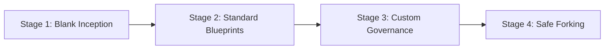

---

#### 🟢 Sub-Flow 1.1: Blank Document Inception & Placement
* **User Action:** Employee navigates to a project (e.g., `Engineering > Payments`) and clicks **"New Document"**.
* **System Execution:**
  1. Spawns an empty record in the `documents` table with status `DRAFT`.
  2. Assigns creator as **Co-Owner** with full management authority.
  3. Automatically cascades baseline access permissions from the parent Project container.
  4. Generates a unique document UUID and human-readable URL slug.

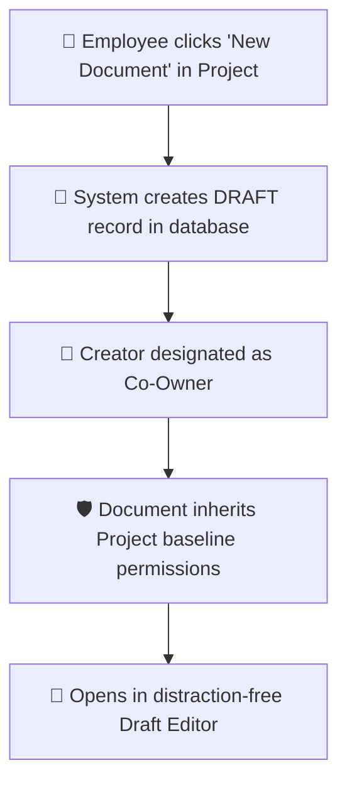

---

#### 📋 Sub-Flow 1.2: Standard Blueprint Selection & Pre-Fill
* **User Action:** Employee clicks **"New from Blueprint"** and selects an organizational standard (e.g., *Architecture Decision Record (ADR)*, *PRD*, *Incident Postmortem*, *SOP*).
* **System Execution:**
  1. Fetches pre-configured markdown boilerplate, structured headers, and callout prompt boxes.
  2. Pre-populates default taxonomy metadata tags (e.g., `#adr`, `#proposed`, `#rfc`).
  3. Initializes document in `DRAFT` status ready for author customization.

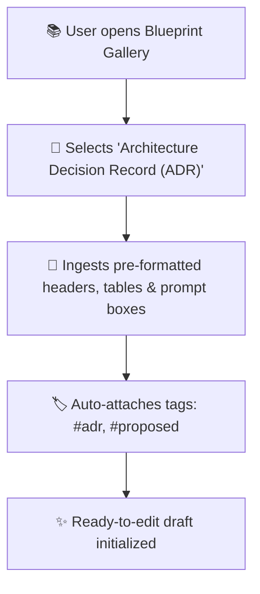

---

#### 🛠️ Sub-Flow 1.3: Custom Blueprint Creation & Governance Scope Approval
* **User Action:** A Lead Author converts a finalized specification into a reusable template by clicking **"Save as Blueprint"** and specifying scope (*Project*, *Department*, or *Company-Wide*).
* **Governance Business Rules:**
  * *Project-Scope:* Published immediately for team use.
  * *Department/Company-Scope:* Triggers an approval workflow requiring sign-off from a Department Head or System Admin.
  * Blueprint updates never mutate previously created historical documents.

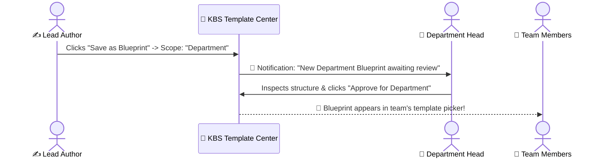

---

#### 📑 Sub-Flow 1.4: Document Duplication & Safe Forking
* **User Action:** User selects **"Duplicate / Fork"** on an existing document and picks a target destination project.
* **System Execution:**
  1. Copies the latest content snapshot into a fresh `v1.0-draft`.
  2. Strips all legacy comment threads and author-specific audit clutter.
  3. Re-scopes inherited access rights to match the target project container.

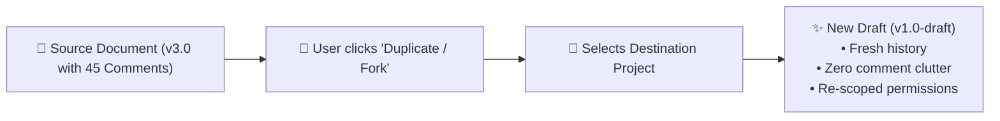

---

---

### WF-02: Universal Rich Authoring, Embedded Assets & Canvas Diagramming

#### Business Purpose
Provide an expressive canvas unifying structured text, live code blocks, vector Mermaid diagrams, freehand whiteboards, media assets, and interactive SOP checklists.

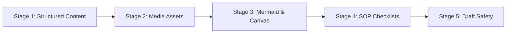

---

#### ✍️ Sub-Flow 2.1: Structured Content & Multi-Language Code Blocks
* **User Action:** Author formats technical specs using headings (`H1`–`H4`), styled callout banners (Note, Tip, Warning, Critical), resizable tables, and fenced code blocks.
* **System Execution:** Syntax highlights multi-language code blocks (TypeScript, Python, SQL, JSON, YAML, Go, Rust) and provides a 1-click clipboard copy utility.

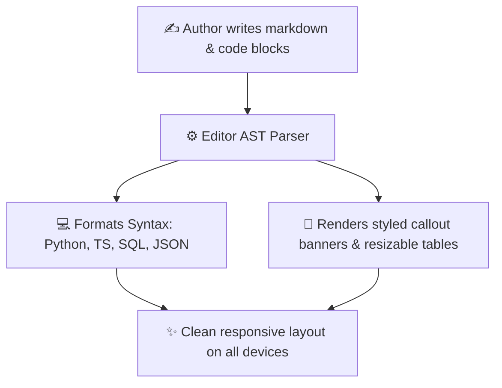

---

#### 🖼️ Sub-Flow 2.2: Media Upload Governance & Secure Storage
* **User Action:** User drags and drops images, PDFs, or attachment archives into the document.
* **Security & Storage Rules:**
  * Validates MIME types (blocks executables `.exe`, `.sh`). Enforces a 50MB per-file limit.
  * Files are stored in tenant-isolated S3 object storage; direct public URL access is blocked (permissions inherit document access rules).

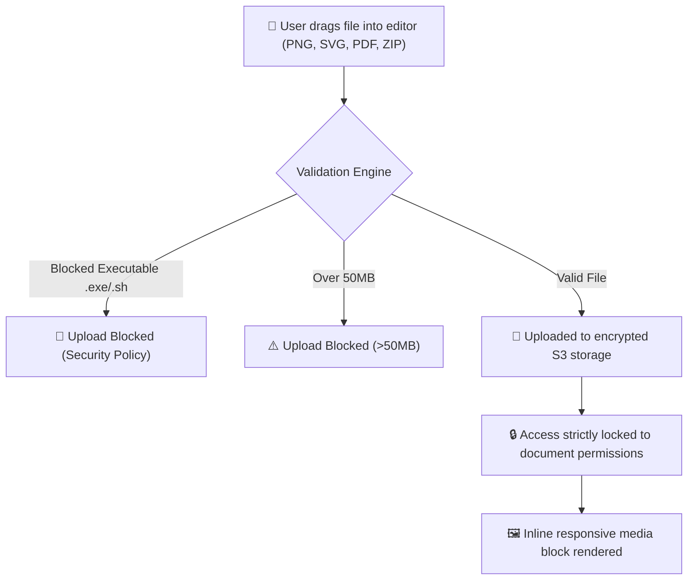

---

#### 📊 Sub-Flow 2.3: Code Diagrams (Mermaid) & Visual Freehand Canvas
* **User Action:** Architect inserts a Mermaid code block (`flowchart TD`, `sequenceDiagram`, `erDiagram`) or opens the visual freehand sketch canvas.
* **System Execution:**
  * Text-to-diagram engine compiles vector SVG graphs inline.
  * *Error Resilience:* If syntax is invalid, highlights the exact faulty line with a contextual fix hint rather than breaking page rendering.

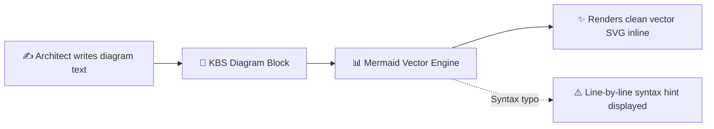

---

#### ☑️ Sub-Flow 2.4: Interactive SOP Checklists & Runbook Execution Tracking
* **User Action:** Operations teams toggle checkboxes during live deployments or runbook execution in both draft and published views.
* **System Execution:** Tracks operator timestamps and updates a document-top real-time progress meter (e.g., *"4 of 6 steps completed (66%)"*).

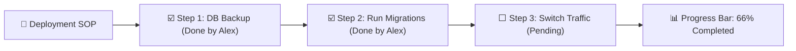

---

#### 🛑 Sub-Flow 2.5: Keystroke Auto-Save, Session Recovery & Intentional Discard
* **System Behavior:**
  * Background auto-save persists working state every keystroke; browser crashes restore the exact working buffer upon reopening.
  * If an author makes unwanted experimental edits, clicking **"Discard Draft Changes"** confirms and cleanly purges the draft buffer back to the published baseline.

```mermaid
flowchart TD
    subgraph AutoSave [Continuous Background Safety]
        Typing["✍️ Author types edits"] --> SilentSave["💾 Silently auto-saved every keystroke"]
        SilentSave --> Crash["⚡ Unexpected browser close"]
        Crash --> Reopen["🟢 Reopening restores exact draft state"]
    end

    subgraph Discard [Intentional Buffer Purge]
        ExpEdits["👤 Author tests unwanted draft edits"] --> ClickDiscard["❌ Clicks 'Discard Draft Changes'"]
        ClickDiscard --> ConfirmPrompt["⚠️ Confirmation: 'Revert to published v1.0 baseline?'"]
        ConfirmPrompt --> Reset["✅ Working draft buffer cleanly reset to v1.0"]
    end
```

---

---

### WF-03: Real-Time Concurrent Multi-User Collaboration & Resilience

#### Business Purpose
Enable distributed teams to simultaneously write, review, and plan during live incidents and meetings with zero file locking, lost keystrokes, or merge conflicts.

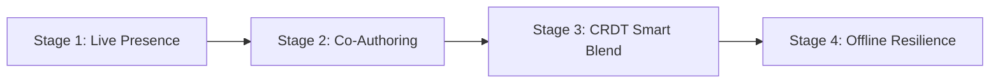

---

#### 🟢 Sub-Flow 3.1: Live Peer Presence & Cursor Tracking
* **System Behavior:** Top navigation header renders real-time collaborator avatars. Colored, labeled cursor flags follow active collaborators across sections as they navigate and type.

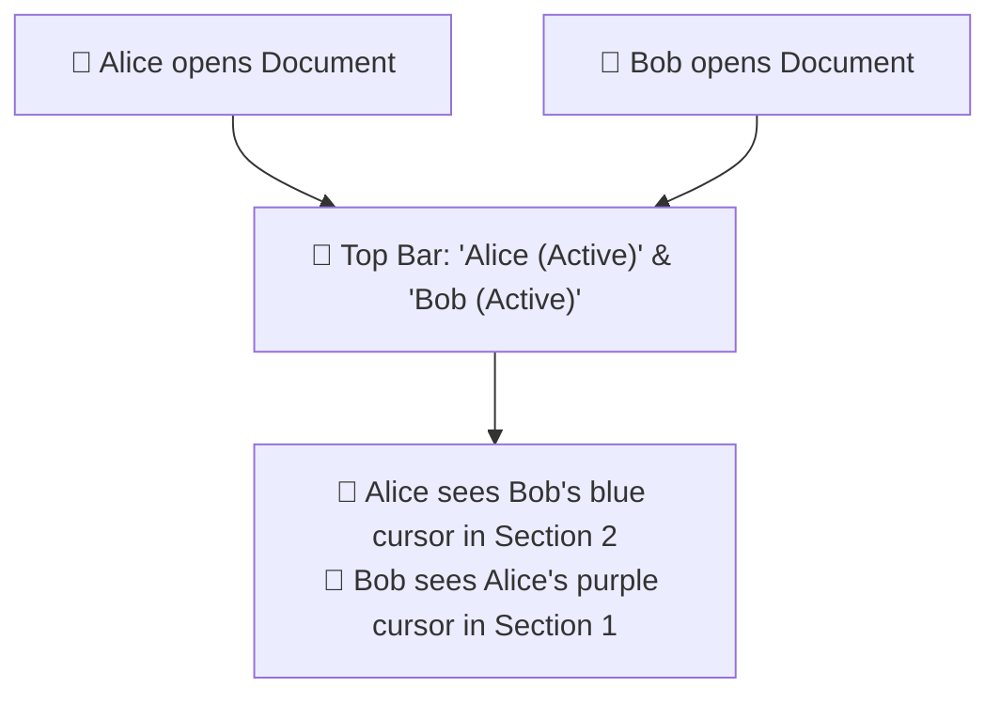

---

#### ✍️ Sub-Flow 3.2: Simultaneous Multi-Section Co-Authoring & Sync
* **System Behavior:** Multiple authors type in different sections of the same specification at the exact same moment. Changes synchronize across all connected screens in sub-seconds via WebSockets with zero latency and no save button.

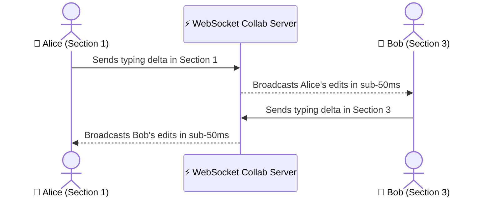

---

#### 🤝 Sub-Flow 3.3: Conflict-Free Keystroke Blending (Yjs CRDT)
* **Problem Solved:** Two users edit the exact same paragraph or table cell simultaneously.
* **System Execution:** The Yjs Conflict-free Replicated Data Type (CRDT) engine blends character-level operations deterministically without manual merge popups or lost words.

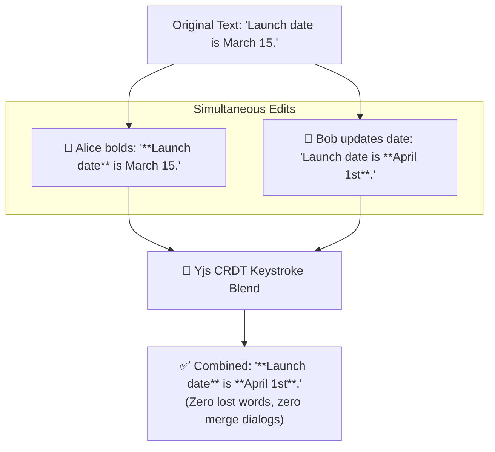

---

#### 📶 Sub-Flow 3.4: Spotty Internet & Offline Resilience
* **System Behavior:** When Wi-Fi drops, the platform switches to **Offline Mode**. Authors continue typing uninterrupted. Edits queue locally in browser storage and auto-reconcile seamlessly upon reconnection.

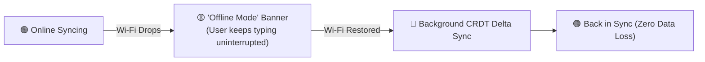

---

---

### WF-04: Contextual Discussions, Mentions & Feedback Lifecycle

#### Business Purpose
Keep technical and policy feedback anchored directly to relevant content, preventing discussions from fragmenting across disconnected messaging channels.

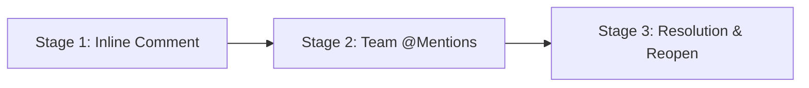

---

#### 💬 Sub-Flow 4.1: Inline Text-Anchored Comment Creation
* **User Action:** Highlight any sentence, code snippet, or table row and click **"Add Comment"**.
* **System Execution:** Anchors the thread to the selected block ID (`{#blk_uuid}`). The thread floats dynamically alongside the anchor even as preceding paragraphs are edited.

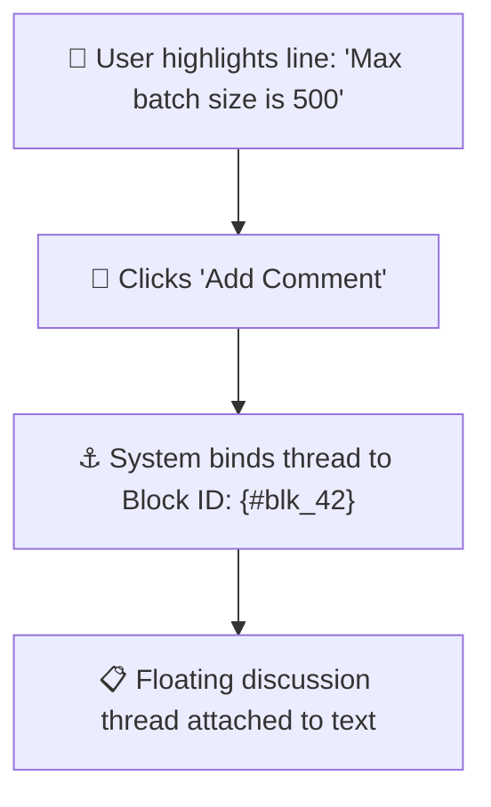

---

#### 📣 Sub-Flow 4.2: Individual & Team Group Mentions (`@user`, `@team`)
* **User Action:** Author types `@security-team` or `@john` in a comment.
* **System Execution:** Dispatches high-priority in-app alerts and emails. Clicking the notification deep-links directly to the exact anchored passage.

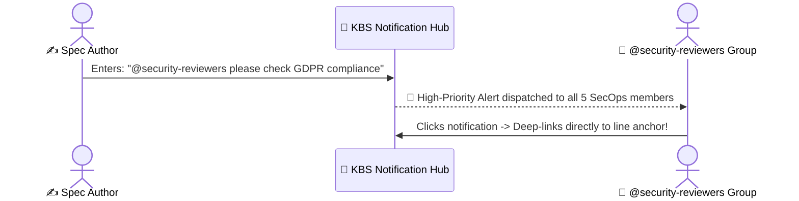

---

#### ✅ Sub-Flow 4.3: Thread Resolution, Drawer Archiving & Re-Opening
* **User Action:** Once changes are made, the author or commenter clicks **"Resolve Comment"**.
* **System Execution:** The thread tucks away into the **Comment History Drawer**. Any resolved discussion can be reviewed and reopened at any time.

```mermaid
flowchart LR
    OpenThread["💬 Active Comment Thread"] --> ResolveClick["👤 Clicks 'Resolve Comment'"]
    ResolveClick --> ArchiveDrawer["🗃️ Thread moves to Comment History Drawer"]
    ArchiveDrawer --> ReopenAction["🔄 Can be reopened if follow-up is needed"]
```

---

---

### WF-05: Document Review, Governance & Formal Publishing Lifecycle

#### Business Purpose
Decouple fast, behind-the-scenes drafting from authoritative enterprise releases, allowing teams to choose between agile direct publishing and formal managerial sign-offs.

```mermaid
flowchart TD
    Draft["📝 Active Working Draft"] --> CheckMode{"Governance Policy?"}
    CheckMode -->|Agile Direct Mode| DirectPublish["🚀 1-Click Publish<br/>(Instant Official Release)"]
    CheckMode -->|Formal Governance Mode| SubmitReview["📋 Submit for Review<br/>(Draft Status: IN_REVIEW)"]
    SubmitReview --> ReviewDecision{"Reviewer Decision"}
    ReviewDecision -->|Request Changes| ReqChanges["🔄 CHANGES_REQUESTED<br/>(Author updates draft)"]
    ReqChanges --> SubmitReview
    ReviewDecision -->|Approved| ApprovedPublish["🌟 Sign-Off Stamped<br/>(Official SSOT Published)"]
```

---

#### 🚀 Sub-Flow 5.1: Agile Direct Publishing (Standard Teams)
* **User Action:** Author clicks **"Publish Official Version"**, inputs version label (`v1.0`), and writes changelog notes.
* **System Execution:** Captures an immutable snapshot, promotes status to `PUBLISHED`, and releases the document as the Single Source of Truth (SSOT).

```mermaid
flowchart TD
    ClickPub["👤 Author clicks 'Publish Official Version'"] --> EnterLog["📝 Enters Version: 'v1.0 (Architecture Baseline)'"]
    EnterLog --> LockSnapshot["🔒 Creates immutable snapshot in document_versions"]
    LockSnapshot --> LiveSSOT["🌟 Document is now Live Official SSOT"]
```

---

#### 📋 Sub-Flow 5.2: Formal Multi-Stage Sign-Off Chain (Governance & Compliance)
* **User Action:** For regulated documents, author clicks **"Submit for Review"** and selects required sign-off users (e.g., Legal, Security, Dept Head).
* **System Execution:** Draft freezes in `IN_REVIEW`. Reviewers inspect a side-by-side visual diff. If changes are requested, status shifts to `CHANGES_REQUESTED`. When all sign-offs are submitted, the official release is stamped.

```mermaid
sequenceDiagram
    actor Author as ✍️ Author
    participant Engine as ⚙️ Governance Engine
    actor Reviewer as 🛡️ Security Reviewer

    Author->>Engine: Clicks "Submit for Review" (Status: IN_REVIEW)
    Engine->>Reviewer: 🔔 Review Assignment Notification
    Reviewer->>Engine: Inspects Visual Diff -> Clicks "Approve"
    Engine-->>Author: ✅ All approvals complete -> Version published!
```

---

#### 🔄 Sub-Flow 5.3: Parallel Working Drafts (Dual-State Architecture)
* **System Behavior:** General staff read the verified published document (`v1.0`), while authors collaborate privately on a `v1.1 Draft` behind the scenes until publishing `v2.0`.

```mermaid
flowchart TD
    subgraph ReadersView [What General Employees Read]
        V1["📖 v1.0 Official (Published)<br/>(Clean, verified, safe for operations)"]
    end

    subgraph AuthorsView [What Authors Edit Behind the Scenes]
        V1_1["✏️ v1.1 Working Draft<br/>(Authors update text and collect reviews in private)"]
    end

    V1_1 -->|When Approved: Author Publishes| V2["🌟 Published as v2.0 (New Official SSOT)"]
    V2 --> ReadersView
```

---

---

### WF-06: Knowledge Connections, Backlinks & Impact Analysis

#### Business Purpose
Prevent broken dependencies and operational silos by automatically tracking cross-document citations, rendering visual relationship maps, and warning authors before changing core specs.

```mermaid
flowchart LR
    A["Stage 1: Two-Way Backlinks"] --> B["Stage 2: Visual Graph Map"]
    B --> C["Stage 3: Impact Warnings"]
```

---

#### 🔗 Sub-Flow 6.1: Dynamic Two-Way Backlinks ("Referenced By" Drawer)
* **User Action:** Author types `[[` or `@` to link to another specification (e.g., *Authentication Guide*).
* **System Execution:** The target document automatically registers an incoming citation in its **"Referenced By"** drawer with title, department path, and contextual snippet.

```mermaid
flowchart LR
    DocA["📄 Payment Spec<br/>(Types: '[[Auth Guide]]')"] --> CreateEdge["🔗 System creates directed edge in document_links"]
    CreateEdge --> DocB["📄 Auth Guide<br/>('Referenced By' drawer shows Payment Spec)"]
```

---

#### 🗺️ Sub-Flow 6.2: Interactive Visual Knowledge Graph & Local Neighborhoods
* **User Action:** User clicks **"Graph View"** to explore enterprise knowledge relationships.
* **System Capabilities:** Zoom, pan, and filter nodes by Department and Project; supports 1-hop and 2-hop local neighborhood subgraph isolation.

```mermaid
flowchart TD
    CoreDoc["📄 Core API Specification"]
    CoreDoc --> Leaf1["📄 Payment Gateway Guide (Engineering)"]
    CoreDoc --> Leaf2["📄 PCI Compliance Runbook (SecOps)"]
    CoreDoc --> Leaf3["📄 Mobile Checkout PRD (Product)"]

    style CoreDoc fill:#1565C0,color:#fff,stroke:#0D47A1,stroke-width:2px
```

---

#### ⚠️ Sub-Flow 6.3: Upstream/Downstream Breaking Change Warnings
* **System Behavior:** When an author modifies or deprecates a core specification, the system scans the graph for downstream dependencies, presents a warning modal, and dispatches automated update alerts to downstream document owners.

```mermaid
sequenceDiagram
    actor Author as ✍️ Core Policy Owner
    participant Engine as ⚙️ Graph Impact Engine
    actor DownstreamOwner as 📱 Mobile Lead (Downstream)

    Author->>Engine: Clicks "Mark as Deprecated" on Auth Token Spec
    Engine->>Engine: Scans graph for downstream dependencies (Found: 2 docs)
    Engine-->>Author: ⚠️ Safety Modal: "Mobile SDK Guide depends on this spec!"
    Author->>Engine: Confirms replacement link ("OAuth2 Spec v2.0")
    Engine-->>DownstreamOwner: 🔔 Alert: "Core spec deprecated. Please update Mobile SDK Guide."
```

---

---

### WF-07: Developer Tools & GitHub Ecosystem Integration

#### Business Purpose
Bridge the gap between engineering code repositories and company-wide knowledge, eliminating documentation drift through native Git integrations.

```mermaid
flowchart LR
    A["Stage 1: Live PR Cards"] --> B["Stage 2: Synced Snippets"]
    B --> C["Stage 3: Docs-as-Code"]
    C --> D["Stage 4: Merged Alerts"]
    D --> E["Stage 5: Sprint Boards"]
```

---

#### 🎴 Sub-Flow 7.1: Live GitHub PR & Issue Interactive Smart Cards
* **User Action:** Author pastes a GitHub PR/Issue URL into a document.
* **System Execution:** Converts link into an interactive live card (status badge, author, reviewers, branch) and posts a reciprocal reference comment on GitHub.

```mermaid
flowchart LR
    PasteLink["👤 Pastes URL: github.com/acme/backend/pull/142"] --> Transform["✨ KBS converts to Interactive Smart Card"]
    Transform --> LiveCard["🎴 Live Card: PR #142 'Stripe 3DS' (🟢 MERGED)"]
    Transform --> BacklinkGH["🤖 Auto-comments on GitHub: 'Referenced in KBS Spec #88'"]
```

---

#### 💻 Sub-Flow 7.2: Live Synced Code Snippets & Release Tag Locking
* **User Action:** Embeds a code block referencing a file path in a repository (`backend/auth/rules.json#L15-L35`).
* **System Execution:** Fetches syntax-highlighted code from the `main` branch, automatically reflecting repository updates. Authors can optionally lock the snippet to an official Git release tag (e.g., `v3.2.0`).

```mermaid
sequenceDiagram
    actor Author as ✍️ Tech Lead
    participant KBS as 📱 KBS Editor
    participant GitHub as 🐙 GitHub Repository

    Author->>KBS: Inserts "GitHub Snippet Block" pointing to `backend/auth/rules.json`
    KBS->>GitHub: Fetches code from branch `main`
    KBS-->>Author: Renders live code with badge: "Synced with GitHub main"
    Note over KBS,GitHub: When code in GitHub updates, the KBS snippet refreshes automatically!
```

---

#### 🔄 Sub-Flow 7.3: Bidirectional "Docs-as-Code" Repository Sync
* **System Execution:**
  * *GitHub $\rightarrow$ KBS:* Merging a PR touching `/docs/*.md` in GitHub automatically publishes a new KBS version milestone.
  * *KBS $\rightarrow$ GitHub:* Editing in the KBS Web UI can open an automated Pull Request in the linked GitHub repository for code review.

```mermaid
flowchart TD
    subgraph GitToKBS [1. GitHub ➔ KBS Sync]
        PRMerge["🐙 PR merged touching /docs/*.md in GitHub"] --> AutoIngest["🤖 KBS automatically imports & publishes milestone"]
    end

    subgraph KBSToGit [2. KBS ➔ GitHub Sync]
        WebEdit["✍️ PM edits document in KBS Web UI"] --> ClickSync["👤 Clicks 'Publish & Sync to GitHub'"]
        ClickSync --> AutoPR["🤖 KBS opens Pull Request in GitHub for review"]
    end
```

---

#### 🔔 Sub-Flow 7.4: Automated "PR Merged" Documentation Alerts & Prompts
* **System Behavior:** Webhook listener alerts document owners when linked pull requests merge, prompting them to review and publish pending draft updates.

```mermaid
sequenceDiagram
    actor Dev as 👨‍💻 Engineer (Alex)
    participant GitHub as 🐙 GitHub
    participant KBS as 📱 KBS Lifecycle Engine
    actor Owner as ✍️ Spec Owner (Sarah)

    Dev->>GitHub: Merges PR #204 ("Payment Webhooks") into `main`
    GitHub-->>KBS: Webhook: PR Merged (Linked to Spec Doc #88)
    KBS-->>Owner: 🔔 Alert: "PR #204 merged. Review & publish Payment Spec v2.0?"
    Owner->>KBS: Clicks alert -> Reviews draft -> Publishes v2.0 SSOT!
```

---

#### 📋 Sub-Flow 7.5: Embedded Live Sprint & Issue Tracker Boards
* **User Action:** Authors embed an interactive task board or issue table inside a PRD or Roadmap document.
* **System Execution:** Reflects live sprint tickets from GitHub Issues, Jira, or Linear, displaying real-time issue status (`In Progress`, `Done`), assignees, and target milestones.

```mermaid
flowchart LR
    EmbedBlock["📋 User embeds 'Sprint Board Block'"] --> ConnectJira["🔗 Binds to Jira / GitHub Project"]
    ConnectJira --> RenderTable["📊 Live Table: Status, Assignees, Estimates & Milestones"]
```

---

---

### WF-08: Dynamic Access Control, Sharing & Live Session Security

#### Business Purpose
Provide enterprise-grade access governance through automatic container inheritance while empowering document owners to safely share individual documents without over-sharing.

```mermaid
flowchart LR
    A["Stage 1: Container Inheritance"] --> B["Stage 2: Single-Doc Share"]
    B --> C["Stage 3: JIT Access Request"]
    C --> D["Stage 4: Live Security Push"]
```

---

#### 🏢 Sub-Flow 8.1: Container Inheritance Precedence & Default Access
* **Precedence Hierarchy:**
  $$\text{Individual Explicit Grant} > \text{Team Group Grant} > \text{Project Grant} > \text{Department Baseline} > \text{Organization Default}$$
* **Default Behavior:** Department members automatically inherit baseline access to department projects and documents without manual invites.

```mermaid
flowchart TD
    UserQuery["👤 User attempts to access document"] --> CheckExplicit{"Explicit Document Grant?"}
    CheckExplicit -->|Found| ApplyDocRole["Apply Document Role (e.g. EDITOR or NONE)"]
    CheckExplicit -->|Not Found| CheckProj{"Project Membership?"}
    CheckProj -->|Found| ApplyProjRole["Apply Project Role"]
    CheckProj -->|Not Found| CheckDept{"Department Baseline?"}
    CheckDept -->|Found| ApplyDeptRole["Apply Department Role"]
    CheckDept -->|Not Found| ApplyOrgDefault["Apply Org Default (NONE - Blocked)"]
```

---

#### 👥 Sub-Flow 8.2: Safe Single-Document Sharing (No Over-Sharing)
* **User Action:** Document Owner shares an isolated confidential document with an external partner (e.g., Legal Counsel) as `COMMENTER`.
* **Security Enforcement:** The collaborator receives access **only** to that specific document; all surrounding departmental project files remain 100% hidden and inaccessible.

```mermaid
flowchart LR
    subgraph PrivateWorkspace [🔒 Private Engineering Workspace]
        DocA["📄 Unreleased Core Architecture"]
        DocB["📄 Vendor Integration Contract"]
    end

    LegalUser["👩 Priya (Legal Counsel)"]

    DocB -->|Owner grants: COMMENTER| LegalUser
    DocA -.->|100% Hidden & Inaccessible| LegalUser
```

---

#### 🙋 Sub-Flow 8.3: Just-In-Time "Request Access" Self-Service Workflow
* **User Action:** Employee navigates to a restricted link and fills out a self-service access request (Role: Viewer/Editor + Reason).
* **System Execution:** Sends an instant alert to the Document Owner, who approves in 1-click without creating IT helpdesk tickets.

```mermaid
sequenceDiagram
    actor Employee as 👤 Employee (Needs Access)
    participant Screen as 📱 Access Screen
    actor Owner as 👑 Document Co-Owner

    Employee->>Screen: Navigates to link -> Sees "Access Required" screen
    Employee->>Screen: Selects role ("Viewer") + enters justification
    Screen-->>Owner: 🔔 In-App & Email Alert: "Access requested. Approve?"
    Owner->>Screen: Clicks "Approve" (1-Click)
    Screen-->>Employee: 🌟 Access granted! Document opens instantly.
```

---

#### ⚡ Sub-Flow 8.4: Real-Time WebSocket Permission Demotion & Revocation Push
* **System Behavior:** If an owner demotes or revokes an active collaborator's access during a live meeting, the change pushes over WebSockets immediately, converting their screen to read-only mode without requiring a page refresh.

```mermaid
sequenceDiagram
    actor Owner as 👑 Document Owner
    participant App as 📱 KBS Access Engine
    actor Collab as 👨‍💻 Active Collaborator (Bob)

    Note over Collab: Bob is actively typing in the document as an EDITOR
    Owner->>App: Changes Bob's role to "Viewer"
    App-->>Collab: ⚡ Real-Time WebSocket Session Downgrade
    Note over Collab: Bob's editor canvas instantly switches to Read-Only mode with toast: "Your access is now View-Only"
```

---

---

### WF-09: Document Hierarchy, Movement, Renaming & Portability

#### Business Purpose
Allow organizations to reorganize document structures, move pages between projects, and rename titles without breaking internal bookmarks or links.

```mermaid
flowchart LR
    A["Stage 1: Sub-Page Nesting"] --> B["Stage 2: Cross-Project Move"]
    B --> C["Stage 3: Title Auto-Sync"]
    C --> D["Stage 4: Universal Export"]
```

---

#### 🌲 Sub-Flow 9.1: Sub-Document Nesting & Tree Drag-and-Drop Reordering
* **User Action:** User drags documents in the sidebar navigation to reorder pages or nest child pages beneath a parent document.
* **System Execution:** Updates the fractional float `position` index (single-row update) and cascades breadcrumbs and permissions down the sub-tree.

```mermaid
flowchart TD
    DragDoc["👤 User drags 'Authentication' under 'API Guide'"] --> UpdateParent["🌲 System sets parent_doc_id = API_Guide_UUID"]
    UpdateParent --> GenBreadcrumbs["🧭 Updates breadcrumb path: Engineering > API Guide > Authentication"]
    GenBreadcrumbs --> ReIndex["📊 Fractional position updated (No row-shifting overhead)"]
```

---

#### 📦 Sub-Flow 9.2: Cross-Project Document Relocation & URL Alias Routing
* **User Action:** Owner selects **"Move Document"** to relocate a specification to a new department project.
* **System Execution:**
  1. Displays a permission impact preview (identifying who will gain/lose access).
  2. Updates the container path while preserving legacy URL redirects (preventing broken bookmarks).

```mermaid
flowchart TD
    SelectMove["👤 Owner selects 'Move Document'"] --> PickDest["📁 Selects Destination Project"]
    PickDest --> ImpactReview["⚠️ Permission Impact Preview:<br/>'3 users will lose access based on target project rules.'"]
    ImpactReview --> ConfirmMove["👤 Clicks 'Confirm Move'"]
    ConfirmMove --> RerouteLinks["🔗 Container path updated; historical URLs permanently redirect"]
```

---

#### 🏷️ Sub-Flow 9.3: Global Document Renaming & Title Reference Auto-Sync
* **User Action:** Author renames *"Payment Spec v1"* to *"Enterprise Payment Gateway Specification"*.
* **System Execution:** The link text chip automatically updates across all referencing documents in the enterprise knowledge base.

```mermaid
sequenceDiagram
    actor Author as ✍️ Author
    participant Engine as ⚙️ KBS Router Engine
    participant Docs as 📄 All Referencing Documents

    Author->>Engine: Renames "Payment Spec v1" ➔ "Enterprise Payment Gateway Spec"
    Engine->>Docs: Broadcasts title update event
    Note over Docs: All link chips across all documents update their display title automatically!
```

---

#### 📤 Sub-Flow 9.4: Multi-Format Universal Export
* **User Action:** User exports published documents to **Formatted PDF** (with automatic table of contents), **Clean Markdown (`.md`)**, or **Standalone HTML**.

```mermaid
flowchart LR
    PubDoc["📄 Published Document"] --> ExportMenu["👤 Selects 'Export'"]
    ExportMenu --> PDF["📄 Formatted PDF (with TOC & headers)"]
    ExportMenu --> MD["📝 Clean Markdown (.md)"]
    ExportMenu --> HTML["🌐 Standalone HTML"]
```

---

---

### WF-10: Safe Version History, Visual Comparison & Non-Destructive Recovery

#### Business Purpose
Protect institutional knowledge from accidental deletions or corrupted edits through time-capsule version snapshots, visual side-by-side diffs, and safe rollbacks.

```mermaid
flowchart LR
    A["Stage 1: Snapshot Ledger"] --> B["Stage 2: Visual Diff"]
    B --> C["Stage 3: Restore to Draft"]
    C --> D["Stage 4: Publish Milestone"]
```

---

#### 📜 Sub-Flow 10.1: Time-Capsule Snapshot Ledger
* **System Execution:** Every publication creates an immutable snapshot record in `document_versions` (`v1.0`, `v2.0`, `v3.0`) capturing frozen content, author stamp, timestamp, and changelog. Historical rows are write-once and can never be altered.

```mermaid
flowchart LR
    PubV1["🌟 v1.0 Snapshot (Frozen)"] --> PubV2["🌟 v2.0 Snapshot (Frozen)"]
    PubV2 --> PubV3["🌟 v3.0 Snapshot (Frozen)"]
    PubV3 --> Note["📜 Permanent append-only ledger; records cannot be modified or deleted"]
```

---

#### 🔍 Sub-Flow 10.2: Side-by-Side Visual Diff Comparison Engine
* **User Action:** Author selects **"Compare v3.0 vs v2.0"**.
* **System Execution:** Side-by-side screen displays additions in green, deletions in red strikethrough, and unchanged text in grey.

```mermaid
flowchart TD
    SelectVersions["👤 Author selects: 'Compare v3.0 vs v2.0'"] --> RenderDiff["🖥️ Visual Diff Comparison Window"]
    RenderDiff --> Highlights["🟢 Green: New clauses added in v3.0<br/>🔴 Red: Sentences deleted from v2.0<br/>⚪ Grey: Unchanged text"]
```

---

#### ⏪ Sub-Flow 10.3: Safe Non-Destructive Restoration Protocol
* **User Action:** Author clicks **"Restore v2.0"**.
* **Business Integrity Rule:** Restoring an older version **never destroys later versions** (`v1.0`, `v2.0`, `v3.0` remain intact). The restored text loads into the active working draft, which is published as the next sequential release (`v4.0`).

```mermaid
flowchart LR
    ClickRestore["👤 Author clicks 'Restore v2.0'"] --> SafeCopy["💾 System loads v2.0 content into Active Working Draft"]
    SafeCopy --> ReviewDraft["📝 Author reviews and edits restored text in private"]
    ReviewDraft --> PublishNew["🌟 Author publishes as v4.0<br/>(Changelog: 'Reverted bad changes from v3.0')"]
```

---

---

### WF-11: Document Deprecation, Archival & Retention Lifecycle

#### Business Purpose
Ensure employees never follow outdated rules or discontinued project instructions while maintaining historical compliance records.

```mermaid
flowchart LR
    A["Stage 1: Deprecate & Link"] --> B["Stage 2: Warning Banner"]
    B --> C["Stage 3: 30-Day Trash Bin"]
    C --> D["Stage 4: Retention Archival"]
```

---

#### ⚠️ Sub-Flow 11.1: Document Deprecation with Replacement Routing
* **User Action:** Owner selects **"Mark as Deprecated"** and inputs the URL of the replacement document.
* **System Execution:** Displays a prominent top warning banner (*"⚠️ Deprecated. Replaced by [2026 Policy]"*) and deprioritizes the document in global search.

```mermaid
flowchart LR
    OldDoc["📄 2024 Travel Policy"] --> DeprecateAction["👤 Owner marks 'Deprecated' & links '2026 Travel Policy'"]
    DeprecateAction --> Banner["⚠️ Warning Banner added at top of page"]
    Banner --> DeRankSearch["📉 Search priority downgraded"]
```

---

#### 🗑️ Sub-Flow 11.2: 30-Day Recoverable Trash Bin & Soft-Deletion
* **System Behavior:** Deleting a document moves it to the **30-Day Trash Bin**. Authors and Admins can restore accidentally deleted documents in 1-click within 30 days before permanent purging.

```mermaid
flowchart LR
    DeleteClick["👤 Author deletes Document"] --> MoveTrash["🗑️ Moved to 30-Day Trash Bin"]
    MoveTrash -->|Within 30 Days| Restore["🟢 1-Click Restore to Project"]
    MoveTrash -->|After 30 Days| Purge["🛑 Permanent Purge / Regulatory Archive"]
```

---

---

### WF-12: Instant Search, Quick Navigation & Security-Aware Discovery

#### Business Purpose
Provide sub-second access to institutional knowledge via keyboard navigation while ensuring confidential documents remain completely invisible to unauthorized users.

```mermaid
flowchart LR
    A["Stage 1: Command Bar (Ctrl+K)"] --> B["Stage 2: Zero-Leak Filter"]
    B --> C["Stage 3: Faceted Drill-Down"]
    C --> D["Stage 4: Deep-Link Jump"]
```

---

#### ⚡ Sub-Flow 12.1: Universal Command Bar (`Ctrl+K` / `Cmd+K`)
* **User Action:** Pressing `Ctrl+K` opens the search palette displaying recent documents, pinned favorites, and instant full-text search.

```mermaid
flowchart TD
    PressHotkey["⌨️ User presses Ctrl+K / Cmd+K"] --> Palette["🔍 Universal Command Palette opens"]
    Palette --> DisplayRecent["🕒 Displays Recent Documents & Pinned Favorites"]
    Palette --> LiveQuery["⌨️ Real-time as-you-type keyword search"]
```

---

#### 🔒 Sub-Flow 12.2: Zero-Leak Security Filtering
* **Security Rule:** Search queries pre-filter results against the user's permission entitlements at the database layer. Restricted document titles and excerpts **never leak** into search suggestions.

```mermaid
flowchart TD
    UserQuery["👤 User searches: 'Executive Compensation'"] --> SecurityScan["🛡️ Database Permission Pre-Filter"]
    SecurityScan --> AllowedDoc["✅ Employee Benefits Guide (Authorized) ➔ Rendered"]
    SecurityScan --> BlockedDoc["🔒 Board Bonus Matrix (Restricted) ➔ 100% Omitted & Hidden"]
```

---

#### 🎯 Sub-Flow 12.3: Quick Filter Drill-Down & Deep-Link Section Jump
* **User Action:** User applies filter chips (Department, Project, Tag, Author) and clicks a search result.
* **System Execution:** The browser opens the document and scrolls directly to the exact section header or table row with a subtle pulse highlight.

```mermaid
sequenceDiagram
    actor User as 👤 Employee
    participant Search as 🔍 KBS Search Engine
    participant DocView as 📄 Document View

    User->>Search: Types "webhook retry backoff" -> Filters: #engineering
    Search-->>User: Result: Payment Spec ➔ Section: "Retry Algorithm"
    User->>Search: Clicks Result
    Search->>DocView: Deep-links to `/doc#blk_retry_algo`
    DocView-->>User: Scrolls smoothly to line & pulses highlight!
```

---

---

### WF-13: Enterprise Audit Trail & Compliance Reporting

#### Business Purpose
Provide forensic accountability, security visibility, and compliance auditability for all document modifications, lifecycle events, and permission adjustments.

```mermaid
flowchart LR
    A["Stage 1: In-Doc Timeline"] --> B["Stage 2: Immutable Ledger"]
    B --> C["Stage 3: Admin Reports"]
```

---

#### 📜 Sub-Flow 13.1: In-Document Collaborator Activity Timeline
* **User Action:** Authors open the **Activity Timeline** side panel.
* **System Execution:** Renders recent edits, version release timestamps, contributor names, and resolved comments.

```mermaid
flowchart LR
    OpenTimeline["👤 User opens 'Activity Timeline' Panel"] --> Stream["📜 Stream: Alex published v2.0 • Sarah resolved comment • John edited Section 3"]
```

---

#### 🛡️ Sub-Flow 13.2: Immutable Enterprise Audit Ledger & Admin Compliance Query
* **System Execution:** All platform events (`DOC_CREATED`, `DOC_DELETED`, `PERMISSION_CHANGED`, `VERSION_PUBLISHED`, `DOC_EXPORTED`, `CLOUD_SYNCED`) are written to an append-only audit table.
* **Admin Capabilities:** System Admins can filter by Actor, Action, Target Resource, and Date Range for compliance reviews (SOC2, HIPAA, ISO 27001).

```mermaid
flowchart TD
    UserAction["👤 User Action (Publish, Share, Export, Delete)"] --> AuditService["⚙️ KBS Audit Service"]
    AuditService --> AppendLog["📜 Immutable 'audit_logs' Table (Append-Only)"]
    AppendLog --> AdminQuery["📊 Admin Compliance Query: Filter by User, Date, Action, Project"]
```

---

---

### WF-14: Cloud Drive Import/Export, Bulk Ingestion & Complete Project Download

#### Business Purpose
Empower teams to seamlessly migrate documents between cloud providers (Google Drive, Microsoft OneDrive, Dropbox), ingest bulk local folder structures, and download complete project workspaces as offline-ready archives.

```mermaid
flowchart TD
    subgraph IngestSection ["📥 1. Ingestion & Cloud Import"]
        CloudPicker["☁️ Google Drive / OneDrive Cloud Picker"] --> Engine["⚙️ Ingestion & Hierarchy Engine"]
        LocalDrop["📁 Local Files & Folder (.zip) Drop"] --> Engine
        Engine --> ProjTree["🗂️ Project Workspace Tree (Preserved Hierarchy)"]
    end

    subgraph ExportSection ["📤 2. Cloud Export & Bulk Download"]
        ProjTree --> CloudExport["☁️ Sync / Export to Google Drive & OneDrive"]
        ProjTree --> FullDownload["📦 Complete Project Download (.zip Bundle)<br/>(Clean Markdown + PDF Snapshots + Media Assets)"]
    end
```

---

#### ☁️ Sub-Flow 14.1: Google Drive & Microsoft OneDrive Cloud Import
* **Goal:** Ingest documents and folder hierarchies directly from Google Drive or OneDrive into a KBS project without manual downloads.
* **User Action:** User clicks **"Import > Connect Cloud Drive"**, completes OAuth authentication, and selects files or folders.
* **System Execution:**
  1. Traverses the selected cloud directory structure.
  2. Recreates the nested folder tree inside the target project using PostgreSQL `ltree`.
  3. Imports documents into the project tree with permissions inherited from the destination container.

```mermaid
sequenceDiagram
    actor Author as ✍️ Project Author
    participant KBS as 📱 KBS Import Center
    participant Cloud as ☁️ Google Drive / OneDrive
    participant DB as 🐘 PostgreSQL Database

    Author->>KBS: Clicks "Import > Connect Cloud Drive"
    KBS->>Cloud: OAuth 2.0 Token Authentication
    Cloud-->>KBS: Returns Drive Directory Tree
    Author->>KBS: Selects Folder: "Backend_Specs/"
    KBS->>DB: Recreates nested document hierarchy (ltree)
    KBS-->>Author: 🌟 Complete folder structure imported into project!
```

---

#### 📁 Sub-Flow 14.2: Local File & Nested Folder Directory Ingestion
* **Goal:** Ingest entire local folder directories or `.zip` archives into a project in one click.
* **User Action:** Author drags and drops a folder directory or `.zip` archive into the project tree.
* **System Execution:**
  1. Recursively maps directory depth to the PostgreSQL `ltree` parent-child tree.
  2. Parses internal relative links between files (e.g., `[Setup Guide](../auth/setup.md)`) and translates them into native KBS bidirectional backlinks.

```mermaid
flowchart TD
    DropFolder["📁 Author drops Folder Directory or .zip into Project"] --> Unpack["⚙️ Ingestion Service unpacks hierarchy"]
    Unpack --> MapTree["🌲 Creates Parent-Child Sub-Pages via ltree"]
    MapTree --> LinkResolver["🔗 Resolves relative links into live KBS Backlinks"]
    LinkResolver --> ReadyTree["✨ Preserved project tree ready in sidebar navigation"]
```

---

#### 📤 Sub-Flow 14.3: Cloud Drive Export (Direct Sync to Google Drive / OneDrive)
* **Goal:** Back up or distribute knowledge base pages directly to enterprise cloud storage.
* **User Action:** User clicks **"Export > Send to Cloud Drive"** on any document or project folder.
* **System Execution:** Formats documents into PDF, Markdown, or HTML and uploads them to the chosen Google Drive/OneDrive folder via cloud storage APIs.

```mermaid
sequenceDiagram
    actor Lead as ✍️ Project Lead
    participant KBS as 📱 KBS Export Center
    participant Cloud as ☁️ Google Drive / OneDrive

    Lead->>KBS: Clicks "Export > Send to Cloud Drive"
    KBS->>KBS: Generates formatted PDFs & Markdown files
    KBS->>Cloud: Pushes files to target Drive folder via REST API
    Cloud-->>Lead: 🌟 Files successfully synced to Cloud Drive!
```

---

#### 📦 Sub-Flow 14.4: Complete Project Download & Bulk Archive Export
* **Goal:** Provide 1-click disaster recovery, offline compliance archival, and migration portability.
* **User Action:** Project Lead or Admin clicks **"Project Settings > Download Complete Project"**.
* **System Execution:** Background packaging worker generates a structured `.zip` archive containing:
  1. **`/markdown/`**: Clean Markdown files matching the project tree.
  2. **`/pdf_snapshots/`**: Formatted PDF exports of all published documents.
  3. **`/assets/`**: All embedded images, diagrams, and reference attachments.
  4. **`manifest.json`**: Metadata index containing document IDs, author stamps, version histories, and tag taxonomy.

```mermaid
flowchart TD
    ClickDownload["👤 User clicks 'Download Complete Project'"] --> Worker["⚙️ Background Packaging Worker"]
    
    subgraph PackageContents [ZIP Archive Bundle Structure]
        Worker --> MDDir["📁 /markdown/ (Clean Markdown matching tree)"]
        Worker --> PDFDir["📁 /pdf_snapshots/ (Formatted PDF releases)"]
        Worker --> AssetDir["📁 /assets/ (Images, diagrams & attachments)"]
        Worker --> Manifest["📄 manifest.json (Metadata, versions, tags)"]
    end

    PackageContents --> ZipFile["📦 Generates 'Project_Archive.zip' (Ready for Download)"]
```

---

## 4. Master Workflow Actors & System Entitlement Matrix

| Workflow ID | Workflow Name | Primary Initiator | Secondary Participants | Key Business Engine |
| :--- | :--- | :--- | :--- | :--- |
| **WF-01** | Inception, Blueprints & Templates | Author / Project Lead | Dept Head, System Admin | Template & Container Engine |
| **WF-02** | Universal Rich Authoring & Canvas | Author / Editor | Connected Collaborators | Document Authoring Engine |
| **WF-03** | Real-Time Co-Authoring & Sync | Co-Owner / Editor | Live Connected Peers | Real-Time Collaboration Engine |
| **WF-04** | Contextual Comments & Feedback | Reviewer / Commenter | Mentioned Teams, Authors | Notification & Discussion Hub |
| **WF-05** | Governance & Publishing Lifecycle | Co-Owner / Lead | Designated Reviewers, Viewers | Governance & Publishing Engine |
| **WF-06** | Knowledge Graph & Impact Warnings | Author / Architect | Downstream Document Owners | Knowledge Topology Engine |
| **WF-07** | Developer Tools & GitHub Ecosystem | Engineer / Tech Lead | Spec Owners, GitHub Repos | Developer Integration Service |
| **WF-08** | Dynamic Access Control & Sharing | Document Co-Owner | Requesters, Team Groups | Dynamic Access Control (DAC) |
| **WF-09** | Hierarchy, Moving & Portability | Co-Owner / Admin | Impacted Team Members | Hierarchy & Document Router |
| **WF-10** | Safe Version History & Rollback | Document Co-Owner | System Auditors | Snapshot & Diff Engine |
| **WF-11** | Deprecation, Archival & Trash Bin | Document Co-Owner | Department Leads, Viewers | Lifecycle & Retention Service |
| **WF-12** | Search, Navigation & Discovery | Any Platform Employee | Security Evaluation Service | Search & Navigation Engine |
| **WF-13** | Enterprise Audit & Compliance | System Admin / SecOps | Document Authors, Auditors | Enterprise Audit Ledger |
| **WF-14** | Cloud Drive Import/Export & Download | Project Lead / Author | Cloud Providers (G-Drive, OneDrive) | Cloud Mobility & Packaging Service |

---

*This document represents the official Part 5 (Master Operational Business Workflows v3.5) for the Enterprise Knowledge Base Platform.*
