# Business Requirements Document (BRD)
## Enterprise Knowledge Base Platform (KBS)

---

### Document Control
- **Document Title:** Enterprise Knowledge Base Platform — Business Requirements Document
- **Document Identifier:** BRD-KBS-001 (Part 1 of 4)
- **Sections Covered:**
  - Section 1: Project Overview
  - Section 2: Problem Statement
  - Section 3: Business Objectives
- **Target Audience:** Engineering Team, System Architects, Technical Lead, Product Stakeholders
- **Document Status:** Draft / For Technical Review
- **Version:** 1.0.0

---

## 1. Project Overview

### 1.1 Executive Summary
The Enterprise Knowledge Base Platform (KBS) is a centralized, high-performance **Single Source of Truth (SSOT)** system engineered to solve information fragmentation, preserve institutional knowledge, and enable synchronous multi-user collaboration. 

The platform bridges modern fluid document authoring with granular enterprise-grade access control, providing:
- **Markdown-First Collaborative Authoring:** Clean Markdown editor (GFM) with live preview/WYSIWYG support and internal link autocomplete.
- **Conflict-Free Real-Time Collaboration:** Multi-user simultaneous editing using Conflict-free Replicated Data Types (CRDTs via Yjs) over WebSocket transports.
- **Dynamic Access Control (DAC):** A 4-tier permission hierarchy ($\text{Organization} \rightarrow \text{Department} \rightarrow \text{Project} \rightarrow \text{Document}$) supporting explicit, individual per-user permission overrides.
- **Knowledge Topology & Graph Connections:** Automated bi-directional link detection (backlinks) and an interactive visual relationship graph.
- **Versioning & Traceability:** Immutable document snapshot history with point-in-time rollback capabilities and an append-only audit ledger.

---

### 1.2 System Architecture Overview

```mermaid
flowchart TD
    subgraph ClientLayer [Frontend Application (React + TypeScript)]
        Editor[Markdown Collaborative Editor]
        GraphView[Interactive Knowledge Graph Viz]
        DACPanel[Dynamic Access Control Matrix]
        CollabPresence[Real-Time Presence & Cursors]
    end

    subgraph APILayer [Backend Services (Node.js)]
        RESTGateway[REST API Gateway]
        WSServer[WebSocket Real-Time Gateway / y-websocket]
        AuthEngine[Dynamic Permission Evaluator]
    end

    subgraph DataLayer [PostgreSQL Database]
        HierarchyStore[(ltree: Container Hierarchy)]
        DocStore[(JSONB: Document ASTs & Snapshots)]
        GraphStore[(Document Links / Backlinks Table)]
        ACLStore[(Roles & Explicit User Grants Table)]
        AuditStore[(Immutable Audit Logs Table)]
    end

    Editor <-->|CRDT Sync Protocol| WSServer
    Editor <-->|Document CRUD & Metadata| RESTGateway
    GraphView <-->|Graph Edge Queries| RESTGateway
    DACPanel <-->|Permission Management| RESTGateway

    RESTGateway --> AuthEngine
    WSServer --> AuthEngine
    AuthEngine --> DataLayer
```

#### Core Technology Stack

| Component | Technology | Responsibility |
| :--- | :--- | :--- |
| **Frontend UI** | **React 18+, TypeScript** | Rich-text block editing, visual graph rendering, real-time collaboration UI, and permission matrix administration. |
| **Editor Framework** | **TipTap / ProseMirror** | Block-level structured document authoring, custom node extensions (mentions, backlinks, callouts), JSON AST generation. |
| **Collaboration Engine** | **Yjs + `y-websocket`** | Shared CRDT data types, real-time state synchronization, peer awareness, and cursor tracking. |
| **Backend Runtime** | **Node.js, Express / Fastify** | REST API endpoints, WebSocket connection lifecycle management, and authorization middleware. |
| **Database Engine** | **PostgreSQL 16+** | Relational data store utilizing specialized capabilities: `ltree` for hierarchy trees, `JSONB` for AST storage, and relational tables for graph edges and audit logs. |

---

## 2. Problem Statement

### 2.1 Background & Context
In multi-team organizations, critical knowledge (product specifications, architecture decision records, engineering runbooks, business guidelines) quickly becomes fragmented across disconnected tools, unlinked documents, and local file storage. This fragmentation leads to operational friction, redundant work, and unmanaged security exposure.

---

### 2.2 Core Problems Addressed

#### Problem 1: Information Fragmentation & Departmental Siloing
- **Description:** Teams create content in isolated silos. Traditional directory trees force documents into single-parent folders, making cross-departmental references invisible.
- **System Impact:** Engineers and stakeholders cannot easily discover related work done by adjacent teams, leading to duplicate solutions and fragmented documentation.

#### Problem 2: Collaboration Friction & Edit Collision
- **Description:** Traditional document platforms rely on file-locking or "last-write-wins" save strategies. When multiple stakeholders collaborate simultaneously, edits overwrite one another or require tedious manual merges.
- **System Impact:** Degraded authoring experience, lost revisions, and resistance to keeping documentation updated in real-time.

#### Problem 3: Inflexible Permission Models (The Binary Access Dilemma)
- **Description:** Standard RBAC systems enforce rigid boundaries: a user either has access to an entire department/project folder or has no access at all. There is no clean mechanism to grant granular access to a single document without exposing the surrounding folder structure.
- **System Impact:** Teams either over-provision permissions (causing security risks) or copy content out to external untracked documents to share with individual cross-functional contributors.

#### Problem 4: Lack of Knowledge Interconnectedness (Missing Backlinks & Graph Topology)
- **Description:** Outbound links in traditional wikis are uni-directional. When Document A links to Document B, Document B has no awareness of Document A.
- **System Impact:** Users cannot determine what dependent systems or documents rely on a given specification, creating blind spots during technical or operational updates.

#### Problem 5: Inadequate Versioning & Audit Traceability
- **Description:** Modifications occur without clear, immutable snapshots or granular tracking of who modified content or who adjusted permission grants.
- **System Impact:** Inability to inspect historical states, safely rollback accidental breaking changes, or audit permission changes for governance compliance.

---

## 3. Business Objectives

### 3.1 Primary Functional Objectives

The system must satisfy five primary functional objectives:

1. **Deliver a Unified Single Source of Truth (SSOT):**
   - Provide a centralized repository where all organizational documentation is indexed, structured, and instantly retrievable.

2. **Enable Real-Time Concurrent Authoring:**
   - Support conflict-free multi-user editing with sub-100ms synchronization latency, live user presence indicators, and block-level consistency.

3. **Implement 4-Tier Dynamic Access Control (DAC):**
   - Enforce an inheritance hierarchy:
     $$\text{Organization} \longrightarrow \text{Department} \longrightarrow \text{Project} \longrightarrow \text{Document}$$
   - Allow document owners to grant explicit, granular per-user overrides (`Owner`, `Editor`, `Commenter`, `Viewer`) that take precedence over container defaults:
     $$\text{Explicit Individual Grant} > \text{Project Grant} > \text{Department Grant} > \text{Organization Default}$$

4. **Surface Knowledge Relationships via Graph Topology:**
   - Automatically extract and maintain bidirectional document references (`backlinks`).
   - Render an interactive, force-directed graph displaying document connectivity across departments and projects.

5. **Provide Immutable Versioning & Audit Traceability:**
   - Record document version snapshots with one-click rollback functionality.
   - Maintain an append-only audit log tracking lifecycle events, permission grants/revocations, and document access.

---

### 3.2 Key System Requirements & Performance Targets

| Objective Area | Requirement Specification | Target Metric / Acceptance Criteria |
| :--- | :--- | :--- |
| **Real-Time Synchronization** | Multi-client simultaneous updates via CRDTs | State convergence across all connected peers within $< 100\text{ ms}$ over local network. |
| **Permission Evaluation** | Resolve effective permissions across the 4-tier hierarchy with overrides | Access resolution completed in $< 10\text{ ms}$ per request at the API middleware layer. |
| **Hierarchy Querying** | Fetch full ancestor paths and descendant subtrees | Subtree lookup execution $< 15\text{ ms}$ leveraging PostgreSQL `ltree` indexing. |
| **Backlink Extraction** | Parse and persist document reference edges on save/publish | Asynchronous link extraction completed in $< 50\text{ ms}$ upon AST payload receipt. |
| **Version Snapshots** | Point-in-time document state capture | Instantaneous delta/snapshot creation without blocking editor write operations. |

---

*End of Document 1 (Sections 1–3).*
*Next Document: Part 2 (Sections 4–6) — Users & Roles, Knowledge Organization, Core Business Capabilities.*


# Business Requirements Document (BRD)
## Enterprise Knowledge Base Platform (KBS)

---

### Document Control
- **Document Title:** Enterprise Knowledge Base Platform — Users & Roles Specification
- **Document Identifier:** BRD-KBS-002 (Section 4)
- **Section Covered:** Section 4: Users & Roles
- **Target Audience:** Engineering Team, System Architects, Technical Lead, Product Stakeholders
- **Document Status:** Draft / Under Technical Review
- **Version:** 1.0.0

---

## 4. Users & Roles Specification

### 4.1 Overview & Design Principles
The platform’s user and role system is designed around two primary organizational principles:
1. **Administrative Tiering (System & Departmental Scope):** Clear governance boundaries for overall platform administration and department-level ownership.
2. **Granular Document Collaboration (Resource Scope):** Flexible collaboration primitives that allow multiple individuals across different teams to read, edit, or govern specific documents without requiring over-provisioned organizational privileges.

---

### 4.2 Platform Roles Definition

The platform defines five distinct roles categorized into **Administrative Roles** and **Collaboration Roles**:

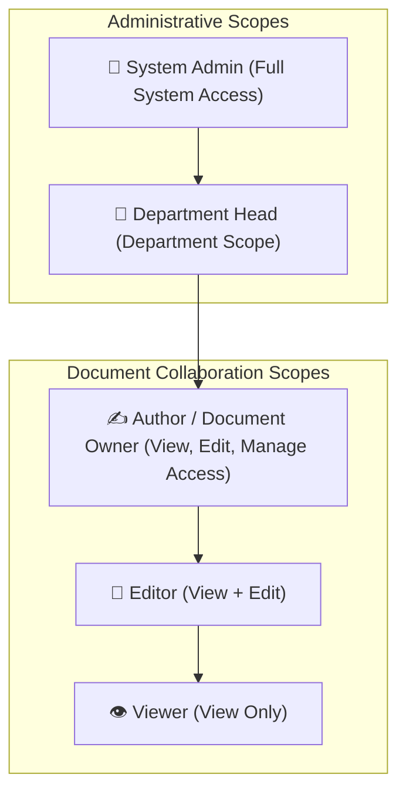

#### 1. System Admin (`ADMIN`)
- **Scope:** Global / Organization-wide.
- **Key Privileges:**
  - Full, unrestricted access across all departments, projects, and documents.
  - Global user management: invite, activate, deactivate, and assign administrative privileges to users.
  - Create and configure top-level Departments and global taxonomy/settings.
  - Access system-wide immutable audit ledgers and security logs.
  - Override any permission lockouts or orphaned document ownerships.

#### 2. Department Head (`DEPARTMENT_HEAD`)
- **Scope:** Assigned Department container(s) and all nested child projects/documents.
- **Key Privileges:**
  - Create, rename, archive, and manage projects within their assigned department.
  - Assign department-level membership and default role policies for department members.
  - Full read, write, and access-management rights over all documents within their department.
  - Manage department-wide knowledge health (e.g., reassigning stale/orphaned documents).

#### 3. Author / Document Owner (`AUTHOR`)
- **Scope:** Specific Document (and its child sub-documents).
- **Key Privileges:**
  - The primary creator or designated owner of a document.
  - **Full Document Control:** View, edit content in real-time, format, and delete the document.
  - **Access Management:** Grant and revoke explicit per-user permissions (assigning Editor or Viewer access to specific individuals).
  - **Lifecycle & History:** Create named version snapshots, perform rollbacks, and view document-level audit logs.

#### 4. Editor (`EDITOR`)
- **Scope:** Document or Project level.
- **Key Privileges:**
  - **View & Edit:** Read and simultaneously co-author document content in real-time.
  - Insert internal bi-directional links (`@mentions`, backlinks) and media blocks.
  - Create and reply to inline comment threads.
  - Create named version checkpoints (e.g., "Draft Complete").
  - *Restrictions:* Cannot delete the document, change document ownership, or modify access permissions for other users.

#### 5. Viewer (`VIEWER`)
- **Scope:** Document, Project, or Department level.
- **Key Privileges:**
  - **View Only:** Read document content, view metadata, and explore the connected knowledge graph.
  - Search and discover indexed documents within their viewable scope.
  - *Restrictions:* Cannot edit document content, modify permissions, or create version snapshots. (Can be configured to allow or disallow read-only comment viewing).

---

### 4.3 Multi-Role & Cross-Functional Collaboration Model

In real-world engineering and product workflows, projects and collaboration frequently transcend departmental boundaries. The role model accommodates the following patterns:

```mermaid
flowchart LR
    subgraph DeptA [Department: Engineering]
        UserA[User A: Dept Member]
    end

    subgraph DeptB [Department: Product]
        UserB[User B: Dept Member]
    end

    subgraph CrossProj [Cross-Departmental / Standalone Project]
        ProjDoc[Project Specification Doc]
    end

    UserA -->|Role: Author / Owner| ProjDoc
    UserB -->|Role: Editor (Explicit Grant)| ProjDoc
```

#### 1. Department-Bound vs. Department-less Projects
- **Department-Bound Projects:** Belong directly to a parent department. Department members inherit default access (e.g., Viewer or Editor) from the department container.
- **Department-less / Standalone Projects:** Exist at the organization level without a single parent department. Designed for cross-functional initiatives (e.g., "Company Rebrand", "Security Compliance Taskforce", "All-Hands Wiki"). Access is granted by explicitly adding users or cross-department teams.

#### 2. Cross-Department Collaborators
- A user whose primary membership is in **Department A (Engineering)** can be added as an **Editor** or **Author** on a specific document located in **Department B (Product)**.
- The user gains access *only* to the explicitly shared document (and any linked resources granted to them), without gaining visibility into the rest of Department B's private containers.

---

### 4.4 Granular Permission & Capability Matrix

| System Action | System Admin | Department Head | Author / Doc Owner | Editor | Viewer |
| :--- | :---: | :---: | :---: | :---: | :---: |
| **Manage Global Users & Settings** | ✅ | ❌ | ❌ | ❌ | ❌ |
| **Create / Manage Departments** | ✅ | ❌ | ❌ | ❌ | ❌ |
| **Create Projects in Department** | ✅ | ✅ *(Own Dept)* | ❌ | ❌ | ❌ |
| **Create Department-less Projects** | ✅ | ✅ *(If permitted)* | ❌ | ❌ | ❌ |
| **Read / View Document** | ✅ | ✅ *(Own Dept)* | ✅ | ✅ | ✅ |
| **Real-Time Co-Author & Edit Document** | ✅ | ✅ *(Own Dept)* | ✅ | ✅ | ❌ |
| **Insert / Remove Backlinks & Mentions** | ✅ | ✅ *(Own Dept)* | ✅ | ✅ | ❌ |
| **Add / Reply to Comments** | ✅ | ✅ *(Own Dept)* | ✅ | ✅ | ❌ *(Read-only)* |
| **Create Named Version Snapshot** | ✅ | ✅ *(Own Dept)* | ✅ | ✅ | ❌ |
| **Rollback to Previous Snapshot** | ✅ | ✅ *(Own Dept)* | ✅ | ❌ | ❌ |
| **Manage Document Access / Grants** | ✅ | ✅ *(Own Dept)* | ✅ | ❌ | ❌ |
| **Delete / Archive Document** | ✅ | ✅ *(Own Dept)* | ✅ | ❌ | ❌ |
| **View Document Audit Logs** | ✅ | ✅ *(Own Dept)* | ✅ | ❌ | ❌ |

---

### 4.5 User Persona Mapping & Typical Scenarios

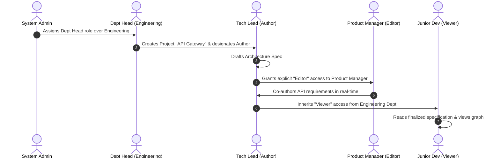

#### Scenario Walkthrough:
1. **Scenario 1 — Internal Department Flow:**
   - Tech Lead creates a document inside `Engineering > Core Infrastructure`.
   - All members of `Engineering` automatically inherit `Viewer` access based on their department role.
   - Specific engineers are assigned `Editor` roles on the project or document.

2. **Scenario 2 — Cross-Functional Project Flow:**
   - A cross-functional initiative ("OAuth2 Migration") is created as a project.
   - The primary Engineer is the **Author**.
   - A Product Manager from another department is added explicitly as an **Editor**.
   - A Security Auditor is added explicitly as a **Viewer**.
   - Each collaborator has precise, scoped permissions with no leaked access to unrelated department assets.

---

*End of Section 4: Users & Roles.*
*Next Document: Section 5 — Knowledge Organization & Data Modeling.*


# Business Requirements Document (BRD)
## Enterprise Knowledge Base Platform (KBS)

---

### Document Control
- **Document Title:** Enterprise Knowledge Base Platform — Knowledge Organization & Content Architecture
- **Document Identifier:** BRD-KBS-003 (Section 5)
- **Section Covered:** Section 5: Knowledge Organization & Content Architecture
- **Target Audience:** Product Managers, Technical Leads, System Architects, Business Analysts, UX Designers
- **Document Status:** Draft / Under Technical Review
- **Version:** 1.1.0

---

## 5. Knowledge Organization & Content Architecture

### 5.1 Information Architecture & Hierarchy Taxonomy
To prevent information fragmentation and maintain consistent institutional navigation, the platform organizes all knowledge assets into a structured 4-tier container taxonomy.

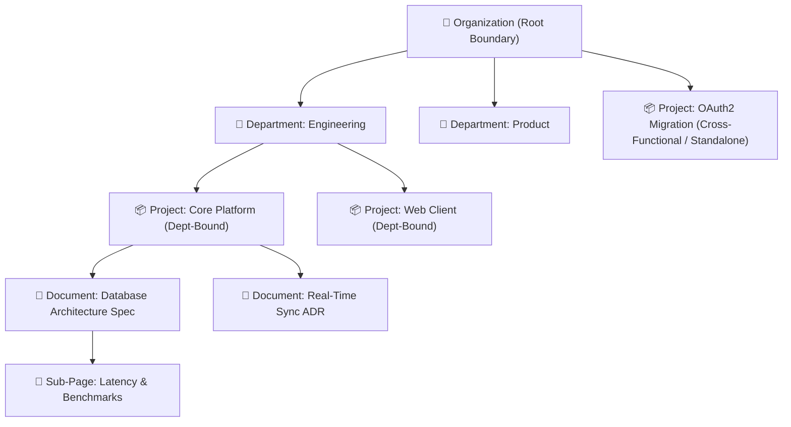

#### 5.1.1 Container Types & Organizational Rules

| Container Level | Scope & Purpose | Containment Rules | Access Defaults |
| :--- | :--- | :--- | :--- |
| **Organization (Root)** | The highest administrative boundary representing the entire enterprise entity. | Contains Departments, Standalone Projects, and Global Settings. | Managed exclusively by System Admins. |
| **Department** | Represents a formal functional business unit (e.g., Engineering, Marketing, Legal). | Contains Department-Bound Projects and Department Wiki root pages. | Managed by Department Heads; department members inherit default base access. |
| **Project (Department-Bound)** | Dedicated workspace for a specific team initiative or system within a department. | Contains Documents and Sub-pages. | Inherits parent Department’s default access policies. |
| **Project (Standalone / Cross-Functional)** | Workspaces for cross-departmental initiatives, temporary task forces, or company-wide handbooks. | Attached directly to the Organization root; contains Documents and Sub-pages. | No automatic department inheritance; access is explicitly granted to cross-functional members. |
| **Document** | The primary unit of authoring and knowledge capture. | Lives inside a Project; can contain nested Sub-Documents. | Inherits parent Project permissions unless explicit per-user overrides are configured. |
| **Sub-Document (Child Page)** | Contextual child pages nested under a parent document for deep documentation trees. | Nested under a parent Document; can nest indefinitely. | Inherits parent Document permissions by default. |

---

### 5.2 Container Lifecycle & Structural Business Rules

#### 5.2.1 Movement & Re-Parenting Rules
1. **Moving a Document between Projects:**
   - When a document is moved from *Project A* to *Project B*, it automatically inherits the default permission policies of *Project B*.
   - **Explicit User Overrides Preservation:** Any explicit per-user permissions assigned directly on the document (e.g., Jane has explicit *Editor* access) must be preserved unless explicitly cleared by the Author performing the move.
   - **Link Continuity:** Moving a document must not break existing internal backlinks pointing to it.
2. **Moving a Project between Departments:**
   - A Department-Bound Project can be transferred to another Department or converted into a Standalone Project only by an Admin or the respective Department Heads.

#### 5.2.2 Deletion, Archiving & Cascade Rules
1. **Soft-Delete vs. Archiving:**
   - Documents and containers are never hard-deleted immediately. Deleted items move to a 30-day recoverable "Trash" bin before permanent purge.
   - Authors and Admins can "Archive" documents, keeping them visible for historical reference but marking them read-only and deprioritized in global search.
2. **Cascade Behavior on Deletion:**
   - Deleting a parent document automatically moves all child sub-pages to Trash.
   - Deleting a Project requires explicit confirmation and notification to all active document authors within that project.

---

### 5.3 Document Content Architecture (Markdown-First)

Documents are authored and stored as standard **GitHub Flavored Markdown (GFM)** text, enabling lightweight storage, rapid rendering, and universal compatibility.

```mermaid
graph TD
    Doc["📄 Markdown Document Text (GFM)"]
    B1["# Headers (H1 - H4)"]
    B2["Paragraphs with [[Document Links]] & @Mentions"]
    B3["> Blockquotes & Callouts"]
    B4["```codeblocks with Syntax Highlighting"]
    B5["| Markdown Tables | & - [ ] Task Lists"]

    Doc --> B1
    Doc --> B2
    Doc --> B3
    Doc --> B4
    Doc --> B5
```

#### 5.3.1 Required Markdown Capabilities
- **Typography & Structure:** Headings (`#` to `####`), Paragraphs, Blockquotes (`>`), Horizontal Rules (`---`).
- **Lists & Tasks:** Bulleted Lists (`- `), Numbered Lists (`1. `), Interactive Task Checklists (`- [ ]`, `- [x]`).
- **Technical & Code Blocks:** Fenced code blocks with language syntax highlighting (TypeScript, SQL, Python, JSON, Bash) and one-click copy buttons.
- **Tabular Data:** Standard GFM markdown tables with header alignment.
- **Internal References:** Internal document links (`[Title](doc:uuid)` or `[[Title]]` / `@Title`) rendered as interactive reference chips.

#### 5.3.2 Comment & Annotation Anchoring
- Inline review comments anchor to specific text passages or line ranges within the Markdown document.
- Section deep-links resolve directly to heading slugs (e.g., `#system-architecture`).

---

### 5.4 Knowledge Topology & Bi-Directional Relationships

The platform must actively dismantle departmental silos by transforming isolated pages into an interconnected web of institutional knowledge.

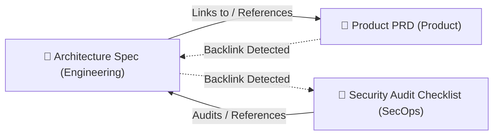

#### 5.4.1 Bi-Directional Linking Requirements
1. **Outbound Linking Experience:**
   - Authors can type `@` or `[[` anywhere in the editor to trigger a quick-search popover and link to another document.
2. **Inbound Backlinks Drawer:**
   - Every document must feature a "Referenced By" (Backlinks) panel listing all other documents across the enterprise that reference the current page.
   - For each referencing document, the system must display the title, container path, and a contextual snippet of the referencing sentence.

#### 5.4.2 Link Integrity & Resilience Rules
- **Automatic Title Synchronization:** If *Document B* is renamed, all references to *Document B* across other documents must display the updated title automatically without requiring manual author intervention.
- **Move Resilience:** Moving a target document across departments or projects must never break existing reference links.
- **Orphan / Deleted Link Handling:** If a linked document is moved to Trash, the referencing link must visually indicate an archived/missing target rather than causing application errors.

#### 5.4.3 Visual Knowledge Graph
- The system must provide an interactive, visual relationship graph where documents appear as nodes and internal references appear as connecting edges.
- Users can filter the graph by Department, Project, or connection depth (1-hop, 2-hop, full network) to explore dependencies and uncover isolated "orphan" documentation.

---

### 5.5 Collaborative Versioning & Snapshot Lifecycle

To support multi-user real-time editing without creating fragmented micro-versions or losing change attribution, the platform implements a **3-Tier Collaborative Versioning Model**.

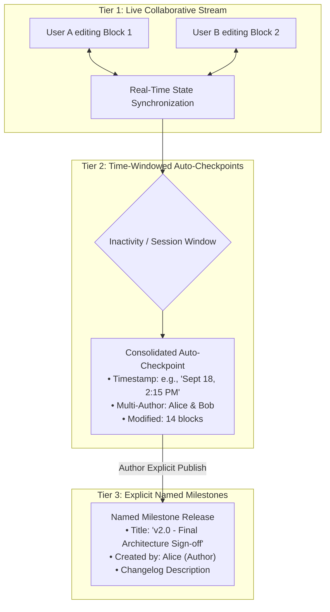

---

#### 5.5.1 Multi-Author Session Grouping & Checkpoint Rules
1. **Time-Windowed Session Consolidation (Auto-Checkpoints):**
   - Keystrokes during continuous active editing are synchronized in real-time but are **not** committed as individual versions.
   - The system aggregates continuous collaborative editing into a consolidated checkpoint once a period of inactivity (e.g., 5–10 minutes of idle time) occurs, or upon reaching a standard session time threshold.
2. **Multi-Author Attribution ("Collaborative Blame"):**
   - Each checkpoint records the list of **all active contributors** who authored changes during that editing window.
   - **Block-Level Attribution:** Changes are tracked per `block_id`, enabling the system to attribute which author added, modified, or deleted specific sections.

---

#### 5.5.2 Explicit Named Version Milestones
1. **Milestone Creation:**
   - Any user with *Author* or *Editor* privileges can explicitly publish a named version snapshot at any time (e.g., *"v1.2 — Security Review Sign-off"*).
   - Milestones require a mandatory title and an optional change summary describing the updates.
2. **Milestone Immutability:**
   - Once published, a named milestone snapshot is permanently frozen and cannot be modified. Subsequent collaborative edits continue on the live draft state.

---

#### 5.5.3 Collaborative Visual Diffs & Author Color Coding
When users inspect the document version history:
1. **Unified Visual Diffs:**
   - Additions are highlighted in green text.
   - Deletions are displayed as red strikethrough text.
2. **Color-Coded Author Highlighting:**
   - Each contributing co-author is assigned a distinct highlight color (e.g., Alice in purple, Bob in blue) so reviewers can visually distinguish contributions across simultaneous collaborators.

```
┌──────────────────────────────────────────────────────────────┐
│ Version History — Sept 18, 2:15 PM (2 Contributors)          │
├──────────────────────────────────────────────────────────────┤
│ [Alice] Added Heading: 'Authentication Layer'                │
│ [Bob]   Modified Paragraph: Updated token expiration to 24h.  │
│ [Alice] Deleted Paragraph: Removed legacy basic-auth notes.  │
└──────────────────────────────────────────────────────────────┘
```

---

#### 5.5.4 Live Collaboration Rollback Protocol
If an Author or Admin triggers a rollback to an earlier version while other collaborators are actively viewing or editing the document:

1. **Non-Destructive Commit ($N+1$ Version):**
   - Restoring an older snapshot does **not** erase the intervening timeline. The restored snapshot is committed as a new current version ($N+1$), preserving a complete, unbroken audit trail.
2. **Live Peer Broadcast Notification:**
   - The rollback event is broadcast immediately across all active WebSocket peer connections.
   - All active collaborators receive an in-app banner notification:
     > *"Alice restored this document to Version 1.0 (Initial Draft)"*.
3. **Safe Cursor & Selection Repositioning:**
   - Active collaborators' cursors and viewports are smoothly repositioned to safe block boundaries in the restored document state without disconnecting or crashing their live session.
4. **Comment Thread Preservation:**
   - Active, unresolved comment threads on unchanged blocks remain intact. Comments on blocks removed by the rollback are moved to an archived "Resolved / Historical" state.

---

*End of Section 5: Knowledge Organization & Content Architecture.*
*Next Document: Section 6 — Core Business Capabilities (`04_core_business_capabilities.md`).*


# Business Requirements Document (BRD)
## Enterprise Knowledge Base Platform (KBS)

---

### Document Control
- **Document Title:** Enterprise Knowledge Base Platform — Core Business Capabilities
- **Document Identifier:** BRD-KBS-004 (Section 6)
- **Section Covered:** Section 6: Core Business Capabilities
- **Target Audience:** Product Managers, Technical Leads, System Architects, UI/UX Designers, QA Engineers
- **Document Status:** Draft / Under Technical Review
- **Version:** 1.1.0 (Calibrated for Markdown-First Authoring)

---

## 6. Core Business Capabilities

### 6.1 Capability Matrix & Overview
The Enterprise Knowledge Base Platform provides eight foundational business capabilities categorized into Authoring, Collaboration, Discovery, Governance, and Security:

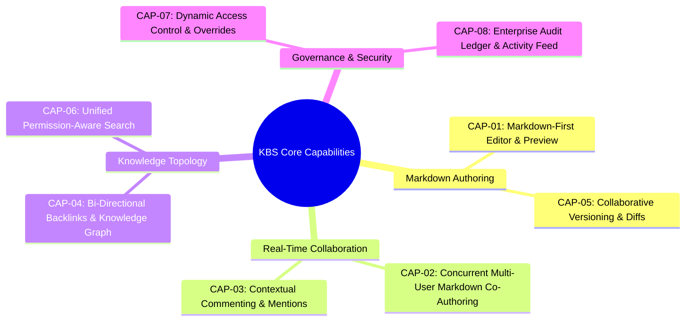

---

### 6.2 Detailed Functional Capability Specifications

---

#### CAP-01: Markdown-First Document Authoring
- **Business Purpose:** Provide a fast, distraction-free Markdown authoring environment supporting standard GitHub Flavored Markdown (GFM) for technical specs, runbooks, and documentation.
- **Functional Requirements:**
  1. **Markdown Syntax Support:** Full support for standard CommonMark and GitHub Flavored Markdown (GFM):
     - Headings (`#` through `####`).
     - Paragraphs, blockquotes (`>`), horizontal rules (`---`).
     - Bulleted lists (`- `), numbered lists (`1. `), and interactive task checklists (`- [ ]`, `- [x]`).
     - Code blocks with syntax highlighting (```language) and inline code.
     - Markdown tables (`| col1 | col2 |`).
     - Standard images and links (`[label](url)`).
  2. **Authoring UX:**
     - Support split-pane or toggleable **Edit / Live Preview** mode, or a seamless hybrid markdown editor (WYSIWYG Markdown).
     - Standard keyboard accelerators (e.g., `Cmd+B` for bold, `Cmd+I` for italics, `Cmd+K` for link insertion).
  3. **Internal Document Links:**
     - Support quick-linking to internal documents using `[[Document Title]]` or `@DocumentTitle` auto-complete, which resolves to `[Document Title](doc:<uuid>)`.

---

#### CAP-02: Real-Time Concurrent Multi-User Collaboration
- **Business Purpose:** Enable multiple team members to co-author Markdown documents simultaneously with zero edit collisions or file locks.
- **Functional Requirements:**
  1. **Conflict-Free Concurrent Editing:** Multiple users can type, format, and edit different sections or lines of the same Markdown document concurrently.
  2. **Presence & Awareness Indicators:**
     - **Live User Carets:** Colored cursor lines showing other active collaborators' positions with name tags.
     - **Selection Highlights:** Real-time visibility of text selections made by peers.
     - **Collaborator Header Bar:** Displays avatar badges of all users actively viewing or editing the document.
  3. **Connection & Offline Resilience:**
     - In-app connection indicator (*Connected*, *Syncing*, *Offline*).
     - Local edits buffered during temporary network disconnections and reconciled automatically upon reconnection.

---

#### CAP-03: Contextual Inline & Document-Level Commenting
- **Business Purpose:** Anchor discussions and review feedback directly to specific text lines without fragmenting conversations into external chat channels.
- **Functional Requirements:**
  1. **Inline Text Selection Comments:**
     - Users can highlight any text segment or line to open a comment thread.
     - Comments track the highlighted text passage and line location.
  2. **Discussion Thread Lifecycle:**
     - Threaded replies, timestamps, and author attribution.
     - User mentions (`@teammate`) triggering in-app notifications.
     - Resolution workflow: Mark as *Resolved* (hidden from main document view, preserved in comment history with a *Reopen* option).
  3. **Document-Level Discussions:** Dedicated side panel for general document-wide feedback.

---

#### CAP-04: Bi-Directional Backlinks & Interactive Knowledge Graph
- **Business Purpose:** Connect isolated Markdown files into an interactive web of knowledge and visualize relationships across projects and departments.
- **Functional Requirements:**
  1. **Internal Linking (@Mention / [[Link]]):**
     - Typing `@` or `[[` triggers an instant document search popover.
     - Selecting a document inserts an internal reference link.
  2. **"Referenced By" (Backlinks) Drawer:**
     - Every document displays a bottom/side drawer showing all other documents across the platform that contain links pointing to the current document.
     - Displays referencing document title, container path, and a preview snippet of the referencing line.
  3. **Interactive Knowledge Graph Canvas:**
     - Visual node-link network graph where documents are nodes and links are edges.
     - Color-coded by Department/Project.
     - Interactive controls: Pan, Zoom, Filter by Department/Project, search nodes, and highlight orphan documents.

---

#### CAP-05: Collaborative Versioning & Visual Diffs
- **Business Purpose:** Maintain a full audit trail of document revisions with clear change attribution and safe rollback.
- **Functional Requirements:**
  1. **Automated Session Checkpoints:** Background aggregation of continuous collaborative edits into time-windowed checkpoints with full contributor lists.
  2. **Explicit Named Milestones:** Authors/Editors can publish named snapshots (e.g., *"v1.0 - Initial Spec Approved"*) with change descriptions.
  3. **Line-by-Line Markdown Diff Viewer:**
     - Visual diffs showing additions (green) and deletions (red strikethrough).
     - Color-coded author attribution showing who modified which lines.
  4. **Non-Destructive Rollback:**
     - Restore any previous version snapshot. Restoring commits a new revision ($N+1$) and updates all active peer sessions live.

---

#### CAP-06: Unified Permission-Aware Search & Discovery
- **Business Purpose:** Instant search across all Markdown documentation with zero access leaks.
- **Functional Requirements:**
  1. **Global Search Modal (`Cmd+K` / `Ctrl+K`):** Instant search accessible anywhere in the application.
  2. **Search Matching:**
     - Exact and prefix matching on document titles.
     - Full-text search across all raw Markdown content and code snippets.
  3. **Faceted Filtering:** Filter by Department, Project, Author, and Date Modified.
  4. **Security Filtering:** Completely omits documents from search results and suggestions where the user's resolved permission is `NONE`.

---

#### CAP-07: Dynamic Access Control & Explicit Permission Overrides
- **Business Purpose:** Enforce 4-tier container inheritance while permitting explicit per-user sharing.
- **Functional Requirements:**
  1. **Container Inheritance:** Permissions cascade: $\text{Org} \rightarrow \text{Dept} \rightarrow \text{Project} \rightarrow \text{Doc}$.
  2. **Document Share Modal:**
     - Authors and Admins can view effective permissions and grant explicit per-user rights (*Author*, *Editor*, *Viewer*).
  3. **Access Resolution Precedence:**
     $$\text{Explicit User Override} > \text{Project Grant} > \text{Department Grant} > \text{Organization Default}$$

---

#### CAP-08: Enterprise Audit Ledger & Activity Feed
- **Business Purpose:** Provide governance, security auditing, and operational traceability.
- **Functional Requirements:**
  1. **Document Activity History:** In-page timeline showing recent edits, versions published, and permission changes.
  2. **System Audit Log (Admin Only):**
     - Immutable event log for critical actions: `DOC_CREATED`, `DOC_UPDATED`, `DOC_DELETED`, `PERMISSION_CHANGED`, `VERSION_RESTORED`.
     - Filterable by Actor, Date Range, Event Type, and Resource.

---

### 6.3 Capability Prioritization Matrix

| Capability ID | Capability Name | Scope Tier | Primary Stakeholder |
| :--- | :--- | :--- | :--- |
| **CAP-01** | Markdown-First Document Authoring | Core Foundation | Content Authors, Engineers |
| **CAP-02** | Real-Time Concurrent Multi-User Collaboration | Core Foundation | All Collaborators |
| **CAP-03** | Contextual Inline Commenting & Mentions | Core Foundation | Reviewers, Technical Leads |
| **CAP-04** | Bi-Directional Backlinks & Knowledge Graph | Core Foundation | Knowledge Managers, Readers |
| **CAP-05** | Collaborative Versioning & Diffs | Core Foundation | Authors, Technical Leads |
| **CAP-06** | Unified Permission-Aware Search | Core Foundation | General Readers, Enterprise |
| **CAP-07** | Dynamic Access Control & Overrides | Core Security | System Admins, Authors |
| **CAP-08** | Enterprise Audit Ledger & Activity Feed | Core Governance | System Admins, SecOps |

---

*End of Section 6: Core Business Capabilities.*
*Next Document: Section 7 — Access Control & Permissions (`05_access_control_and_permissions.md`).*


# Business Requirements Document (BRD)
## Enterprise Knowledge Base Platform (KBS)

---

### Document Control
- **Document Title:** Enterprise Knowledge Base Platform — Access Control & Permissions (Dynamic Access Control)
- **Document Identifier:** BRD-KBS-005 (Section 7)
- **Section Covered:** Section 7: Access Control & Permissions
- **Target Audience:** Product Managers, Security Architects, Backend Engineers, Technical Leads, Compliance Officers
- **Document Status:** Draft / Under Technical Review
- **Version:** 1.0.0

---

## 7. Access Control & Permissions (Dynamic Access Control - DAC)

### 7.1 Overview & Security Philosophy
Enterprise documentation requires a permission model that balances **strong governance** with **flexible collaboration**. Traditional Role-Based Access Control (RBAC) creates an unworkable trade-off: either permissions are locked strictly by department folders (blocking cross-team collaboration), or permissions are made public (causing security and compliance leaks).

KBS implements a **Stacked, Multi-Layered Dynamic Access Control (DAC)** model that combines **4-tier container inheritance** with **granular, explicit per-user overrides**.

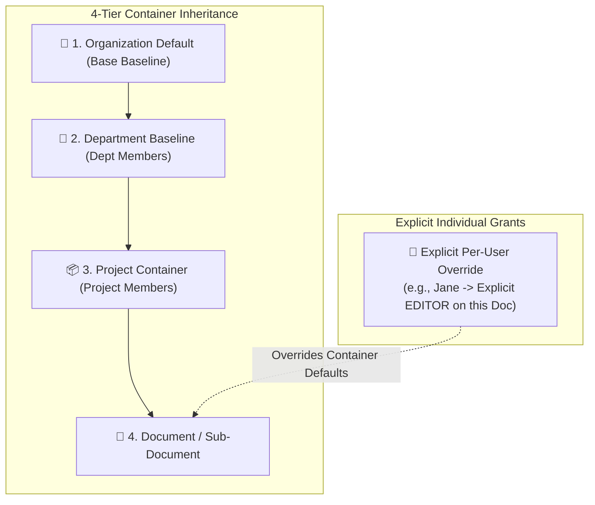

---

### 7.2 Access Resolution Algorithm & Precedence Hierarchy

When a user attempts to view, edit, or manage a document, the system calculates their **Effective Permission** by evaluating access rules from the most specific scope (the individual document) up to the broadest scope (the organization).

#### 7.2.1 The Precedence Formula
$$\text{Explicit Document Override} > \text{Explicit Project Override} > \text{Department Baseline} > \text{Organization Default}$$

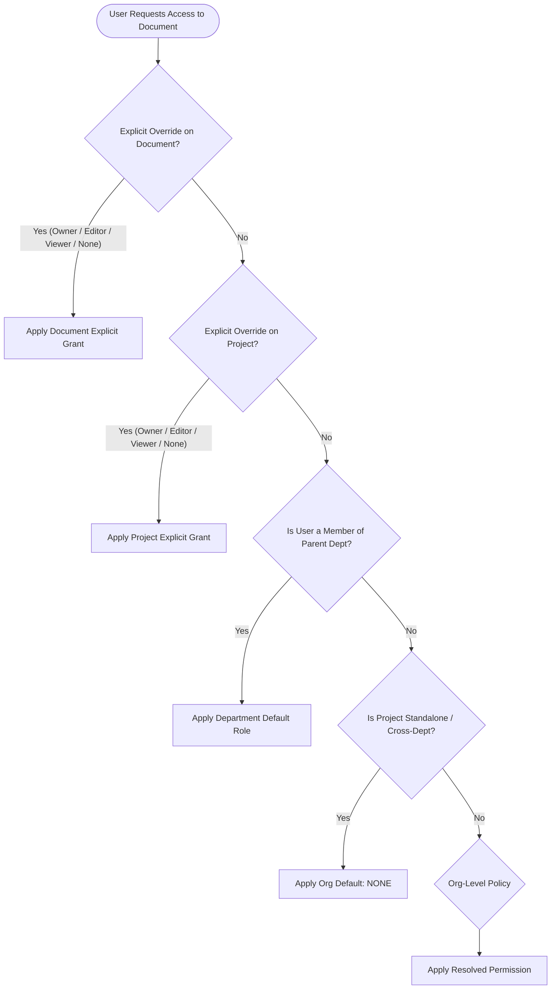

#### 7.2.2 Step-by-Step Resolution Logic:
1. **Step 1 — Document-Level Explicit Grant:** Check if the user is explicitly listed on the document's Access Control List (ACL). If an entry exists (e.g., `AUTHOR`, `EDITOR`, `VIEWER`, or `NONE`), apply it immediately and stop evaluation.
2. **Step 2 — Project-Level Explicit Grant:** Check if the user is explicitly listed on the parent project's ACL. If an entry exists, apply it and stop evaluation.
3. **Step 3 — Department Baseline:** If the project belongs to a Department, check the user's role in that Department (e.g., Department Member inherits `VIEWER` or `EDITOR`).
4. **Step 4 — Organization Fallback:** If no prior rule matches (e.g., for standalone cross-functional projects or external departments), apply the global organization default (which defaults to `NONE` / No Access).

---

### 7.3 Access Roles & Capability Matrix

| Capability / Action | OWNER / AUTHOR | EDITOR | VIEWER | NONE (Revoked) |
| :--- | :---: | :---: | :---: | :---: |
| **Discover & View in Search / Sidebar** | ✅ | ✅ | ✅ | ❌ *(Hidden)* |
| **Read Document Content & Metadata** | ✅ | ✅ | ✅ | ❌ |
| **View Backlinks Drawer & Knowledge Graph** | ✅ | ✅ | ✅ | ❌ |
| **Add / Reply to Inline Comments** | ✅ | ✅ | ❌ *(Read-only)* | ❌ |
| **Real-Time Concurrent Markdown Editing** | ✅ | ✅ | ❌ | ❌ |
| **Insert / Update Document Links (`[[...]]`)** | ✅ | ✅ | ❌ | ❌ |
| **Create Named Version Snapshot** | ✅ | ✅ | ❌ | ❌ |
| **Rollback Document to Historical Snapshot** | ✅ | ❌ | ❌ | ❌ |
| **Grant / Revoke Explicit User Permissions** | ✅ | ❌ | ❌ | ❌ |
| **Delete / Archive Document** | ✅ | ❌ | ❌ | ❌ |
| **View Document Activity & Audit Logs** | ✅ | ❌ | ❌ | ❌ |

---

### 7.4 Concrete Business Scenarios & Use Cases

#### Scenario 1: Cross-Department Collaboration
- **Context:** An Engineer in *Department A (Engineering)* drafts an Architecture Spec. A Product Manager (PM) in *Department B (Product)* needs to co-author the requirements section.
- **Access Setup:**
  - *Engineering Department default:* All Engineering members have `VIEWER` access.
  - *Document Explicit Override:* The Engineer (Author) adds the PM with an explicit `EDITOR` grant on this specific document.
- **Outcome:** The PM can open, co-author, and comment on this specific specification in real-time, but has **zero** access to any other private documents inside Department A.

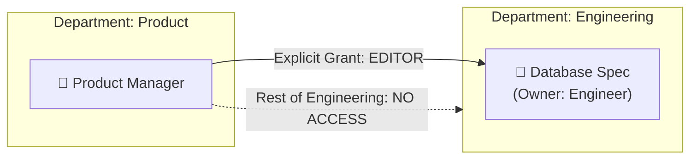

---

#### Scenario 2: Confidential / Restricted Project
- **Context:** An HR / Executive team creates a project: `"2026 Leadership Restructure"` inside a department.
- **Access Setup:**
  - The project is marked as **`Restricted`** (`is_restricted = true`).
  - Container inheritance is severed for general department members.
  - Only explicitly added individuals receive access (`OWNER` or `VIEWER`).
- **Outcome:** General department members cannot see the project in the sidebar, cannot find it in search, and see no references in the knowledge graph.

---

#### Scenario 3: Explicit Access Revocation (`NONE`)
- **Context:** A contractor or temporary member has broad `VIEWER` access across a department, but a specific document contains sensitive budget figures.
- **Access Setup:**
  - The document Author adds an explicit override for the contractor with the role `NONE`.
- **Outcome:** Even though the contractor has department-level viewer access, the explicit `NONE` override on the document takes precedence. The document is invisible to the contractor.

---

### 7.5 Permission Management & Security Workflows

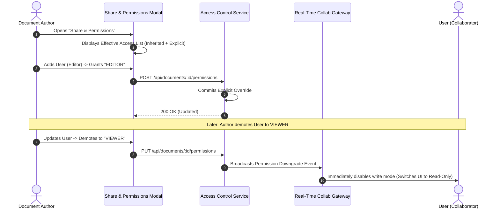

#### 7.5.1 Real-Time Permission Invalidation Rules
1. **Live Session Demotion:**
   - If an active user currently typing in a document has their permission downgraded (e.g., from `EDITOR` to `VIEWER` or `NONE`), the system must **immediately** invalidate their write session via the WebSocket gateway without requiring a page refresh.
   - The user’s editor UI switches instantly to read-only mode, or redirects them if access was revoked to `NONE`.
2. **Orphan Prevention & Single-Owner Rule:**
   - Every document must have at least one active `OWNER` or `AUTHOR`.
   - An Author cannot remove their own Owner status without first transferring ownership to another valid user or an Admin.

#### 7.5.2 Effective Access Inspector (Transparency)
- To prevent confusion over why a user can or cannot see a file, the "Share" modal must provide an **Access Explanation**:
  - *Example 1:* `"Alice — EDITOR (Explicitly granted on this document by Bob)"`
  - *Example 2:* `"Charlie — VIEWER (Inherited from Engineering Department)"`
  - *Example 3:* `"David — NONE (Explicitly restricted)"`

---

*End of Section 7: Access Control & Permissions.*
*Next Document: Section 8 — Key Business Workflows (`06_key_business_workflows.md`).*


# Business Requirements Document (BRD)
## Enterprise Knowledge Base Platform (KBS)

---

### Document Control
- **Document Title:** Enterprise Knowledge Base Platform — Key Business Workflows
- **Document Identifier:** BRD-KBS-006 (Section 8)
- **Section Covered:** Section 8: Key Business Workflows
- **Target Audience:** Product Managers, Technical Leads, System Architects, UX Designers, QA Engineers
- **Document Status:** Draft / Under Technical Review
- **Version:** 1.0.0

---

## 8. Key Business Workflows

### 8.1 Workflow Index & Overview
This section specifies the primary end-to-end operational workflows executed by users across the knowledge base platform:

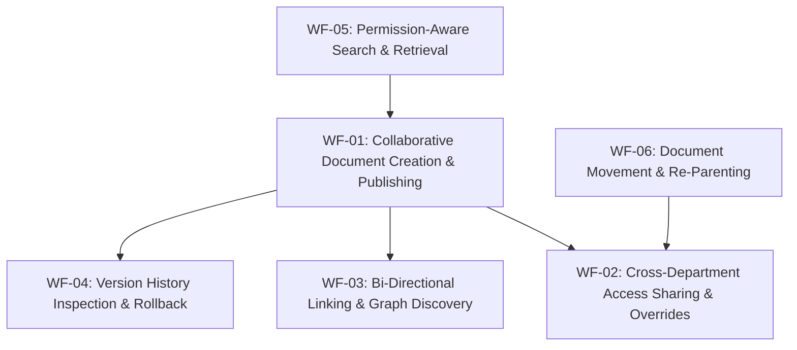

---

### 8.2 Detailed Workflow Specifications

---

#### WF-01: Collaborative Document Creation, Review & Milestone Publishing

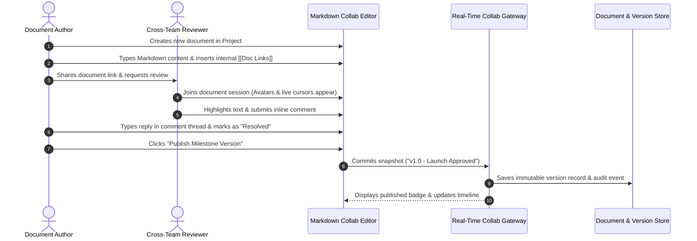

##### Workflow Steps:
1. **Initiation:** The Author navigates to a Project and selects "New Document". The system initializes an empty Markdown document and designates the creator as `AUTHOR / OWNER`.
2. **Drafting:** The Author inputs content using Markdown syntax, keyboard shortcuts, and internal link autocompletion (`@DocumentTitle` or `[[DocumentTitle]]`).
3. **Collaborative Review:** A Reviewer opens the document. The editor displays live cursor indicators and presence badges. The Reviewer highlights a paragraph to create an inline review thread.
4. **Resolution:** The Author reviews the feedback, adjusts the Markdown text, and clicks "Resolve".
5. **Milestone Publish:** The Author opens the Version drawer, enters a version title (e.g., *"v1.0 - Initial Specification"*), and clicks "Publish Milestone". The system freezes the snapshot and records an audit log entry.

---

#### WF-02: Cross-Department Sharing & Dynamic Permission Override

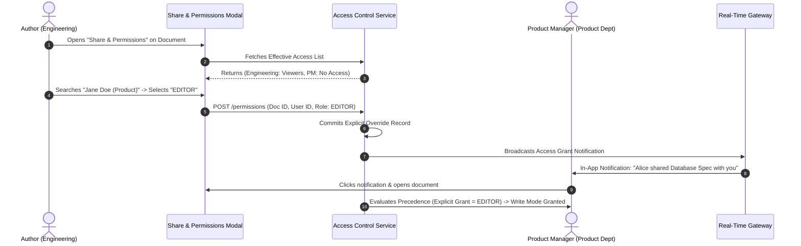

##### Workflow Steps:
1. **Access Assessment:** The Author opens the "Share & Permissions" modal on a document housed in *Department A (Engineering)*.
2. **User Search & Role Assignment:** The Author searches for a user in *Department B (Product)* and assigns them an explicit `EDITOR` grant.
3. **Explicit ACL Commit:** The system registers the override in the Access Control List. The recipient receives an instant in-app notification.
4. **Session Elevation:** When the recipient opens the document, the Dynamic Access Control engine resolves their explicit grant over container defaults, opening the document in collaborative write mode.

---

#### WF-03: Bi-Directional Linking & Knowledge Graph Navigation

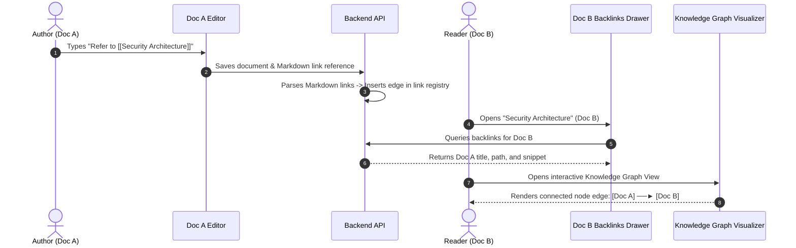

##### Workflow Steps:
1. **Link Insertion:** While writing in *Document A*, the Author inserts an internal link to *Document B* using `[[Security Architecture]]`.
2. **Edge Registration:** Upon save, the system automatically extracts the reference and registers the directed edge in the database.
3. **Backlink Discovery:** A reader viewing *Document B* opens the "Referenced By" drawer, which instantly displays *Document A* with a preview snippet.
4. **Graph Exploration:** The reader switches to the interactive Knowledge Graph to visually navigate adjacent project dependencies and connected documents.

---

#### WF-04: Version History Inspection & Non-Destructive Rollback

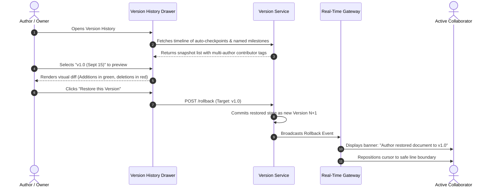

##### Workflow Steps:
1. **Timeline Inspection:** The Author opens the Version History drawer to browse previous checkpoints and named milestones.
2. **Visual Diff Preview:** The Author clicks an earlier snapshot. The UI renders a line-by-line visual diff showing color-coded contributor changes.
3. **Rollback Execution:** The Author clicks "Restore this Version".
4. **$N+1$ Non-Destructive Commit:** The system creates a new revision ($N+1$) with the restored content, ensuring historical continuity.
5. **Live Peer Synchronization:** Active collaborators receive a live notification banner, and their editor viewports adjust seamlessly to the restored state.

---

#### WF-05: Unified Permission-Aware Search & Knowledge Retrieval

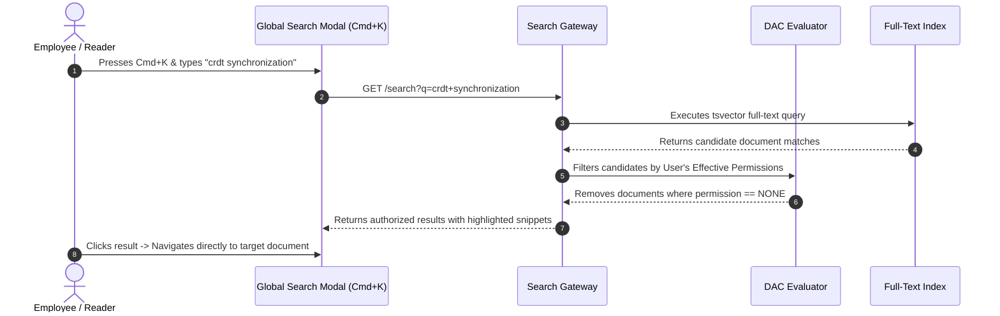

##### Workflow Steps:
1. **Search Trigger:** The user presses `Cmd+K` from any screen to open the global search modal.
2. **Query Execution:** As the user types, the system executes a full-text search against the indexed Markdown repository.
3. **Security Filtering:** The search gateway evaluates the user’s resolved permissions across the container hierarchy and explicit grants, eliminating any restricted (`NONE`) documents.
4. **Direct Navigation:** The user reviews highlighted text snippets and clicks a result to jump directly to the target document.

---

#### WF-06: Document Movement & Re-Parenting

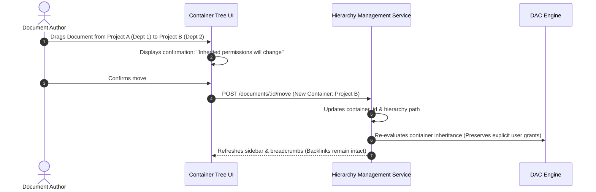

##### Workflow Steps:
1. **Drag-and-Drop or Move Modal:** The Author initiates a move from *Project A* to *Project B*.
2. **Permission Change Notice:** The UI warns the Author that the document will inherit *Project B's* container defaults while preserving explicit individual grants.
3. **Atomic Move:** The system updates the container association.
4. **Link Preservation:** All internal backlinks pointing to the document remain fully functional.

---

*End of Section 8: Key Business Workflows.*
*Next Document: Section 9 — Business Rules & Edge Scenarios (`07_business_rules_and_scenarios.md`).*
