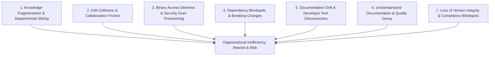
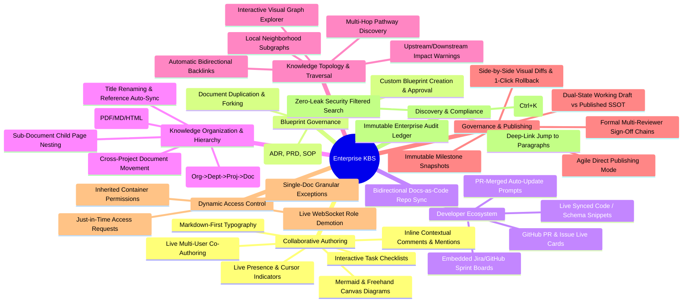

# Business Requirements Document (BRD)
## Enterprise Knowledge Base Platform (KBS)

---

### Document Control
- **Document Title:** Enterprise Knowledge Base Platform — Overview, Problem Statement & Business Objectives
- **Document Identifier:** BRD-KBS-001 (Part 1: Overview, Problem Statement & Business Objectives)
- **Document Location:** `refined_brd/01_overview_problem_objectives.md`
- **Target Audience:** Product Management, Engineering Leads, System Architects, Quality Assurance, Executive Stakeholders
- **Document Status:** Approved Baseline Business Specification
- **Version:** 2.5.0 (Pure Product/Business Specification)

---

## 1. Executive Summary & Product Vision

### 1.1 Product Overview
The **Enterprise Knowledge Base Platform (KBS)** is a centralized, collaborative **Single Source of Truth (SSOT)** designed for modern, multi-team organizations. It provides a unified workspace where technical specifications, product requirements, engineering runbooks, operational policies, and organizational decisions are authored, discovered, interconnected, and governed.

Modern enterprises suffer from severe knowledge decay, documentation drift, and cross-team friction caused by scattered, outdated, or siloed documentation. KBS eliminates these challenges by combining **fluid, real-time collaborative authoring** with **deep knowledge graph interconnectivity**, **enterprise-grade dynamic access control**, and **native developer ecosystem integrations** (GitHub, GitLab, Jira).

### 1.2 Core Value Proposition
* **Single Source of Truth (SSOT):** Eliminates redundant and conflicting information by hosting all institutional knowledge in a single, searchable repository.
* **Frictionless Real-Time Collaboration:** Enables distributed teams to co-author, review, and comment simultaneously without lockouts, save conflicts, or lost work.
* **Knowledge Interconnectedness & Impact Safety:** Automatically discovers relationships between documents (via bidirectional backlinks and visual relationship mapping) and alerts downstream stakeholders before breaking changes occur.
* **Developer Ecosystem Synchronization:** Bridges the gap between code and documentation by syncing with GitHub repositories, embedding live code/schema snippets, and prompting authors when PRs merge to prevent documentation drift.
* **Granular, Flexible Access Governance:** Implements a hierarchical permission model with explicit overrides, allowing cross-functional sharing of single documents without compromising container security.
* **Standardized Blueprint Governance:** Ensures high documentation standards across departments through curated and custom template libraries with approval workflows.
* **Auditability & Historic Integrity:** Provides complete snapshot versioning, one-click rollbacks, and an immutable log of all content and access changes for regulatory and operational governance.

---

## 2. Problem Statement & Business Context

### 2.1 The Organizational Challenge
As organizations scale across multiple departments, projects, and geographic locations, knowledge generation naturally outpaces organizational ability to index, maintain, and connect it. Documentation ends up scattered across disparate systems (wikis, local files, cloud drives, ticketing systems, and messaging apps).

This fragmentation creates seven critical organizational bottlenecks:

### 2.2 Detailed Problem Analysis

#### Problem 1: Information Fragmentation & Departmental Siloing
* **Issue:** Teams operate in organizational silos. Standard hierarchical directory structures force each document into a single parent folder (e.g., *Engineering* or *Finance*).
* **Business Impact:** Cross-functional initiatives become disjointed. Stakeholders in one department cannot easily discover relevant research, architecture decisions, or policies established by another department, resulting in duplicate efforts, wasted engineering hours, and contradictory procedures.

#### Problem 2: Collaboration Friction & Edit Collisions
* **Issue:** Legacy document tools and basic wikis rely on document-locking mechanisms or "last-write-wins" overwrite models.
* **Business Impact:** When multiple users attempt to collaborate simultaneously during planning meetings, incident response, or design reviews, changes overwrite one another or require tedious manual reconciliation. This friction discourages continuous, real-time documentation updates.

#### Problem 3: The "Binary Access" Dilemma (Inflexible Permission Models)
* **Issue:** Traditional Role-Based Access Control (RBAC) ties access strictly to entire containers or workspaces. A user either has full access to an entire department's repository or zero access.
* **Business Impact:** When an employee needs to collaborate on a single cross-functional document, administrators must either:
  1. **Over-provision access**, granting the user visibility into sensitive department-wide documents (a serious security risk), or
  2. **Force manual workarounds**, such as copying content into unmanaged third-party files or chat channels (creating untracked duplicates and data sprawl).

#### Problem 4: Dependency Blindspots & Knowledge Isolation
* **Issue:** Conventional linking is strictly unidirectional (Document A links to Document B, but Document B has no knowledge of Document A).
* **Business Impact:** Authors cannot see what systems, runbooks, or projects depend on a specific document. Modifying or deprecating a document inadvertently breaks downstream operational workflows because teams have no way to trace references back to the source.

#### Problem 5: Documentation Drift & Developer Tool Disconnection
* **Issue:** Engineering teams write code in Git repositories while documentation lives in disconnected wikis. 
* **Business Impact:** Code changes in GitHub/GitLab merge into production, but architecture specifications, API guides, and runbooks in the wiki are never updated. Static code snippets copied into documents quickly drift from actual repository code, leading to dangerous operational outages during incident responses.

#### Problem 6: Unstandardized Documentation & Operational Inconsistency
* **Issue:** Different teams author specifications, ADRs, PRDs, and postmortems in arbitrary formats with missing sections and unvetted structures.
* **Business Impact:** Key operational details (such as rollback plans, security reviews, or compliance requirements) are frequently omitted. Without reusable blueprint governance, documentation quality remains erratic.

#### Problem 7: Loss of Version Integrity & Compliance Blindspots
* **Issue:** Changes occur continuously without clear, named snapshots, granular difference views, or auditability regarding who changed what content or who modified permission grants.
* **Business Impact:** Accidental deletions or incorrect updates cannot be quickly reverted with confidence. Security teams cannot fulfill compliance requirements because historical access grants, permission changes, and document view histories are not reliably logged.

---

## 3. Product Goals & Business Objectives

### 3.1 Primary Business Goals

| Goal Ref | Business Goal | Strategic Purpose |
| :--- | :--- | :--- |
| **BG-01** | **Consolidate Organizational Knowledge** | Provide a single, enterprise-wide repository that replaces ad-hoc wikis, unmanaged cloud docs, and local files. |
| **BG-02** | **Accelerate Cross-Team Collaboration** | Support real-time simultaneous authoring and discussion so distributed teams can finalize specifications faster. |
| **BG-03** | **Enforce Secure, Flexible Governance** | Protect sensitive data while empowering owners to safely share individual documents cross-functionally without over-permissioning. |
| **BG-04** | **Prevent Knowledge Rot & Broken Dependencies** | Surface references across all documents through automated bidirectional links, relationship discovery, and pre-change impact warnings. |
| **BG-05** | **Bridge Engineering & Business Knowledge** | Connect KBS with GitHub/developer ecosystems to keep specifications synchronized with active codebases and sprint execution. |
| **BG-06** | **Standardize Documentation Excellence** | Provide curated and custom blueprint libraries with approval gates to enforce enterprise documentation standards. |
| **BG-07** | **Ensure Full Compliance & Traceability** | Guarantee non-destructive historical tracking, instant version restoration, and immutable event auditing. |

---

### 3.2 High-Level Functional Capabilities

#### 1. Collaborative Authoring & Expressive Content
* **Structured Markdown & Code Blocks:** Distraction-free authoring with headings, callouts, tables, interactive task lists, and syntax-highlighted code blocks with one-click copy.
* **Diagramming & Visual Canvas:** Native rendering of text-defined diagrams (Mermaid flowcharts, sequence diagrams, ERDs) and freehand visual sketching whiteboards directly within pages.
* **Concurrent Co-Authoring:** Real-time multi-user typing, live cursor flags, collaborator avatars, and automatic offline recovery with zero data loss.
* **Inline Discussions & Mentions:** Text-anchored feedback threads, individual (`@user`) and team group (`@team`) mentions, and thread resolution history.

#### 2. Blueprint Library & Template Governance
* **Standardized Blueprints:** Curated templates for ADRs, PRDs, Engineering Runbooks, Incident Postmortems, and RFCs.
* **Custom Blueprint Management:** Teams can save high-performing documents as blueprints with scoped visibility (*Project*, *Department*, *Organization*) and administrative sign-offs.
* **Safe Document Forking:** Clone runbooks or specs into new workspaces with reset history and re-scoped permissions.

#### 3. Developer Tool & GitHub Ecosystem Integration
* **Live PR & Issue Cards:** Paste GitHub PR/Issue links to render interactive status cards (`Merged`, `Open`, `Approved`) with automatic reciprocal backlinks in GitHub.
* **Live Synced Code Snippets:** Embed code files or schema definitions directly from GitHub repos that stay synchronized with `main` or locked to release tags.
* **Bidirectional Docs-as-Code Sync:** Synchronize GitHub repository `/docs` markdown with KBS workspaces.
* **PR-Merged Update Prompts:** Proactively notify document owners when linked GitHub PRs merge to prompt spec reviews and publishing.
* **Embedded Sprint Boards:** Embed live Jira or GitHub Issue tracker tables inside requirement documents.

#### 4. Knowledge Organization & Document Portability
* **4-Tier Organizational Model:** Clear structural cascade:
  $$\text{Organization} \longrightarrow \text{Department} \longrightarrow \text{Project} \longrightarrow \text{Document} \longrightarrow \text{Sub-Documents}$$
* **Nesting & Drag-and-Drop:** Arbitrarily deep sub-page hierarchies with breadcrumbs and sidebar tree reordering.
* **Move & Rename Resilience:** Safely transfer documents between projects with permission impact checks; renaming titles automatically synchronizes link text across all referencing documents.
* **Import & Export:** Ingest Word (`.docx`) and Markdown (`.md`); export to formatted PDF (with table of contents), clean Markdown, or standalone HTML.

#### 5. Knowledge Topology & Impact Intelligence
* **Bidirectional Backlinks:** Every document automatically displays a "Referenced By" drawer showing citing documents and contextual snippets.
* **Interactive Visual Graph:** Explore company-wide knowledge networks and focused local neighborhood subgraphs (1-hop / 2-hop filters).
* **Pre-Change Impact Warnings:** Inspect upstream foundations and downstream dependent runbooks before modifying or deprecating documents, triggering automated alerts to affected team leads.

#### 6. Governance, Milestones & Non-Destructive Recovery
* **Dual-State Draft vs. Published Model:** Real-time edits update working drafts behind the scenes without polluting the authoritative SSOT seen by general readers.
* **Flexible Publishing Modes:** Support both agile direct publishing and formal multi-reviewer sign-off workflows with structured change requests.
* **Visual Diffing & Rollback:** Compare any two versions side-by-side; restoring an older version non-destructively loads content into the working draft for sequential re-publishing.

#### 7. Dynamic Access Control & Live Security
* **Inherited Defaults with Explicit Overrides:** Cascading container permissions with granular single-document exception sharing:
  $$\text{Individual Explicit Grant} > \text{Team Group Grant} > \text{Project Grant} > \text{Department Baseline} > \text{Org Default}$$
* **Just-in-Time Access Requests:** In-app access request forms with one-click owner approval.
* **Live Session Role Demotion:** Immediate WebSocket downgrades to read-only or session revocation without requiring page reloads.

#### 8. Discovery, Search & Audit Compliance
* **Universal Command Palette (`Ctrl+K`):** Sub-second search across titles and body text with strict zero-leak security filtering (hidden documents are never surfaced).
* **Deep-Link Direct Jump:** Search results scroll directly to exact section headers and paragraphs with pulse highlights.
* **Enterprise Audit Ledger:** Immutable append-only log capturing all document creation, deletion, permission change, and publishing events for compliance reviews.

---

## 4. User Experience & Operational Performance Requirements

| Dimension | User Requirement & Expectation | Business Rationale |
| :--- | :--- | :--- |
| **Collaboration Latency** | Changes typed by one collaborator appear to other peers near-instantaneously (sub-second under normal network conditions). | Prevents disorientation, overlapping typing, and perceived lag during live planning meetings. |
| **Authorization Evaluation** | Permission checks when viewing, editing, or searching documents occur instantaneously without blocking page loads. | Ensures security checks do not degrade everyday navigation and reading speeds. |
| **Graph & Traversal Performance** | Visual relationship graphs, local subgraphs, and backlink queries render smoothly across tens of thousands of interconnected documents. | Ensures dependency analysis is practical during live authoring and architectural reviews. |
| **Data Durability & Conflict Safety** | Guaranteed zero data loss during simultaneous edits, unexpected network drops, or tab closures. | Builds institutional trust that critical operational documentation is never lost. |
| **Developer Sync Reliability** | Code snippet syncing and webhook-driven PR alerts update reliably within seconds of GitHub events. | Eliminates documentation drift and keeps engineering documentation strictly synchronized. |
| **Accessibility & Responsiveness** | Responsive interface functioning smoothly across desktop and mobile browsers. | Allows on-call engineers, traveling managers, and remote staff to review documents from any device. |

---

## 5. Scope & Product Boundaries (Part 1 Focus)

### 5.1 In-Scope (Phase 1 Baseline)
* Core 4-tier document hierarchy (Organization, Department, Project, Document, Sub-Document).
* Real-time collaborative Markdown authoring with live presence and conflict-free sync.
* Curated and custom blueprint template libraries with scoping and approval workflows.
* Embedded code-based diagramming (Mermaid) and visual freehand canvas wireframing.
* Developer integrations: GitHub PR/Issue cards, live synced code snippets, Docs-as-Code repo sync, and PR-merged alerts.
* Dynamic Access Control with container inheritance, explicit overrides, and live session demotions.
* Automatic backlink extraction, interactive visual knowledge graph, and pre-change impact warnings.
* Document version history, visual diff comparison, and non-destructive one-click restoration.
* Document move/rename resilience, Word/Markdown import, and formatted PDF/HTML export.
* Universal command palette (`Ctrl+K`) search with strict security filtering and paragraph deep-linking.
* Enterprise audit logging for security, permissions, and lifecycle operations.

### 5.2 Out-of-Scope (Deferred to Future Phases)
* **Public/Anonymous Internet Publishing:** KBS is an authenticated internal enterprise platform; unauthenticated public viewing is excluded in Phase 1.
* **Third-Party File System Sync:** Local desktop file folder synchronization agents (e.g., Dropbox/Google Drive file stream) are excluded.
* **Automated Natural Language Translation:** Machine translation of documents into multiple languages is deferred.
* **Video/Audio Hosting Engine:** Rich media attachments are supported as embedded files, but native video streaming transcoding is out of scope.

---

## 6. Key Assumptions & Open Product Decisions

### 6.1 Foundational Assumptions
1. **Enterprise Identity Integration:** The organization provides an identity provider (IdP) for authenticating users and establishing departmental memberships.
2. **Developer Tool Access:** Organizations using GitHub integrations provide authorized GitHub App / OAuth credentials with repository read/write scopes.
3. **Collaboration Culture:** Teams desire transparent, cross-functional discovery by default, with granular security applied to sensitive assets.

### 6.2 Resolved Product Decisions
1. **Default Visibility on Creation:** Newly created documents start in private `DRAFT` mode visible only to authors/editors until explicitly published or shared.
2. **Comment Resolution Permissions:** Document Co-Owners, Editors, and the original comment author have authority to resolve discussion threads; all resolved threads are archived and reopenable.
3. **Backlink Visibility Across Restricted Documents:** If Document A links to Document B, but a user lacks permission to view Document A, Document B's backlink panel indicates an anonymized reference (*"1 restricted document references this"*) without leaking the confidential title or content.

---

*This document serves as Part 1 of the official Enterprise Knowledge Base Platform Business Requirements Document suite.*
*Next Document in Series: `refined_brd/02_users_and_roles.md` (Part 2: Users, Personas & Role Definitions).*
