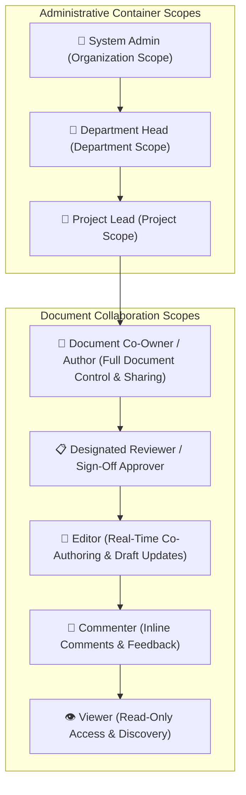
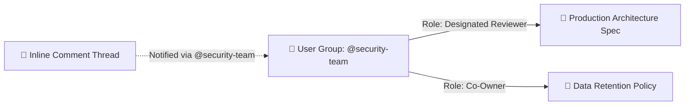
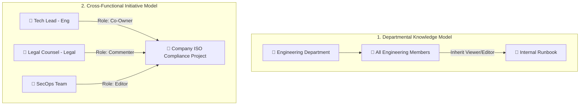

# Business Requirements Document (BRD)
## Enterprise Knowledge Base Platform (KBS)

---

### Document Control
- **Document Title:** Enterprise Knowledge Base Platform — Users, Roles & Collaboration Matrix
- **Document Identifier:** BRD-KBS-002 (Part 2: Users, Roles & Collaboration Scopes)
- **Document Location:** `refined_brd/02_users_and_roles.md`
- **Target Audience:** Product Management, Engineering Leads, System Architects, Quality Assurance, Security & Compliance
- **Document Status:** Approved Baseline Business Specification
- **Version:** 2.5.0 (Pure Product/Business Specification)

---

## 1. Overview & Role Hierarchy Principles

### 1.1 Design Principles
The platform’s user and access model is built upon three foundational business principles:

1. **Clear Administrative Tiering:** Structural containers (Organization, Department, Project) have designated stewards who manage boundaries, projects, blueprints, and high-level policies without needing to intervene in day-to-day document authoring.
2. **Multi-Author & Granular Collaboration:** Individual documents support multiple co-owners and granular contribution tiers (`Editor`, `Commenter`, `Viewer`, and `Designated Reviewer`), enabling seamless cross-team participation without over-privileging collaborators.
3. **Team-Based Scalability:** Access and notifications can be granted to both individual users and reusable **User Groups / Teams**, minimizing administrative overhead as the organization expands.



---

## 2. Platform Roles & Responsibilities

The platform establishes distinct roles across two functional categories: **Container Administrative Roles** and **Document Collaboration Roles**.

### 2.1 Container Administrative Roles

#### 1. System Administrator (`ADMIN`)
* **Scope:** Organization-wide (Global).
* **Business Purpose:** Ensures overall platform health, security compliance, organizational structure, global integrations, and top-level governance.
* **Core Capabilities:**
  - Full visibility and administrative control across all departments, projects, blueprints, and documents.
  - Global user management: invite new members, activate/deactivate accounts, and assign system-level administrative privileges.
  - Create and configure top-level Departments, global taxonomy tags, and organization-wide blueprints.
  - Manage enterprise-wide User Groups and team directories.
  - Configure enterprise-level Developer Integrations (GitHub App authorizations, OAuth scopes).
  - Access global audit logs and security activity reports.
  - Recover or reassign unmanaged documents or projects from 30-day trash.

#### 2. Department Head (`DEPARTMENT_HEAD`)
* **Scope:** Assigned Department container(s) and all nested child projects/documents.
* **Business Purpose:** Governs departmental knowledge, project creation, default access policies, and departmental blueprint approval.
* **Core Capabilities:**
  - Create, configure, rename, and archive Projects within their assigned Department.
  - Appoint **Project Leads** to manage specific initiatives.
  - Establish default visibility and baseline access policies for members of their department.
  - Review and approve proposed **Department-Wide Blueprints / Templates**.
  - Full read, edit, and access management rights over all documents contained within their department.
  - Oversee departmental knowledge health, including identifying duplicate or outdated documentation.

#### 3. Project Lead (`PROJECT_LEAD`)
* **Scope:** Specific Project container(s) and all nested documents.
* **Business Purpose:** Leads tactical execution for an initiative, managing project-level memberships, project structure, blueprints, and document categorization.
* **Core Capabilities:**
  - Manage project metadata, descriptions, tags, and organizational sub-trees.
  - Add or remove project members and assign project-level roles to individual users or User Groups.
  - Create and publish **Project-Level Blueprints / Templates**.
  - Configure Project-level GitHub repository links for Docs-as-Code synchronization.
  - Create new documents and manage sidebar tree reordering within the project.
  - Archive or unarchive completed projects.

---

### 2.2 Document Collaboration Roles

#### 4. Document Co-Owner / Author (`OWNER`)
* **Scope:** Specific Document (and any sub-documents created beneath it).
* **Business Purpose:** Serves as the authoritative steward of the document. The system explicitly supports **multiple co-owners** per document to enable shared technical or managerial stewardship.
* **Core Capabilities:**
  - Full authoring, editing, diagramming, and formatting control in real-time.
  - **Access Administration:** Grant and revoke access to specific users or User Groups (assigning Co-Owner, Editor, Commenter, or Viewer roles).
  - **Lifecycle Control:** Rename titles, move documents across projects, deprecate, or delete to 30-day trash.
  - **Publishing & Governance:** Direct publish official milestones, submit for formal multi-reviewer sign-off, trigger rollbacks to historical versions, and view audit logs.
  - **Save as Blueprint:** Save finalized documents as reusable team blueprints.

#### 5. Designated Reviewer / Sign-Off Approver (`REVIEWER`)
* **Scope:** Configured on a per-document or per-project basis for formal governance workflows.
* **Business Purpose:** Enables designated technical leads, managers, or compliance officers to review visual diffs and approve or request changes on `IN_REVIEW` drafts before official publication.
* **Core Capabilities:**
  - Review visual diffs between active draft and the current published milestone.
  - Leave structured change requests with mandatory action items.
  - Formally **Approve & Sign-Off** on publication.

#### 6. Editor (`EDITOR`)
* **Scope:** Assigned at the Document, Project, or Department level.
* **Business Purpose:** Actively co-authors and contributes content to documents.
* **Core Capabilities:**
  - Simultaneously co-author document content with live presence and conflict-free synchronization.
  - Insert and modify markdown elements, tables, code blocks, diagrams (Mermaid / Canvas), and media attachments.
  - Embed live GitHub code snippets, PR status cards, and Jira issue tracker boards.
  - Insert internal references, `@mentions`, and bidirectional links.
  - Initiate and participate in inline comment threads.
  - Check/uncheck interactive task items in operational runbooks.
* **Restrictions:** Cannot delete the document, move the document across containers, transfer primary ownership, or alter other collaborators' access permissions.

#### 7. Commenter (`COMMENTER`) (viewer with additional permissions)
* **Scope:** Assigned at the Document, Project, or Department level.
* **Business Purpose:** Enables cross-functional stakeholders (e.g., legal counsel, external reviewers) to review documents and provide structured feedback without risking unintended text edits.
* **Core Capabilities:**
  - Read document content, view metadata, and inspect the knowledge graph.
  - Select specific text blocks or sections to initiate contextual discussion threads.
  - Reply to existing comments, mention team members (`@user`, `@team`), and suggest revisions.
  - Resolve discussion threads once feedback has been incorporated.
* **Restrictions:** Cannot directly edit body text, modify metadata, publish versions, or alter permissions.

#### 8. Viewer (`VIEWER`)
* **Scope:** Assigned at the Document, Project, or Department level.
* **Business Purpose:** Provides safe, read-only consumption of organizational knowledge for employees who need information without participating in authoring.
* **Core Capabilities:**
  - Read published content and browse document metadata.
  - Discover content via global search (`Ctrl+K`), tag filtering, and the visual knowledge graph.
  - Read existing comment threads for additional context (read-only comments).
  - Export published documents to formatted PDF, Markdown, or HTML.
* **Restrictions:** Cannot modify document text, add comments, create version snapshots, or manage settings.

---

## 3. User Groups & Team-Based Access Governance

### 3.1 Business Need for User Groups
Managing permissions solely at the individual user level creates excessive friction and high error rates in large enterprises. The platform supports **User Groups / Teams** to enable group-level authorization and collective communication.



### 3.2 User Group Capabilities
* **Reusable Team Definitions:** Administrators and authorized leads create named groups (e.g., `Engineering Leads`, `Product Design`, `Security Compliance`, `Frontend Guild`).
* **Group-Level Role Grants:** A User Group can be assigned any standard role (`Project Lead`, `Co-Owner`, `Editor`, `Commenter`, `Viewer`) on a Department, Project, or Document.
* **Dynamic Group Membership:** When a user is added to or removed from a User Group, their inherited permissions across all associated projects and documents update automatically.
* **Collective Mentions (`@group`):** Collaborators can mention an entire User Group in document comments (e.g., *"@security-compliance please review this section"*), notifying all members of the group simultaneously.

---

## 4. Multi-Role & Cross-Functional Collaboration Models



### 4.1 Department-Bound vs. Cross-Functional Projects
1. **Department-Bound Projects:**
   * Reside within a specific parent Department (e.g., `Engineering > Backend Infrastructure`).
   * Members of the parent department automatically inherit baseline access (e.g., Viewer or Editor) based on departmental defaults.
2. **Cross-Functional / Standalone Projects:**
   * Exist at the organizational level without being restricted to a single parent department (e.g., *"SOC2 Certification"*, *"Annual Strategic Plan"*).
   * Access is constructed collaboratively by assigning roles to specific cross-functional individuals and User Groups.

### 4.2 Cross-Department Document Sharing (Granular Exceptions)
* A document created within a private departmental project can be shared directly with an outside individual or team.
* Example: An author in **Engineering** can grant the **Legal Team** `Commenter` access to an *"Open Source Compliance"* document without exposing the rest of Engineering’s private projects or repositories.

---

## 5. Granular Capability & Permission Matrix

The following matrix defines the authoritative capability entitlements for every system role:

| Capability / System Action | System Admin | Dept Head | Project Lead | Document Co-Owner | Reviewer | Editor | Commenter | Viewer |
| :--- | :---: | :---: | :---: | :---: | :---: | :---: | :---: | :---: |
| **Manage Global System Settings & Taxonomies** | ✅ | ❌ | ❌ | ❌ | ❌ | ❌ | ❌ | ❌ |
| **Create & Manage Departments** | ✅ | ❌ | ❌ | ❌ | ❌ | ❌ | ❌ | ❌ |
| **Create & Manage Global User Groups** | ✅ | ❌ | ❌ | ❌ | ❌ | ❌ | ❌ | ❌ |
| **Approve Org-Wide / Dept-Wide Blueprints** | ✅ | ✅ *(Dept)* | ❌ | ❌ | ❌ | ❌ | ❌ | ❌ |
| **Configure GitHub / Dev Tool Integrations** | ✅ | ✅ *(Dept)* | ✅ *(Proj)* | ❌ | ❌ | ❌ | ❌ | ❌ |
| **Create Projects within Department** | ✅ | ✅ *(Own Dept)* | ❌ | ❌ | ❌ | ❌ | ❌ | ❌ |
| **Manage Project Settings & Membership** | ✅ | ✅ *(Own Dept)* | ✅ *(Own Proj)* | ❌ | ❌ | ❌ | ❌ | ❌ |
| **Archive / Delete Project** | ✅ | ✅ *(Own Dept)* | ✅ *(Own Proj)* | ❌ | ❌ | ❌ | ❌ | ❌ |
| **Create Documents & Project Blueprints** | ✅ | ✅ *(Own Dept)* | ✅ *(Own Proj)* | ❌ | ❌ | ❌ | ❌ | ❌ |
| **Read / View Published Document Content** | ✅ | ✅ *(Own Dept)* | ✅ *(Own Proj)* | ✅ | ✅ | ✅ | ✅ | ✅ |
| **Explore Knowledge Graph & Backlinks** | ✅ | ✅ *(Own Dept)* | ✅ *(Own Proj)* | ✅ | ✅ | ✅ | ✅ | ✅ |
| **Export Document to PDF / MD / HTML** | ✅ | ✅ *(Own Dept)* | ✅ *(Own Proj)* | ✅ | ✅ | ✅ | ✅ | ✅ |
| **Real-Time Co-Author & Edit Document Text** | ✅ | ✅ *(Own Dept)* | ✅ *(Own Proj)* | ✅ | ❌ | ✅ | ❌ | ❌ |
| **Embed Diagrams, Media & GitHub Live Snippets**| ✅ | ✅ *(Own Dept)* | ✅ *(Own Proj)* | ✅ | ❌ | ✅ | ❌ | ❌ |
| **Toggle Interactive Runbook Checklists** | ✅ | ✅ *(Own Dept)* | ✅ *(Own Proj)* | ✅ | ❌ | ✅ | ❌ | ❌ |
| **Create & Reply to Inline Comments** | ✅ | ✅ *(Own Dept)* | ✅ *(Own Proj)* | ✅ | ✅ | ✅ | ✅ | ❌ *(Read-only)* |
| **Resolve / Close Comment Threads** | ✅ | ✅ *(Own Dept)* | ✅ *(Own Proj)* | ✅ | ✅ | ✅ | ✅ | ❌ |
| **Submit Document for Formal Review** | ✅ | ✅ *(Own Dept)* | ✅ *(Own Proj)* | ✅ | ❌ | ✅ | ❌ | ❌ |
| **Approve / Reject Formal Review Requests** | ✅ | ✅ *(Own Dept)* | ✅ *(Own Proj)* | ✅ | ✅ | ❌ | ❌ | ❌ |
| **Direct Publish Milestone Snapshots (v1.0)** | ✅ | ✅ *(Own Dept)* | ✅ *(Own Proj)* | ✅ | ❌ | ❌ | ❌ | ❌ |
| **Rollback Document to Historical Snapshot** | ✅ | ✅ *(Own Dept)* | ✅ *(Own Proj)* | ✅ | ❌ | ❌ | ❌ | ❌ |
| **Move Document Across Projects** | ✅ | ✅ *(Own Dept)* | ✅ *(Own Proj)* | ✅ | ❌ | ❌ | ❌ | ❌ |
| **Manage Document Permissions & Sharing** | ✅ | ✅ *(Own Dept)* | ✅ *(Own Proj)* | ✅ | ❌ | ❌ | ❌ | ❌ |
| **Archive / Soft-Delete Document (Trash)** | ✅ | ✅ *(Own Dept)* | ✅ *(Own Proj)* | ✅ | ❌ | ❌ | ❌ | ❌ |
| **Restore Deleted Documents from Trash** | ✅ | ✅ *(Own Dept)* | ✅ *(Own Proj)* | ✅ | ❌ | ❌ | ❌ | ❌ |
| **Inspect Document Audit Logs** | ✅ | ✅ *(Own Dept)* | ✅ *(Own Proj)* | ✅ | ❌ | ❌ | ❌ | ❌ |

---

## 6. User Personas & Practical Workflow Scenarios

### 6.1 Key Personas

| Persona | Primary Role(s) | Key Workflow & Motivations |
| :--- | :--- | :--- |
| **Elena (Head of Engineering)** | `Department Head` | Needs oversight of all engineering initiatives, creates top-level projects, approves departmental blueprints, and ensures documentation standards without editing every spec. |
| **Marcus (Project Manager)** | `Project Lead` | Organizes project roadmaps, links Jira/GitHub boards, invites cross-functional teams, and tracks document completion milestones. |
| **Aarav & Sarah (Tech Leads)** | `Document Co-Owners` | Co-author complex architecture specifications, manage reviewer access, configure live GitHub code snippets, approve revisions, and publish official version snapshots. |
| **Devin (Software Engineer)** | `Editor` | Contributes implementation details, updates code examples, embeds Mermaid diagrams, updates task checklists during deployments, and answers technical comments. |
| **Priya (Legal / Compliance Counsel)** | `Designated Reviewer / Commenter` | Reviews data privacy sections, highlights legal clauses, tags team leads with feedback, and formally signs off on `IN_REVIEW` compliance specifications. |
| **Liam (New Hire Developer)** | `Viewer` | Browses company runbooks, traverses knowledge graphs to learn architecture, and consumes onboarding documentation safely. |

---

### 6.2 Realistic Collaboration Scenario Walkthrough

```mermaid
sequenceDiagram
    autonumber
    actor Elena as Dept Head (Elena)
    actor Marcus as Project Lead (Marcus)
    actor Aarav as Tech Lead / Co-Owner (Aarav)
    actor Devin as Engineer / Editor (Devin)
    actor Priya as Legal / Reviewer (Priya)
    actor Liam as Junior Dev / Viewer (Liam)

    Elena->>Marcus: Creates Project "Payments 2.0" & assigns Marcus as Project Lead
    Marcus->>Marcus: Adds @engineering-team as Editors & links GitHub Repo `acme/payments`
    Aarav->>Aarav: Creates "Payment Gateway Spec" from ADR Blueprint & adds Sarah as Co-Owner
    Devin->>Aarav: Simultaneously co-authors webhook handling & embeds live GitHub schema snippet
    Aarav->>Priya: Submits spec for Formal Review; assigns Priya as Sign-Off Reviewer
    Priya->>Aarav: Reviews visual diff, requests 1 PCI-DSS change -> Aarav updates draft
    Priya->>Aarav: Approves revision & signs off!
    Aarav->>Aarav: System publishes official milestone snapshot "v1.0-Approved"
    Liam->>Liam: Reads finalized specification and navigates related dependency graph
```

---

*This document serves as Part 2 of the official Enterprise Knowledge Base Platform Business Requirements Document suite.*
*Next Document in Series: `refined_brd/03_core_business_capabilities.md` (Part 3: Core Functional Capabilities).*
