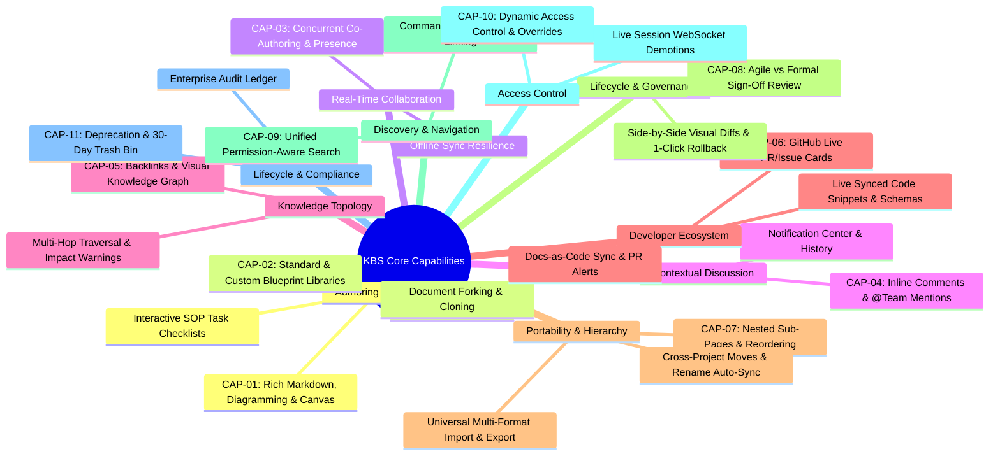
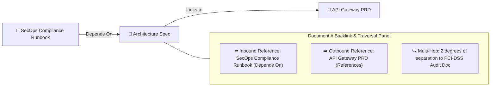

# Business Requirements Document (BRD)
## Enterprise Knowledge Base Platform (KBS)

---

### Document Control
- **Document Title:** Enterprise Knowledge Base Platform — Core Business Capabilities
- **Document Identifier:** BRD-KBS-003 (Part 3: Core Functional Capabilities)
- **Document Location:** `refined_brd/03_core_business_capabilities.md`
- **Target Audience:** Product Managers, Technical Leads, System Architects, UI/UX Designers, QA Engineers
- **Document Status:** Approved Baseline Business Specification
- **Version:** 2.5.0 (Pure Product/Business Specification)

---

## 1. Capability Architecture Overview

The Enterprise Knowledge Base Platform delivers eleven foundational business capabilities categorized into **Authoring & Media**, **Blueprint Governance**, **Real-Time Collaboration**, **Developer Ecosystem**, **Knowledge Topology**, **Lifecycle & Governance**, **Portability & Hierarchy**, **Search & Discovery**, **Access Control**, and **Security & Audit**:

---

## 2. Detailed Functional Capability Specifications

---

### CAP-01: Rich Structured Authoring, Diagramming & Canvas

#### 1. Business Purpose
Provide technical teams, product managers, and operations staff with an expressive, high-performance authoring environment that unifies structured Markdown, code-based diagram rendering, visual sketching, and operational checklists.

#### 2. Functional Requirements
* **Markdown-First Authoring:**
  - Full support for standardized structured typography: Headings (`H1`–`H4`), body paragraphs, blockquotes, callout boxes (Note, Tip, Warning, Critical), and horizontal dividers.
  - Interactive checklists (`- [ ]`, `- [x]`), bulleted lists, and ordered sequences.
  - Formatted tables with header alignment, column resizing, and row additions.
  - Fenced code blocks with language syntax highlighting (TypeScript, Python, SQL, JSON, YAML, Bash) and a one-click copy button.
* **Code-Based Diagramming (Mermaid):**
  - Native rendering of text-defined diagrams (flowcharts, sequence diagrams, state machines, entity-relationship diagrams, Gantt charts) directly within the document preview.
* **Visual Sketching & Freehand Canvas:**
  - Embedded visual whiteboard/drawing tool allowing authors to sketch freehand diagrams, architecture wireframes, and UI workflows directly within documents.
* **Rich Media & Asset Handling:**
  - Seamless inline image insertion with captions, zoom-to-expand preview, and file attachment chips for reference documents (PDF, ZIP), with strictly inherited document permissions.
* **Interactive Task Checklists & SOP Progress Tracking:**
  - Interactive checkboxes that can be checked/unchecked during operational runbooks in both draft and published views, with a real-time progress counter.

---

### CAP-02: Blueprint Libraries & Custom Template Governance

#### 1. Business Purpose
Standardize documentation excellence across all departments through curated blueprints while empowering teams to publish their own custom templates with appropriate administrative oversight.

#### 2. Functional Requirements
* **Standard Curated Blueprints:**
  - Curated out-of-the-box templates: *Architecture Decision Records (ADR)*, *Product Requirement Documents (PRD)*, *Engineering Runbooks / SOPs*, *Incident Postmortems / RCAs*, and *Team RFCs*.
* **Custom Blueprint Creation & Scoping:**
  - Authors and Project Leads can convert any high-quality document into a reusable blueprint.
  - Scoping options: *Project-Only*, *Department-Wide*, or *Company-Wide*.
  - Department-wide and company-wide blueprints require sign-off from a Department Head or System Admin.
* **Safe Document Duplication / Forking:**
  - Users can duplicate an existing document into another project with a clean reset of historical comment threads and re-scoped target permissions.

---

### CAP-03: Real-Time Concurrent Collaboration & Resilience

#### 1. Business Purpose
Eliminate authoring silos and save-collision friction by allowing distributed teams to write, edit, and review documentation simultaneously during meetings, incidents, and sprint planning.

#### 2. Functional Requirements
* **Conflict-Free Concurrent Co-Authoring:**
  - Multiple authorized users can simultaneously edit the same document without file locks, modal locks, or "last-write-wins" overwrites.
* **Presence & Peer Awareness:**
  - **Live Carets:** Real-time colored cursor indicators showing where other collaborators are typing, labeled with user name tags.
  - **Collaborator Header Avatars:** Real-time avatar badges displaying all users currently viewing or actively editing the page.
* **Connection & Offline Resilience:**
  - Clear visual indicator showing connection status (*Connected*, *Syncing*, *Offline Mode*).
  - Edits made during brief network interruptions are preserved locally and reconciled automatically upon reconnection with zero data loss.
* **Draft Auto-Save & Discard:**
  - Silent auto-save on every keystroke; author can intentionally click "Discard Draft" to revert to the current published baseline.

---

### CAP-04: Contextual Inline Commenting & Notification Hub

#### 1. Business Purpose
Anchor review conversations directly to relevant content, preventing discussions from fragmenting across disconnected messaging channels.

#### 2. Functional Requirements
* **Inline Text-Anchored Discussions:**
  - Highlight any text passage or table row to initiate a contextual discussion thread.
  - Comments remain visually tethered to the highlighted text passage as content above or below is edited.
* **Individual & Team Mentions:**
  - Support typing `@username` to mention specific colleagues or `@team-group` (e.g., `@security-reviewers`, `@backend-devs`) to alert entire functional units.
* **Thread Lifecycle & Resolution:**
  - Threaded replies, timestamps, and author attribution.
  - Open threads can be resolved and archived to the historical comment drawer, with an option to reopen if needed.
* **In-App Notification Center:**
  - Centralized notification bell displaying unread badges; clicking deep-links directly to the exact comment anchor.

---

### CAP-05: Knowledge Topology, Graph Traversal & Relationship Intelligence

#### 1. Business Purpose
Transform isolated documents into an interconnected enterprise knowledge network, allowing teams to visualize dependencies, navigate multi-hop pathways, and identify upstream/downstream impacts.

#### 2. Functional Requirements
* **Inline Reference Autocomplete:**
  - Typing `@` or `[[` triggers an instant popover search to link directly to other internal documents.
* **Inbound Backlinks ("Referenced By") Panel:**
  - Dedicated drawer displaying all other enterprise documents linking to the current page with title, path, and contextual snippet.
* **Interactive Knowledge Graph Canvas:**
  - Visual node-link map rendering documents as nodes and cross-references as connecting edges, with Department/Project color-coding and local neighborhood subgraphs (1-hop / 2-hop filters).
* **Upstream & Downstream Impact Warnings:**
  - Authors inspect downstream dependencies before editing, renaming, or deprecating a document, triggering automated alerts to affected downstream owners.
* **Link Health & Integrity:**
  - Automatic title synchronization across all referencing documents when a target document is renamed.

---

### CAP-06: Developer Tool & GitHub Ecosystem Integration

#### 1. Business Purpose
Bridge engineering codebases with company knowledge, eliminating documentation drift and maintaining bidirectional traceability between specifications and code repositories.

#### 2. Functional Requirements
* **Live GitHub PR & Issue Status Cards:**
  - Pasting GitHub PR or Issue links transforms them into live interactive cards showing status (`Merged`, `Open`, `Approved`), branch, and assignees, while automatically posting a reference backlink in GitHub.
* **Live Synced Code Snippets & Schemas:**
  - Authors embed code or schema files directly from GitHub repos that stay synchronized with `main` or locked to specific release tags.
* **Bidirectional Docs-as-Code Repository Sync:**
  - Sync GitHub `/docs` markdown files with KBS workspaces, and open automated Pull Requests in GitHub when non-engineers publish updates in KBS.
* **Automated "PR Merged" Documentation Alerts:**
  - Automatically alert document owners when linked GitHub PRs merge, prompting them to review and publish updated drafts.
* **Embedded Sprint & Issue Tracker Boards:**
  - Embed dynamic GitHub Issue or Jira sprint tables showing real-time ticket progress directly within PRDs and roadmaps.

---

### CAP-07: Document Portability, Hierarchy & Tree Management

#### 1. Business Purpose
Allow organizations to structure, reorganize, import, and export knowledge assets flexibly without breaking internal links or losing references.

#### 2. Functional Requirements
* **Arbitrarily Deep Sub-Document Nesting:**
  - Create parent-child document trees with automatic breadcrumb navigation and inherited permissions.
  - Drag-and-drop sidebar reordering for intuitive workspace organization.
* **Cross-Project / Cross-Department Movement:**
  - Transfer documents between projects with permission re-calculation summaries and guaranteed URL/link continuity.
* **Universal Document Import:**
  - Ingest Markdown (`.md`) and Microsoft Word (`.docx`) files into native KBS editable drafts.
* **Universal Document Export:**
  - Export published documents to formatted PDF (with automated table of contents), clean Markdown (`.md`), or standalone HTML.

---

### CAP-08: Document Lifecycle, Formal Sign-Off & Non-Destructive Versioning

#### 1. Business Purpose
Decouple fast, real-time drafting from authoritative milestones, supporting both agile direct publishing and formal multi-reviewer sign-off workflows with safe historical recovery.

#### 2. Functional Requirements
* **Dual-State Draft vs. Published Model:**
  - Working drafts remain private to editors while general readers continue viewing the verified published milestone.
* **Flexible Publishing Modes:**
  - **Agile Direct Publish:** Authors directly publish milestone snapshots (`v1.0`, `v2.0`).
  - **Formal Sign-Off Review:** Submit draft to designated sign-off reviewers (`IN_REVIEW`), who can approve or request changes (`CHANGES_REQUESTED`) before official publication.
* **Side-by-Side Visual Diffs:**
  - Compare any two versions side-by-side with color-coded additions (green) and deletions (red strikethrough).
* **Non-Destructive Point-in-Time Restore:**
  - Restoring an older version loads historical content into the active working draft; previous milestones remain permanently intact.

---

### CAP-09: Unified Permission-Aware Search & Quick Navigation

#### 1. Business Purpose
Enable employees to instantly find accurate institutional knowledge via keyboard shortcuts while guaranteeing zero access leaks.

#### 2. Functional Requirements
* **Universal Command Palette (`Ctrl+K` / `Cmd+K`):**
  - Instant search modal accessible anywhere across titles, body text, tables, and code snippets.
* **Zero-Leak Security Filtering:**
  - Search results, suggested links, and graph nodes strictly exclude any document for which the searching user does not have at least `Viewer` permissions.
* **Faceted Filtering & Deep-Linking:**
  - Filter queries by Department, Project, Author, Tag, and Date; clicking a result scrolls directly to the exact paragraph with a pulse highlight.

---

### CAP-10: Dynamic Access Control & Live Security Enforcement

#### 1. Business Purpose
Provide enterprise-grade access governance through automatic container inheritance while enabling safe, single-document cross-functional sharing and instant session security.

#### 2. Functional Requirements
* **Hierarchical Container Inheritance:**
  - Baseline permissions cascade automatically:
    $$\text{Organization} \longrightarrow \text{Department} \longrightarrow \text{Project} \longrightarrow \text{Document}$$
* **Single-Document Exception Sharing:**
  - Document Co-Owners can grant explicit individual or group access (`Co-Owner`, `Editor`, `Commenter`, `Viewer`) to specific documents without exposing parent folders.
* **Just-in-Time Access Requests:**
  - In-app request forms with one-click owner approval.
* **Live Session Role Demotion:**
  - Immediate WebSocket session downgrade (to read-only) or revocation during live collaboration without page reloads.

---

### CAP-11: Document Deprecation, Archival & Enterprise Audit Ledger

#### 1. Business Purpose
Ensure regulatory compliance, prevent employees from following outdated procedures, and maintain complete forensic visibility.

#### 2. Functional Requirements
* **Deprecation & Replacement Routing:**
  - Mark outdated documents as deprecated with prominent visual warning banners pointing to replacement documents.
* **30-Day Recoverable Trash Bin:**
  - Soft-deleted documents move to a 30-day trash bin for single-click restoration before permanent purge.
* **Enterprise Audit Ledger:**
  - Immutable append-only log capturing all critical lifecycle events (`DOC_CREATED`, `DOC_DELETED`, `PERMISSION_CHANGED`, `VERSION_PUBLISHED`, `DOC_EXPORTED`), searchable by Actor, Event Type, and Date Range.

---

## 3. Capability Delivery & Stakeholder Alignment Matrix

| Capability ID | Capability Name | Strategic Importance | Primary Stakeholders | Business Outcome |
| :--- | :--- | :---: | :--- | :--- |
| **CAP-01** | Structured Authoring & Canvas | Critical | Engineers, Tech Leads, Authors | Expressive, standardized content creation. |
| **CAP-02** | Blueprint Libraries & Governance | Critical | Dept Heads, PMs, Authors | Enterprise documentation consistency. |
| **CAP-03** | Real-Time Collaboration & Sync | Critical | All Employees, Remote Teams | Synchronized live co-authoring without lockouts. |
| **CAP-04** | Contextual Inline Comments | High | Reviewers, Legal, PMs | Contextual reviews; rapid feedback resolution. |
| **CAP-05** | Knowledge Topology & Impact Warnings| High | Architects, Knowledge Leads | Elimination of silos and broken dependencies. |
| **CAP-06** | Developer & GitHub Ecosystem | Critical | Engineers, Tech Leads, DevOps | Zero documentation drift; live repo sync. |
| **CAP-07** | Portability, Hierarchy & Moves | High | Project Leads, Authors | Flexible reorganization; Word/PDF portability. |
| **CAP-08** | Milestones, Review & Rollback | Critical | Tech Leads, Compliance | Authoritative SSOT releases with safe rollbacks. |
| **CAP-09** | Search & Quick Navigation | Critical | All Platform Users | Instant knowledge retrieval; zero access leakage. |
| **CAP-10** | Dynamic Access Control & Security | Critical | Admins, Security, Owners | Granular least-privilege security without friction. |
| **CAP-11** | Deprecation, Trash & Audit Ledger| High | SecOps, Admins, Auditors | Complete compliance, safe trash recovery, and auditability. |

---

*This document serves as Part 3 of the official Enterprise Knowledge Base Platform Business Requirements Document suite.*
*Next Document in Series: `refined_brd/04_access_control_and_permissions.md` (Part 4: Access Control, Permissions & Security Rules).*
