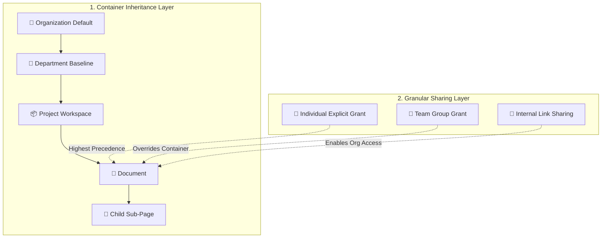
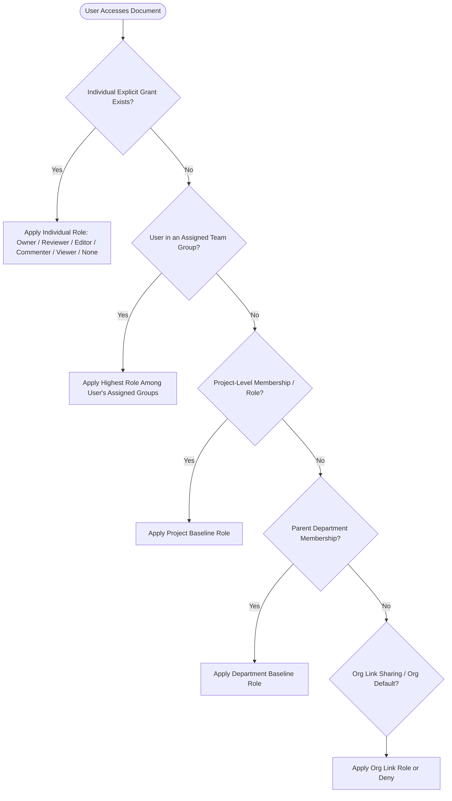
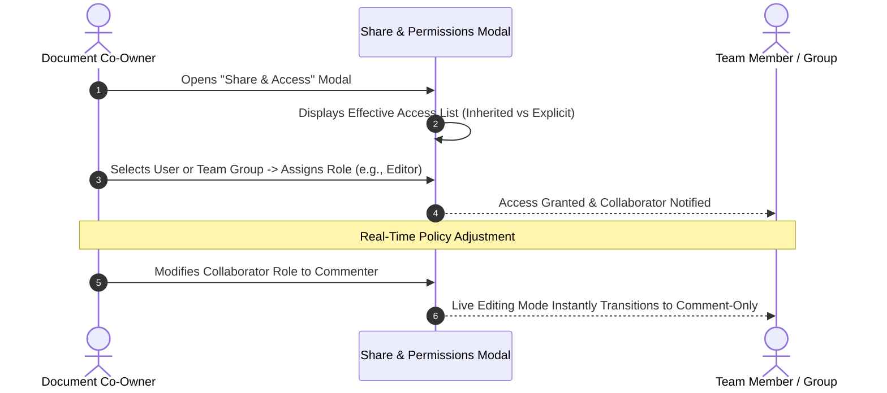
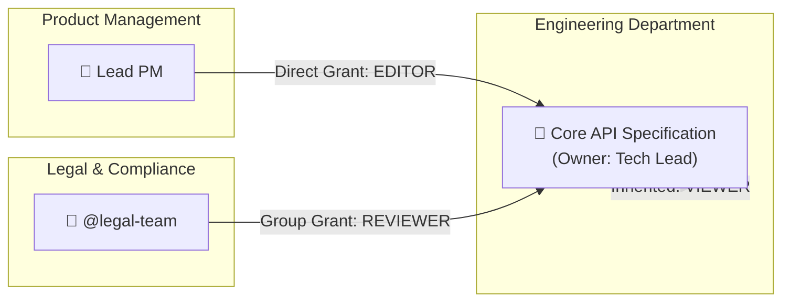

# Business Requirements Document (BRD)
## Enterprise Knowledge Base Platform (KBS)

---

### Document Control
- **Document Title:** Enterprise Knowledge Base Platform — Access Control & Permissions
- **Document Identifier:** BRD-KBS-004 (Part 4: Dynamic Access Control & Governance)
- **Document Location:** `refined_brd/04_access_control_and_permissions.md`
- **Target Audience:** Product Managers, Security Architects, Technical Leads, Compliance Officers
- **Document Status:** Approved Baseline Business Specification
- **Version:** 2.5.0 (Pure Product/Business Specification)

---

## 1. Access Control Philosophy & Business Objectives

### 1.1 The Business Challenge
Enterprise knowledge management requires a permission system that balances **strict organizational governance** with **frictionless cross-team collaboration**. 

Traditional systems force an unworkable trade-off:
* **Overly Rigid Folders:** Documents are trapped within department silos, requiring administrative friction or security exceptions just to share one specification with a cross-functional partner.
* **Over-Provisioned Access:** To avoid sharing friction, teams grant overly broad access to entire workspaces, leaking confidential or unreleased plans.

### 1.2 The Dynamic Access Control (DAC) Approach
The platform resolves this dilemma through **Dynamic Access Control (DAC)**:
1. **Container Inheritance:** Knowledge inherits natural baseline access down the organizational structure ($\text{Organization} \rightarrow \text{Department} \rightarrow \text{Project} \rightarrow \text{Document} \rightarrow \text{Sub-Document}$).
2. **Explicit Granular Overrides:** Document co-owners can grant explicit access to individual users or functional teams without altering parent project or department boundaries.
3. **Internal Link Sharing:** Co-owners can enable organizational link-sharing with configured baseline roles (e.g., view-only or commenting) to streamline company-wide discovery.

---

## 2. Permission Evaluation & Precedence Rules

When a user opens, edits, or searches for a document, the platform evaluates their effective permissions by progressing from the most specific explicit assignment up to the broadest container baseline.

### 2.1 Precedence Hierarchy
$$\text{Individual Explicit Grant} > \text{Team Group Grant} > \text{Project Grant} > \text{Department Baseline} > \text{Organization Default}$$

### 2.2 Resolution Logic Principles
1. **Individual Priority:** A direct explicit grant to an individual user always takes precedence over team group memberships or container defaults (e.g., if a user is in a group with `Viewer` access, but is directly granted `Editor` on a document, they receive `Editor` privileges).
2. **Group Synergy:** If a user belongs to multiple teams assigned to the same resource, they receive the highest privilege level among their assigned groups.
3. **Inherited Fallback:** In the absence of an explicit individual or group grant, the user seamlessly inherits access from the parent Project and Department.

---

## 3. Access Roles & Capability Entitlements

The platform provides six clear permission levels for documents and projects:

| System Capability | CO-OWNER | REVIEWER | EDITOR | COMMENTER | VIEWER | NONE (Restricted) |
| :--- | :---: | :---: | :---: | :---: | :---: | :---: |
| **Discover in Search & Navigation** | ✅ | ✅ | ✅ | ✅ | ✅ | ❌ *(Hidden)* |
| **Read Document Content & Metadata** | ✅ | ✅ | ✅ | ✅ | ✅ | ❌ |
| **View Backlinks & Knowledge Graph** | ✅ | ✅ | ✅ | ✅ | ✅ | ❌ |
| **Export Document to PDF / HTML / MD**| ✅ | ✅ | ✅ | ✅ | ✅ | ❌ |
| **View Discussion Threads** | ✅ | ✅ | ✅ | ✅ | ✅ *(Read-only)*| ❌ |
| **Add / Reply to Inline Comments** | ✅ | ✅ | ✅ | ✅ | ❌ | ❌ |
| **Resolve Discussion Threads** | ✅ | ✅ | ✅ | ✅ | ❌ | ❌ |
| **Toggle Interactive Runbook Checklists**| ✅ | ❌ | ✅ | ❌ | ❌ | ❌ |
| **Real-Time Concurrent Text Authoring**| ✅ | ❌ | ✅ | ❌ | ❌ | ❌ |
| **Embed Diagrams & GitHub Live Snippets**| ✅ | ❌ | ✅ | ❌ | ❌ | ❌ |
| **Submit Document for Formal Review** | ✅ | ❌ | ✅ | ❌ | ❌ | ❌ |
| **Approve / Sign-Off Formal Review** | ✅ | ✅ | ❌ | ❌ | ❌ | ❌ |
| **Direct Publish Milestone Snapshots**| ✅ | ❌ | ❌ | ❌ | ❌ | ❌ |
| **Save Document as Team Blueprint** | ✅ | ❌ | ❌ | ❌ | ❌ | ❌ |
| **Restore Document from History** | ✅ | ❌ | ❌ | ❌ | ❌ | ❌ |
| **Move Document Across Projects** | ✅ | ❌ | ❌ | ❌ | ❌ | ❌ |
| **Manage Document Sharing & Access** | ✅ | ❌ | ❌ | ❌ | ❌ | ❌ |
| **Soft-Delete Document to Trash** | ✅ | ❌ | ❌ | ❌ | ❌ | ❌ |
| **Inspect Document Audit History** | ✅ | ❌ | ❌ | ❌ | ❌ | ❌ |

---

## 4. Sharing & Access Delegation Workflows

### 4.1 Sharing Primitives
* **Direct People Sharing:** Add colleagues by name or email with a designated role (`Co-Owner`, `Reviewer`, `Editor`, `Commenter`, `Viewer`).
* **Team Group Sharing:** Assign access to predefined functional teams (e.g., `@backend-engineers`, `@product-design`, `@legal-counsel`).
* **Internal Shareable Links:** Generate an internal link allowing anyone within the authenticated enterprise to view or comment on the document without individual manual invites.

### 4.2 Effective Access Transparency
To eliminate confusion over why a colleague has or lacks access, the sharing interface clearly indicates the **source of a user’s access**:
* *"Alice — Editor (Directly assigned on this document)"*
* *"Bob — Reviewer (Assigned as Designated Sign-off Reviewer)"*
* *"Charlie — Commenter (Member of assigned team @legal-counsel)"*
* *"Dana — Viewer (Inherited from Engineering Department)"*

---

## 5. Live Collaboration Security & Real-Time Enforcement

To ensure enterprise data protection, permission changes take effect **immediately during live sessions**:
* **Instant Session Transition:** If an active contributor’s role is changed while they have the document open (e.g., demoted from `Editor` to `Commenter` or `Viewer`), their editing interface immediately switches to read-only/comment-only mode via real-time WebSocket push without requiring a page reload.
* **Instant Revocation:** If access is removed completely (`None`), the active document session is immediately terminated, and the user is redirected away with a polite notification.

---

## 6. Real-World Business Scenarios

### Scenario A: Cross-Functional Specification
* **Context:** An Engineering Tech Lead creates an API architecture document inside the private Engineering workspace.
* **Access Model:**
  * Engineering team members inherit baseline access.
  * The Lead Product Manager is added directly as an **Editor** to co-author user stories.
  * The Legal Team is added as **Reviewers** to inspect diffs and sign off on data compliance.
* **Result:** Seamless cross-functional contribution without exposing unrelated engineering repositories to outside departments.

### Scenario B: Sensitive / Confidential Planning
* **Context:** A project team drafts documentation regarding an unannounced reorganization or acquisition.
* **Access Model:**
  * Access is restricted to explicitly invited individuals and leadership groups.
  * General department inheritance is bypassed, keeping the document completely invisible from search and graph discovery for non-members.

---

*This document serves as Part 4 of the official Enterprise Knowledge Base Platform Business Requirements Document suite.*
*Next Document in Series: `refined_brd/05_key_business_workflows 2.md` (Part 5: Complete Business Workflows).*
