# Business Requirements Document (BRD)
## Enterprise Knowledge Base Platform (KBS)

---

### Document Control
- **Document Title:** Enterprise Knowledge Base Platform — End-to-End Business Workflows & Operational Scenarios
- **Document Identifier:** BRD-KBS-005 (Part 5: Complete Business Workflows)
- **Document Location:** `refined_brd/05_key_business_workflows 2.md`
- **Target Audience:** Product Management, Engineering Leadership, System Architects, Quality Assurance, Security & Compliance, Executive Stakeholders
- **Document Status:** Approved Baseline Business Specification
- **Version:** 2.5.0 (Pure Business/Product Specification)

---

## 1. Overview & Workflow Architecture

This document serves as the **definitive operational guide and business workflow specification** for the Enterprise Knowledge Base Platform (KBS). It details the end-to-end interactions between human organizational actors, governance policies, and platform subsystems.

To eliminate operational blindspots, the platform’s business capabilities are organized into **13 comprehensive workflow domains**:

```mermaid
mindmap
  root((Enterprise KBS Workflows))
    Inception & Templates
      WF-01: Creation & Blueprint Library
      Custom Blueprint Governance
      Document Cloning / Duplication
    Rich Authoring & Assets
      WF-02: Structured Formatting & Media
      Embedded Mermaid & Freehand Canvas
      Interactive Checklists & Discard Draft
    Real-Time Collaboration
      WF-03: Live Co-Authoring & Presence
      Conflict-Free Reconciliation
      Offline Disconnect Resilience
    Contextual Discussions
      WF-04: Inline Feedback & Anchoring
      Individual & Group @Mentions
      Thread Resolution & Reopening
    Governance & Publishing
      WF-05: Agile vs Formal Approvals
      Change Requests & Sign-Offs
      Parallel Revision Drafts
    Knowledge Topology
      WF-06: Bidirectional Backlinks
      Visual Knowledge Graph Explorer
      Multi-Hop Impact Warnings
    Developer Integrations
      WF-07: GitHub PR & Issue Cards
      Live Code Snippet Sync
      Docs-as-Code Repo Sync
      PR Merged Auto-Prompts
      Embedded Task / Issue Boards
    Dynamic Access Control
      WF-08: Container Inheritance
      Single-Doc Exception Sharing
      Just-in-Time Access Requests
      Live WebSocket Role Demotion
    Structure & Portability
      WF-09: Nested Child Pages
      Cross-Project Moves & Link Safety
      Title Renaming & Reference Auto-Sync
      Import (MD/Docx) & Export (PDF/HTML)
    Version Recovery
      WF-10: Time-Capsule Snapshot Ledger
      Side-by-Side Visual Diff
      Non-Destructive Safe Rollback
    Lifecycle & Archival
      WF-11: Deprecation Pointers
      30-Day Soft-Delete Trash Bin
      Permanent Purge vs Compliance Archive
    Search & Navigation
      WF-12: Universal Command Bar (Ctrl+K)
      Zero-Leak Security Filtering
      Deep-Link Jump to Paragraph
    Audit & Compliance
      WF-13: In-Doc Activity Timeline
      Immutable Enterprise Audit Ledger
```

---

---

## 2. WF-01: Document Inception, Blueprint Templates & Custom Template Governance

### 2.1 Business Purpose
Ensure institutional knowledge creation is organized from the moment of inception, standardizing documentation quality across all departments through curated blueprints while allowing teams to define their own custom templates without administrative overhead.

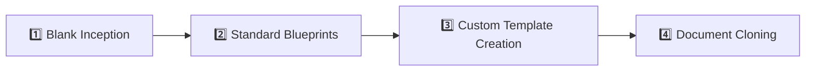

---

### 2.2 Phase-by-Phase Breakdown

#### 🟢 Stage 1: Blank Document Inception & Placement
**Goal:** An employee starts a new document inside a project workspace with clear organizational placement and default permissions.

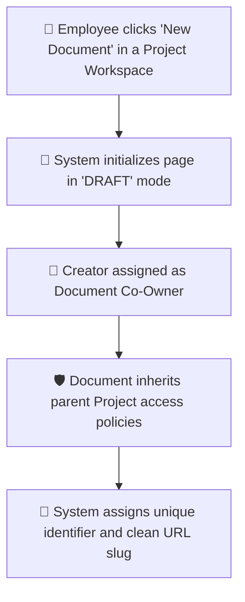

* **What the User Does:** The user navigates to their department project (e.g., `Engineering > Backend Services`) and clicks **"New Document"**.
* **How the System Helps:** 
  * The document starts in private **Draft Mode** (not discoverable by general readers).
  * Creator is designated as **Co-Owner** with full management authority.
  * Access rights naturally cascade down from the parent Project container.

---

#### 📋 Stage 2: Standard Blueprint Selection & Pre-Fill
**Goal:** Standardize specifications, policies, and runbooks across teams using pre-configured blueprints.

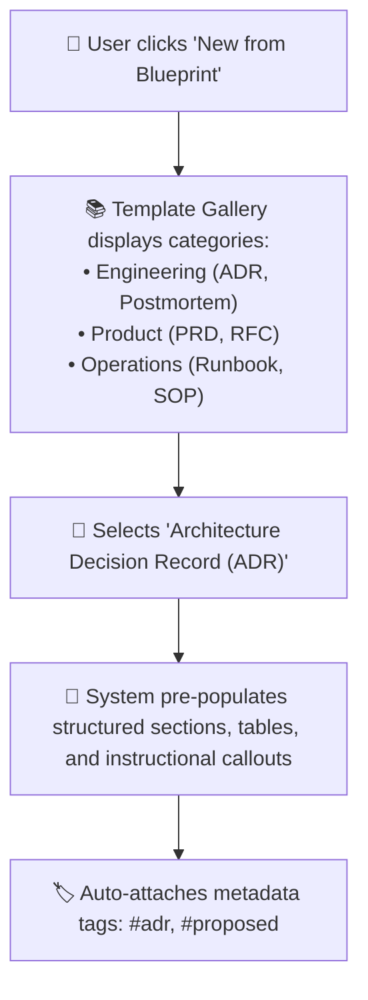

* **What the User Does:** Selects a standardized blueprint (e.g., *Architecture Decision Record* or *Incident Postmortem*).
* **How the System Helps:** Pre-populates standard headings, instructional prompt boxes, checklist boilerplate, and default tags.

---

#### 🛠️ Stage 3: Custom Blueprint / Template Creation & Governance
**Goal:** Empower teams to turn any high-performing document into a reusable template without IT tickets.

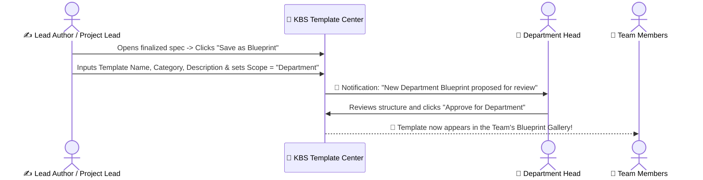

* **What the User Does:** A Tech Lead creates a standard release runbook, clicks **"Save as Blueprint"**, and defines its availability scope (*Project-Only*, *Department-Wide*, or *Company-Wide*).
* **Business Governance Rules:**
  * Project Leads can publish *Project-level* templates immediately.
  * *Department-wide* or *Company-wide* templates require sign-off from a Department Head or System Admin.
  * Updating a blueprint never modifies previously created historical documents.

---

#### 📑 Stage 4: Document Duplication & Safe Forking
**Goal:** Clone an existing operational spec or runbook into a new project without copying historical clutter.

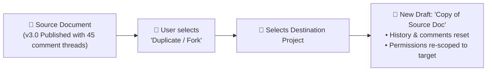

* **How It Protects the Organization:**
  * Cloned copies start as a clean working draft (`v1.0-draft`).
  * Historical audit trails and old resolved comment threads remain isolated in the source document.
  * Permissions are cleanly re-scoped to the destination container.

---

---

## 3. WF-02: Rich Authoring, Embedded Assets & Canvas Diagramming

### 3.1 Business Purpose
Provide cross-functional teams with an expressive, distraction-free environment that unifies structured text, code-based diagram rendering, freehand whiteboards, media assets, interactive checklists, and draft safety.

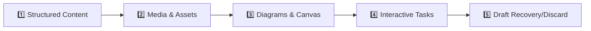

---

### 3.2 Phase-by-Phase Breakdown

#### ✍️ Stage 1: Structured Markdown & Code Blocks
* **What the User Does:** Authors rich specifications using headings (`H1`–`H4`), callout banners (Note, Tip, Warning, Critical), structured data tables, and fenced code blocks.
* **How the System Helps:** 
  * Fenced code blocks feature automatic syntax highlighting (TypeScript, Python, SQL, JSON, YAML, Bash) and a one-click copy button.
  * Tables support dynamic column resizing, row additions, and header alignment.

---

#### 🖼️ Stage 2: Media & File Attachment Governance
**Goal:** Seamlessly embed images, diagrams, and PDF reference files while strictly enforcing access security and storage limits.

```mermaid
flowchart TD
    DropFile["👤 User drags & drops file (PNG, SVG, PDF, ZIP) into document"] --> CheckFile{"System File Validation"}
    CheckFile -->|Executables (.exe, .sh)| Block["🛑 Upload Blocked (Security Policy)"]
    CheckFile -->|Over Size Limit (>50MB)| SizeWarn["⚠️ Warning: File exceeds 50MB limit"]
    CheckFile -->|Valid Asset| Ingest["💾 Asset uploaded & encrypted in storage"]
    Ingest --> BindDoc["🔒 Asset access permissions locked to parent document"]
    BindDoc --> Render["🖼️ Interactive inline preview or downloadable attachment chip rendered"]
```

* **Business Rules:**
  * **Strict Permission Inheritance:** Media files cannot be accessed via direct public URL; they strictly inherit the document's access control rules.
  * **Orphan Cleanup:** When an image is deleted from a draft and the version is published, unreferenced assets are flagged for storage reclamation.

---

#### 📊 Stage 3: Embedded Code-Based Diagrams (Mermaid) & Visual Freehand Canvas
**Goal:** Allow engineers and architects to embed dynamic text-defined diagrams (flowcharts, sequence diagrams, ERDs) or draw visual wireframe sketches directly within documents.

```mermaid
sequenceDiagram
    actor Author as ✍️ Architect
    participant Editor as 📝 KBS Editor
    participant Render as 📊 Diagram Engine

    Author->>Editor: Inserts "Diagram Block" (Mermaid or Freehand Canvas)
    Author->>Editor: Types flowchart syntax: `graph TD; A-->B;`
    Editor->>Render: Parse and validate syntax
    Render-->>Editor: Render crisp vector diagram inline
    Note over Author,Editor: Any team member with Edit access can click to modify the diagram!
```

* **Resilience Rule:** If diagram syntax contains a typo, the system highlights the exact faulty line with a helpful error hint rather than breaking the page.

---

#### ☑️ Stage 4: Interactive Task Checklists & SOP Progress Tracking
**Goal:** Support engineering runbooks and operational checklists with interactive checkboxes.

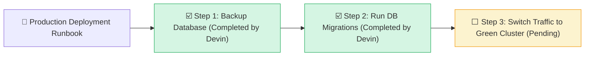

* **How It Works:** In both draft editing and published read-only runbook views, authorized operators can check items off during an operation. A progress meter at the top of the document displays real-time execution status (e.g., *"2 of 3 tasks completed (66%)"*).

---

#### 🛑 Stage 5: Draft Auto-Save, Recovery & Intentional Discard
**Goal:** Protect authors from data loss while giving them an easy way to abandon experimental draft edits.

```mermaid
flowchart TD
    subgraph AutoSaveFlow [Background Safety]
        Typing["✍️ User types in Draft"] --> SilentSave["💾 System silently auto-saves every keystroke"]
        SilentSave --> Crash["⚡ Browser tab closes unexpectedly"]
        Crash --> Reopen["🟢 Re-opening restores exact state: 'Draft recovered'"]
    end

    subgraph DiscardFlow [Intentional Revert]
        ExpEdits["👤 Author makes experimental edits on v2.0"] --> Regret["❌ Author decides not to keep changes"]
        Regret --> ClickDiscard["👤 Clicks 'Discard Draft Changes'"]
        ClickDiscard --> Confirm["⚠️ System asks: 'Permanently revert to published v2.0?'"]
        Confirm --> Reverted["✅ Draft buffer cleanly reset to v2.0 baseline"]
    end
```

---

---

## 4. WF-03: Real-Time Concurrent Multi-User Collaboration & Resilience

### 4.1 Business Purpose
Enable distributed teams to simultaneously write, review, and plan specifications during live meetings, incidents, and sprints without file locking, lost keystrokes, or merge conflicts.

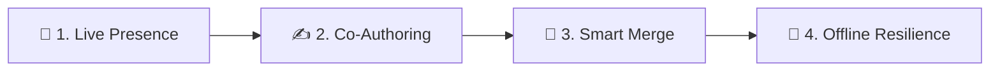

---

### 4.2 Phase-by-Phase Breakdown

#### 🟢 Stage 1: Live Peer Presence & Cursor Tracking
* **What Users See:** Header avatars display all colleagues currently viewing or editing the document. Colored, named cursor flags follow collaborators in real time.

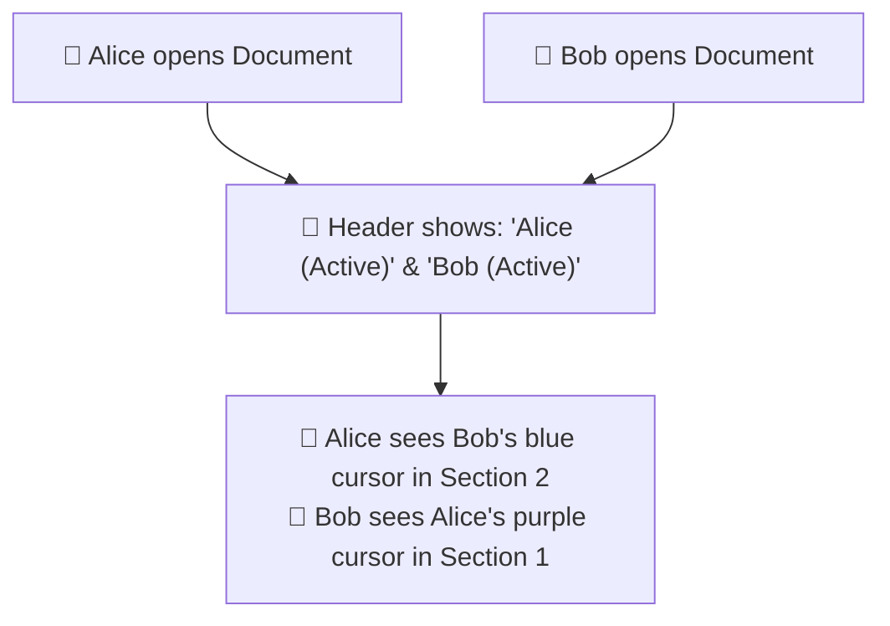

---

#### ✍️ Stage 2: Simultaneous Typing & Real-Time Sync
* **What Happens:** Multiple users type in different sections of the same specification at the exact same moment. Changes synchronize across all connected screens in sub-seconds with zero lag and no manual "Save" button.

---

#### 🤝 Stage 3: Conflict-Free Editing (Smart Keystroke Blending)
* **Goal:** When two users type in the exact same paragraph or table cell simultaneously, neither person's work is overwritten.

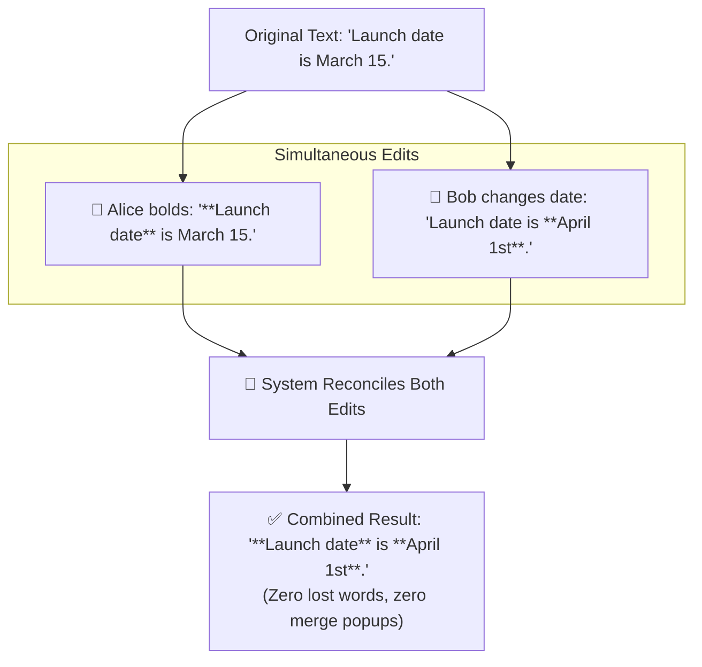

---

#### 📶 Stage 4: Spotty Internet & Offline Resilience
* **Goal:** Keep users productive during Wi-Fi drops (e.g., traveling, flights, spotty office networks).

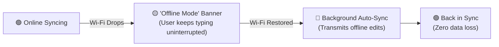

---

---

## 5. WF-04: Contextual Discussions, Mentions & Feedback Lifecycle

### 5.1 Business Purpose
Keep technical and policy feedback anchored directly to relevant content, preventing discussions from fragmenting across disconnected messaging channels or emails.

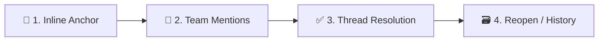

---

### 5.2 Phase-by-Phase Breakdown

#### 💬 Stage 1: Inline Contextual Comment Creation
* **What the User Does:** Highlights a sentence, code block, or table row and clicks **"Add Comment"**.
* **How the System Helps:** The discussion thread stays visually tethered to the highlighted passage even as paragraphs above or below are edited.

---

#### 📣 Stage 2: Individual & Team Group Mentions (`@user`, `@team`)
**Goal:** Instantly alert specific colleagues or entire functional units with a single comment.

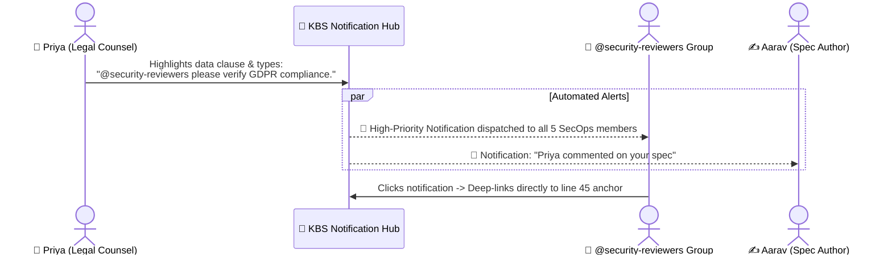

---

#### ✅ Stage 3: Thread Resolution & Re-opening
* **Resolution:** Once feedback is incorporated, the author or commenter clicks **"Resolve Comment"**. The thread smoothly tucks away from the main canvas into the resolved history drawer.
* **Audit & Re-opening:** Any resolved thread can be viewed in the **"Comment History"** panel and reopened if follow-up discussion is needed.

---

---

## 6. WF-05: Document Review, Governance & Formal Publishing Lifecycle

### 6.1 Business Purpose
Decouple fast, behind-the-scenes drafting from authoritative enterprise releases, allowing teams to choose between agile direct publishing and formal managerial/peer sign-off workflows.

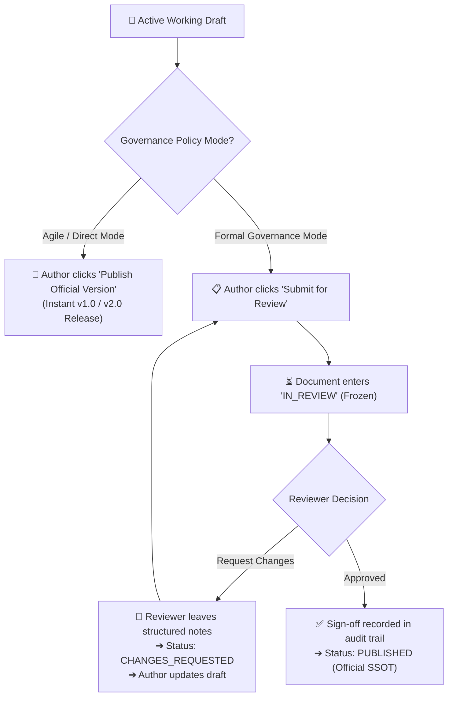

---

### 6.2 Phase-by-Phase Breakdown

#### 🚀 Stage 1: Agile Direct Publishing (Standard Teams)
* **What the User Does:** When a draft is ready, an authorized author clicks **"Publish Version"**, enters a version title (e.g., `"v1.0 - Initial Architecture"`), and writes a brief changelog.
* **Outcome:** System captures an immutable snapshot, marks it as the official single source of truth, and makes it available to all authorized company viewers.

---

#### 📋 Stage 2: Formal Review & Sign-Off Chain (Governance & Compliance)
* **What Happens:**
  1. Author clicks **"Submit for Review"** and selects required configured sign-off user(s) (e.g., Editor, Department Head, Security Officer, Legal Team, etc).
  2. The working draft freezes into `IN_REVIEW` status.
  3. Reviewers review the visual diff against the last published release.
  4. If revisions are required, the reviewer clicks **"Request Changes"** with mandatory feedback items $\rightarrow$ Status changes to `CHANGES_REQUESTED`.
  5. Once all required approvals are submitted, the system stamps the publication as approved with full approver attribution.

---

#### 🔄 Stage 3: Active Working Drafts Behind Published Documents
**Goal:** Allow authors to make updates to an existing policy or runbook without confusing employees who are reading the live version.

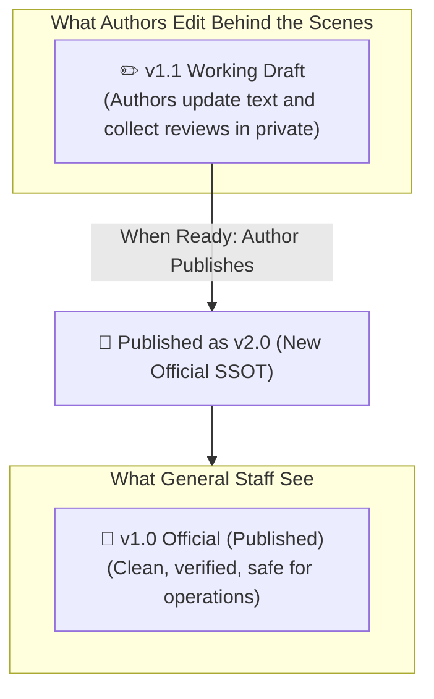

---

---

## 7. WF-06: Knowledge Connections, Backlinks & Impact Analysis

### 7.1 Business Purpose
Prevent broken dependencies and operational silos by automatically tracking cross-document citations, rendering visual relationship maps, and warning authors before they modify or deprecate foundational documents.

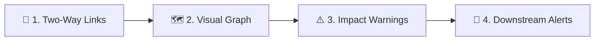

---

### 7.2 Phase-by-Phase Breakdown

#### 🔗 Stage 1: Automatic Two-Way Backlinks ("Referenced By" Drawer)
* **What the User Does:** An author types `@` or `[[` to reference another document (e.g., linking to the *Security Authentication Policy*).
* **How the System Helps:** The *Security Authentication Policy* automatically displays an incoming reference in its **"Referenced By"** side drawer, showing the citing document's title, department path, and a contextual preview snippet.

---

#### 🗺️ Stage 2: Interactive Visual Knowledge Graph & Local Neighborhoods
* **What Users See:** An interactive node-link map representing the entire organizational knowledge base.
* **Capabilities:**
  * **Global Explorer:** Zoom, pan, and filter nodes by Department and Project.
  * **Local Neighborhood Subgraph:** Focus on the current document and view its 1-hop or 2-hop immediate dependencies.

```mermaid
flowchart TD
    CentralNode["📄 Core Payment Specification"]
    CentralNode --> Leaf1["📄 Payment Gateway Guide (Engineering)"]
    CentralNode --> Leaf2["📄 PCI-DSS Compliance Spec (SecOps)"]
    CentralNode --> Leaf3["📄 Mobile Checkout PRD (Product)"]

    style CentralNode fill:#2E86C1,color:#fff,stroke:#1B4F72,stroke-width:2px
```

---

#### ⚠️ Stage 3: Upstream/Downstream Breaking Change Warnings
**Goal:** Force authors to check who relies on a specification before making breaking changes or deprecating it.

```mermaid
sequenceDiagram
    actor Author as ✍️ Policy Owner
    participant App as 📱 KBS Impact Engine
    actor MobileLead as 📱 Mobile Lead (Downstream)
    actor SecLead as 🛡️ SecOps Lead (Downstream)

    Author->>App: Clicks "Mark as Deprecated" on "Auth Token Specification"
    App->>App: Scans Knowledge Graph for downstream dependencies
    App-->>Author: ⚠️ Safety Modal: "3 documents depend on this spec:<br/>1. Mobile SDK Guide<br/>2. Server Login Runbook"
    Author->>App: Enters Replacement Spec Link ("OAuth2 Spec v2.0") & confirms
    
    par Automated Downstream Alerts
        App-->>MobileLead: 🔔 High-Priority Alert: "Auth Token Spec deprecated. Please update Mobile SDK Guide."
        App-->>SecLead: 🔔 High-Priority Alert: "Auth Token Spec deprecated. Please update Server Login Runbook."
    end
```

---

---

## 8. WF-07: Developer Tools & GitHub Ecosystem Integration

### 8.1 Business Purpose
Bridge the gap between engineering repositories and company-wide knowledge, eliminating "documentation drift" by integrating with GitHub, GitLab, and Jira.

```mermaid
flowchart LR
    A["🎴 1. Live PR/Issue Cards"] --> B["💻 2. Live Code Sync"]
    B --> C["🔄 3. Docs-as-Code Sync"]
    C --> D["🔔 4. PR-Merged Prompts"]
    D --> E["📋 5. Issue Tracker Boards"]
```

---

### 8.2 Phase-by-Phase Breakdown

#### 🎴 Stage 1: Live GitHub PR & Issue Cards with Bi-directional Traceability
**Goal:** Seamlessly link documents to code changes and provide instant live status indicators.

```mermaid
flowchart LR
    PasteLink["👤 Author pastes link:<br/>`github.com/acme/backend/pull/142`"] --> Transform["✨ KBS converts to Interactive Live Card"]
    Transform --> LiveCard["🎴 Smart Card Displays:<br/>• PR #142: 'Migrate to Stripe 3DS'<br/>• Status: 🟢 MERGED<br/>• Author: @alex | Reviewers: @sarah<br/>• Branch: `feature/stripe-3ds`"]
    Transform --> PostBacklink["🤖 System auto-comments on GitHub PR:<br/>'Referenced in KBS Spec: Payment Gateway v2.0'"]
```

* **Knowledge Graph Connection:** GitHub Pull Requests and Repositories appear as connected external nodes in the KBS visual graph.

---

#### 💻 Stage 2: Live Synced Code Snippets & Schemas (Drift Prevention)
**Goal:** Prevent stale architecture documentation by embedding live snippets that stay synchronized with GitHub repositories.

```mermaid
sequenceDiagram
    actor Author as ✍️ Tech Lead
    participant KBS as 📱 KBS Editor
    participant GitHub as 🐙 GitHub Repository

    Author->>KBS: Inserts "Live GitHub Snippet Block" pointing to `backend/auth/rules.json#L15-L35`
    KBS->>GitHub: Fetch syntax-highlighted code from `main` branch
    KBS-->>Author: Renders live code block with badge: "Synced with GitHub main • Last commit 2h ago"
    
    Note over KBS,GitHub: When code in GitHub changes, the KBS block reflects updates automatically!
```

* **Tag Locking Option:** Authors can lock a code snippet to an official Git Release Tag (e.g., `release-v3.2.0`) to preserve an exact architectural baseline.

---

#### 🔄 Stage 3: Bidirectional "Docs-as-Code" Repository Sync
**Goal:** Enable engineers to write Markdown in VS Code/Git while allowing non-engineers to read, review, and comment in the KBS Web Platform.

```mermaid
flowchart TD
    subgraph GitToKBS [1. GitHub ➔ KBS Synchronization]
        PRMerge["🐙 Engineer merges PR touching `/docs/*.md` in GitHub"] --> AutoIngest["🤖 KBS automatically imports changes and publishes new version milestone"]
    end

    subgraph KBSToGit [2. KBS ➔ GitHub Synchronization]
        WebEdit["✍️ PM / Technical Writer edits document in KBS Web UI"] --> ClickSync["👤 Clicks 'Publish & Sync to GitHub'"]
        ClickSync --> AutoPR["🤖 KBS opens an automated Pull Request in the target GitHub repository for code review"]
    end
```

---

#### 🔔 Stage 4: Automated "PR Merged" Documentation Alerts & Prompts
**Goal:** Remind engineers to update documentation when code goes live.

```mermaid
sequenceDiagram
    actor Dev as 👨‍💻 Engineer (Alex)
    participant GitHub as 🐙 GitHub
    participant KBS as 📱 KBS Lifecycle Engine
    actor Owner as ✍️ Spec Owner (Sarah)

    Dev->>GitHub: Merges PR #204 ("Payment Webhook Idempotency") into `main`
    GitHub-->>KBS: Webhook Event: PR Merged (Linked to Spec Doc #88)
    KBS-->>Owner: 🔔 Proactive Alert: "GitHub PR #204 has merged. 'Payment Gateway Spec' has an active draft. Review & publish v2.0?"
    Owner->>KBS: Clicks notification -> Reviews draft -> Publishes v2.0 SSOT!
```

---

#### 📋 Stage 5: Embedded Sprint & Issue Tracker Boards (GitHub / Jira / Linear)
* **What the User Does:** Authors embed an interactive task board or issue table inside a PRD or Roadmap document.
* **How It Works:** The table dynamically reflects live sprint tickets, showing real-time issue status (`In Progress`, `Code Review`, `Done`), assignees, and target milestones directly from GitHub Issues or Jira.

---

---

## 9. WF-08: Dynamic Access Control, Sharing & Live Session Security

### 9.1 Business Purpose
Provide enterprise-grade access governance through automatic container inheritance while empowering document owners to safely share individual documents cross-functionally without over-provisioning access to entire department workspaces.

```mermaid
flowchart LR
    A["🏢 1. Smart Defaults"] --> B["👥 2. Single-Doc Sharing"]
    B --> C["🙋 3. Request Access"]
    C --> D["⚡ 4. Live Security Push"]
```

---

### 9.2 Phase-by-Phase Breakdown

#### 🏢 Stage 1: Smart Container Defaults & Inheritance
* **Precedence Hierarchy:**
  $$\text{Individual Explicit Grant} > \text{Team Group Grant} > \text{Project Grant} > \text{Department Baseline} > \text{Organization Default}$$
* **Default Behavior:** All members of a department inherit baseline access to department-bound projects and documents without requiring manual invites.

---

#### 👥 Stage 2: Safe Single-Document Sharing (No Over-Sharing)
**Goal:** Share one sensitive document with a cross-functional partner without exposing the rest of your private departmental workspace.

```mermaid
flowchart LR
    subgraph PrivateEngDept [🔒 Private Engineering Workspace]
        DocA["📄 Unreleased Core Architecture"]
        DocB["📄 Vendor Integration Contract"]
    end

    LegalUser["👩 Priya (Legal Counsel)"]

    DocB -->|Owner grants: COMMENTER| LegalUser
    DocA -.->|100% Hidden & Inaccessible| LegalUser
```

---

#### 🙋 Stage 3: Just-In-Time "Request Access" Workflow
**Goal:** An employee who navigates to a restricted document link can request permission directly, and the owner can approve it in one click without IT helpdesk tickets.

```mermaid
sequenceDiagram
    actor Employee as 👤 Employee (Needs Access)
    participant Screen as 📱 Access Screen
    actor Owner as 👑 Document Co-Owner

    Employee->>Screen: Clicks link -> Sees "Access Required" screen
    Employee->>Screen: Selects role ("Viewer") + inputs justification reason
    Screen-->>Owner: 🔔 In-App & Email Alert: "Employee requested Viewer access. Approve?"
    Owner->>Screen: Clicks "Approve" (1-Click)
    Screen-->>Employee: 🌟 Access granted! Document opens instantly.
```

---

#### ⚡ Stage 4: Live Session Security Enforcement (Real-Time Push)
**Goal:** If a collaborator's access is demoted or revoked during a live meeting, the change takes effect immediately without requiring a page refresh.

```mermaid
sequenceDiagram
    actor Owner as 👑 Document Owner
    participant App as 📱 KBS Access Engine
    actor Collab as 👨‍💻 Active Collaborator (Bob)

    Note over Collab: Bob is actively typing in the document as an EDITOR
    Owner->>App: Opens Share Modal -> Changes Bob's role to "Viewer"
    App->>App: Update permission record
    App-->>Collab: ⚡ Real-Time WebSocket Session Downgrade
    Note over Collab: Bob's editor canvas instantly switches to Read-Only mode with toast notification: "Your access is now View-Only"
```

---

---

## 10. WF-09: Document Hierarchy, Movement, Renaming & Portability

### 10.1 Business Purpose
Allow organizations to reorganize their document structures, move pages between projects, rename titles, and import/export files without breaking internal links or losing references.

```mermaid
flowchart LR
    A["🌲 1. Sub-Doc Nesting"] --> B["📦 2. Cross-Project Move"]
    B --> C["🏷️ 3. Rename Auto-Sync"]
    C --> D["📤 4. Import / Export"]
```

---

### 10.2 Phase-by-Phase Breakdown

#### 🌲 Stage 1: Sub-Document (Child Page) Nesting & Tree Reordering
* **What the User Does:** Drags documents in the sidebar navigation to reorder them or nests child pages beneath a parent document (e.g., Parent: *API Guide* $\rightarrow$ Children: *Authentication*, *Endpoints*, *Rate Limits*).
* **How the System Helps:** Generates dynamic parent-child breadcrumbs and cascades permissions down the sub-tree.

---

#### 📦 Stage 2: Moving Documents Across Projects or Departments
**Goal:** Safely transfer documents after a team re-organization without breaking incoming links.

```mermaid
flowchart TD
    SelectMove["👤 Owner selects 'Move Document'"] --> ChooseDest["📁 Picks Destination Project"]
    ChooseDest --> ImpactReview["⚠️ System displays Permission Impact Summary:<br/>'3 users will lose access based on target project rules.<br/>1 explicit user grant will be preserved.'"]
    ImpactReview --> ConfirmMove["👤 Owner clicks 'Confirm Move'"]
    ConfirmMove --> RerouteLinks["🔗 System updates container path; all historical URLs seamlessly redirect"]
```

---

#### 🏷️ Stage 3: Document Renaming & Enterprise-Wide Title Auto-Sync
* **The Problem:** In legacy wikis, renaming a document breaks links or leaves outdated link text across dozens of other documents.
* **How KBS Solves It:** When an author renames *"Payment Spec v1"* to *"Enterprise Payment Gateway Specification"*, the system automatically updates the link title chip across all documents in the company.

---

#### 📤 Stage 4: Document Import & Universal Multi-Format Export
* **Importing:** Teams can import existing Markdown (`.md`) or Word (`.docx`) files directly into any project workspace as ready-to-edit drafts.
* **Exporting:** Users can export published documents to:
  * **Formatted PDF** (with automatic table of contents, company header, and page numbers).
  * **Clean Markdown (`.md`)** for external engineering sharing.
  * **Standalone HTML** for offline viewing.

---

---

## 11. WF-10: Safe Version History, Visual Comparison & Non-Destructive Recovery

### 11.1 Business Purpose
Protect institutional knowledge from accidental deletions or corrupted edits by providing time-capsule version snapshots, visual side-by-side diffs, and non-destructive rollbacks.

```mermaid
flowchart LR
    A["📜 1. Time-Capsule Snapshots"] --> B["🔍 2. Visual Diff"]
    B --> C["⏪ 3. Non-Destructive Restore"]
    C --> D["🌟 4. New Milestone (v4.0)"]
```

---

### 11.2 Phase-by-Phase Breakdown

#### 📜 Stage 1: Time-Capsule Snapshot Ledger
* **What the System Does:** Every official publication creates an immutable version record (`v1.0`, `v2.0`, `v3.0`) capturing author attribution, date/time, frozen content, and changelog notes. Historical version records are permanent and can never be altered or deleted.

---

#### 🔍 Stage 2: Side-by-Side Visual Diff Comparison
* **What the User Sees:** A side-by-side comparison screen displaying exact additions (highlighted in green), deletions (highlighted in red strikethrough), and modified paragraphs between any two versions.

```mermaid
flowchart TD
    SelectVersions["👤 Author selects: 'Compare v3.0 vs v2.0'"] --> RenderDiff["🖥️ Visual Diff Comparison Window"]
    RenderDiff --> Highlights["🟢 Green: New clauses added in v3.0<br/>🔴 Red: Sentences deleted from v2.0<br/>⚪ Grey: Unchanged content"]
```

---

#### ⏪ Stage 3: Safe Non-Destructive Restoration Protocol
**Goal:** Restore an earlier good version (e.g., `v2.0`) without erasing the timeline history.

```mermaid
flowchart LR
    ClickRestore["👤 Author clicks 'Restore v2.0'"] --> SafeCopy["💾 System loads v2.0 content into the Active Working Draft"]
    SafeCopy --> ReviewDraft["📝 Author reviews and edits restored text in private"]
    ReviewDraft --> PublishNew["🌟 Author publishes as v4.0<br/>(Changelog: 'Reverted bad changes from v3.0')"]
```

* **Business Integrity Rule:** Restoring an older version **never destroys later versions** (`v1.0`, `v2.0`, `v3.0` remain permanently intact). The restored text becomes the active working draft, which is published as the next sequential release (`v4.0`).

---

---

## 12. WF-11: Document Deprecation, Archival & Retention Lifecycle

### 12.1 Business Purpose
Ensure employees never rely on outdated procedures while maintaining historical compliance records.

```mermaid
flowchart LR
    A["⚠️ 1. Deprecate & Link New"] --> B["🗄️ 2. Archive Workspace"]
    B --> C["🗑️ 3. 30-Day Trash Bin"]
    C --> D["🛑 4. Permanent Purge"]
```

---

### 12.2 Phase-by-Phase Breakdown

#### ⚠️ Stage 1: Document Deprecation with Replacement Routing
* **What the User Does:** When a policy is superseded, the owner selects **"Mark as Deprecated"** and provides the link to the replacement document.
* **How the System Helps:** A prominent warning banner appears at the top of the old page (*"⚠️ This document is deprecated. Replaced by [2026 Expense Policy]"*). The deprecated page is deprioritized in global search while preserving historical links.

---

#### 🗑️ Stage 2: 30-Day Recoverable Trash Bin & Soft-Deletion
* **Soft-Delete Rule:** Deleting a document moves it to the **30-Day Trash Bin**. 
* **Recovery:** Authors and Admins can restore accidentally deleted documents with a single click within 30 days. After 30 days, items are permanently purged.

---

---

## 13. WF-12: Instant Search, Quick Navigation & Security-Aware Discovery

### 13.1 Business Purpose
Provide sub-second access to institutional knowledge via keyboard navigation while ensuring confidential documents remain completely invisible to unauthorized users.

```mermaid
flowchart LR
    A["⚡ 1. Command Bar (Ctrl+K)"] --> B["🔒 2. Zero-Leak Security Filter"]
    B --> C["🏷️ 3. Faceted Filter Chips"]
    C --> D["🎯 4. Jump to Answer"]
```

---

### 13.2 Phase-by-Phase Breakdown

#### ⚡ Stage 1: Universal Command Bar (`Ctrl+K` / `Cmd+K`)
* **What the User Experiences:** Pressing `Ctrl+K` immediately opens a search palette displaying recent documents, pinned favorites, and quick search across titles and body text.

---

#### 🔒 Stage 2: Zero-Leak Security Filtering
**Goal:** Ensure restricted documents never appear in search results or auto-complete suggestions.

```mermaid
flowchart TD
    UserQuery["👤 User types: 'Executive Compensation'"] --> SecurityScan["🛡️ System verifies User's Access Rights"]
    SecurityScan --> AllowedDoc["✅ Employee Benefits Guide (Authorized) ➔ Displayed"]
    SecurityScan --> BlockedDoc["🔒 Board Bonus Allocation (Restricted) ➔ 100% Hidden & Omitted"]
```

---

#### 🎯 Stage 3: Deep-Link Direct Jump to Section Header
* **What the User Sees:** Clicking a search result doesn't just open a 40-page document; it scrolls smoothly to the exact section header or table row with a subtle pulse highlight.

---

---

## 14. WF-13: Enterprise Audit Trail & Compliance Reporting

### 14.1 Business Purpose
Provide forensic accountability, security visibility, and compliance auditability for all document modifications, lifecycle events, and permission adjustments.

```mermaid
flowchart LR
    UserAction["👤 User Action<br/>(Publish, Share, Delete, Restore)"] --> AuditEngine["⚙️ KBS Audit Service"]
    AuditEngine --> AppendOnlyLog["📜 Immutable Enterprise Audit Ledger"]
    AppendOnlyLog --> AdminReport["📊 Admin Compliance & Activity Reports"]
```

---

### 14.2 Phase-by-Phase Breakdown

#### 📜 Stage 1: In-Document Collaborator Activity Timeline
* **What Authors See:** An in-document side panel detailing recent changes, version release timestamps, contributor names, and comment resolutions.

---

#### 🛡️ Stage 2: Immutable Append-Only Enterprise Audit Ledger
* **Admin Capabilities:** System Admins can query and filter the global audit log by Actor, Action Type (`DOC_CREATED`, `DOC_DELETED`, `PERMISSION_CHANGED`, `VERSION_PUBLISHED`, `DOC_EXPORTED`), Target Resource, and Date Range for compliance and security reviews.

---

---

## 15. Comprehensive Workflow Actors & System Entitlement Matrix

| Workflow ID | Workflow Name | Primary Initiator | Secondary Participants | Key Business Engine |
| :--- | :--- | :--- | :--- | :--- |
| **WF-01** | Inception, Blueprints & Custom Templates | Author / Project Lead | Dept Head, System Admin | Template & Container Engine |
| **WF-02** | Rich Authoring, Assets & Canvas | Author / Editor | Connected Collaborators | Document Authoring Engine |
| **WF-03** | Real-Time Co-Authoring & Sync | Co-Owner / Editor | Live Connected Peers | Real-Time Collaboration Engine |
| **WF-04** | Contextual Comments & Feedback | Reviewer / Commenter | Mentioned Teams, Authors | Notification & Discussion Hub |
| **WF-05** | Governance & Publishing Lifecycle | Co-Owner / Lead | Designated Reviewers, Viewers | Governance & Publishing Engine |
| **WF-06** | Knowledge Graph & Impact Warnings | Author / Architect | Downstream Document Owners | Knowledge Topology Engine |
| **WF-07** | Developer Tools & GitHub Ecosystem | Engineer / Tech Lead | Spec Owners, GitHub Repos | Developer Integration Service |
| **WF-08** | Dynamic Access Control & Sharing | Document Co-Owner | Requesters, Team Groups | Dynamic Access Control (DAC) |
| **WF-09** | Hierarchy, Moving & Portability | Co-Owner / Admin | Impacted Team Members | Hierarchy & Document Router |
| **WF-10** | Safe Version History & Rollback | Document Co-Owner | System Auditors | Snapshot & Diff Engine |
| **WF-11** | Deprecation, Archival & Trash Bin | Document Co-Owner | Department Leads, Viewers | Lifecycle & Retention Service |
| **WF-12** | Search, Navigation & Discovery | Any Platform Employee | Security Evaluation Service | Search & Navigation Engine |
| **WF-13** | Enterprise Audit & Compliance | System Admin / SecOps | Document Authors, Auditors | Enterprise Audit Ledger |

---

*This document serves as the official Part 5 of the Enterprise Knowledge Base Platform Business Requirements Document suite.*
