# Business Requirements Document (BRD)
## Enterprise Knowledge Base Platform (KBS)

---

### Document Control
- **Document Title:** Enterprise Knowledge Base Platform — Key Business Workflows & Scenarios
- **Document Identifier:** BRD-KBS-005 (Part 5: End-to-End Business Workflows)
- **Document Location:** `BRD_documents/05_key_business_workflows.md`
- **Target Audience:** Product Managers, Technical Leads, System Architects, UI/UX Designers, QA Engineers, Enterprise Stakeholders
- **Document Status:** Approved Product Intent / Baseline for Technical Design
- **Version:** 2.0.0 (Pure Product/Business Specification)

---

## 1. Overview & Workflow Architecture

This document defines the **six foundational business workflows** of the Enterprise Knowledge Base Platform (KBS). Each workflow details the step-by-step interaction between human actors, system interfaces, and backend business engines to ensure that business stakeholders, software engineers, and QA teams have a shared, unambiguous understanding of the platform's execution logic.

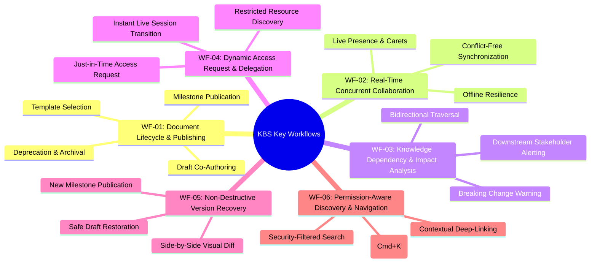

---

## 2. WF-01: End-to-End Document Lifecycle & Publishing Management

### 2.1 The Big Picture (Complete Document Journey)
Every document in the organization follows a simple 5-stage lifecycle. This ensures that **readers only see finalized, approved company documents**, while **authors have a safe space to draft and update content behind the scenes**.

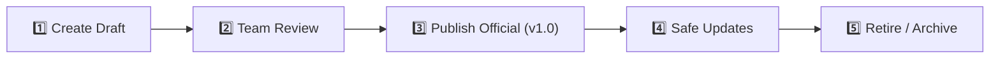

---

### 2.2 Phase-by-Phase Breakdown with Simple Diagrams

---

#### 🟢 Stage 1: Creating a New Document
**Goal:** An employee starts a new document using a standardized company template or a blank page.

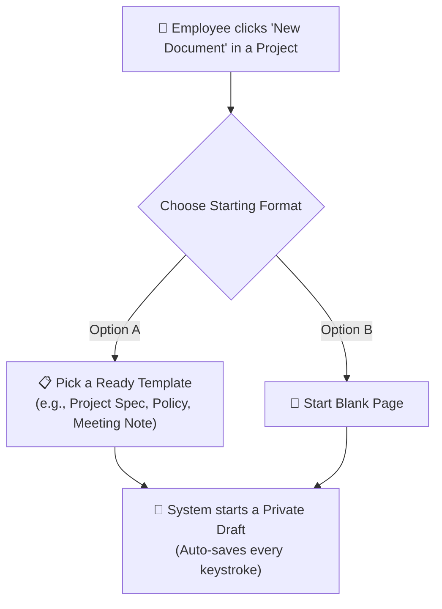

* **What the User Does:** The user selects where the document belongs (e.g., *Marketing Project* or *Engineering Team*) and chooses a template.
* **How the System Helps:** 
  * The document starts in **Draft Mode** (not visible to general readers yet).
  * The creator is automatically assigned as the **Document Owner**.
  * Auto-save is active from the first character, so work is never lost.

---

#### 💬 Stage 2: Team Collaboration & Getting Feedback
**Goal:** Team members work together on the draft and provide feedback before it is published.

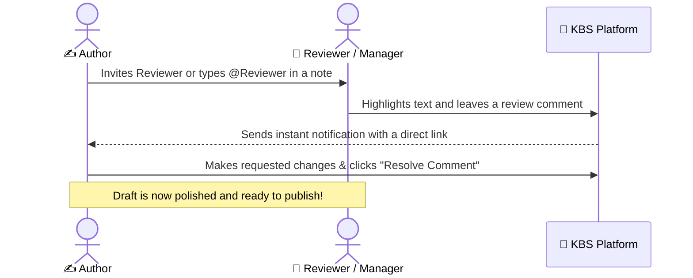

* **What the User Does:** The author asks managers or team members to review specific paragraphs by tagging them (e.g., `@legal-team please verify this rule`).
* **How the System Helps:** 
  * Reviewers can add comments and suggest edits without accidentally breaking or deleting the author's work.
  * Discussion threads stay attached directly to the relevant text so context is never lost.

---

#### 🚀 Stage 3: Publishing the Official Version
**Goal:** The author releases the approved document to the company as the single source of truth.

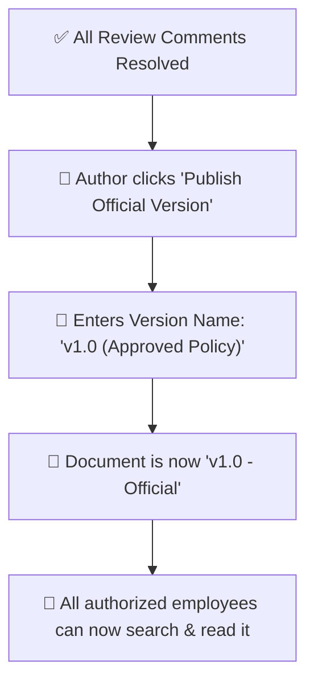

* **What the User Does:** When the draft is ready, the author clicks **"Publish"** and writes a short note summarizing what the document is about.
* **How the System Helps:** 
  * The system locks in this milestone as **Version 1.0 (Official)**.
  * The document becomes fully discoverable across search and team navigation.

---

#### 🔄 Stage 4: Making Updates Without Confusing Readers
**Goal:** An author needs to update a published document, but wants to keep working in private until the new changes are approved.

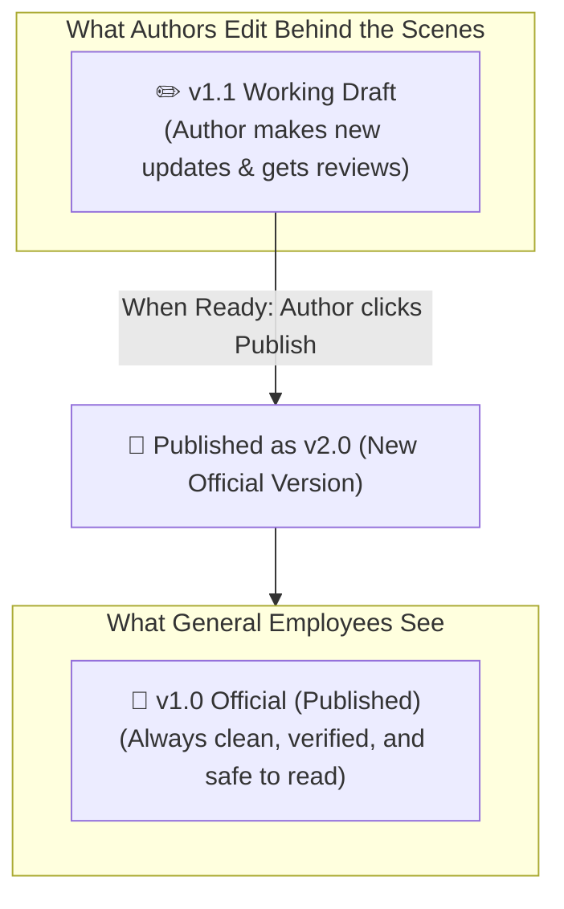

* **The Problem It Solves:** In older tools, editing a live document causes general staff to see incomplete sentences or work-in-progress notes.
* **How the System Helps:**
  * General readers continue to see the approved **v1.0** version.
  * Authors collaborate on a **v1.1 Draft** behind the scenes.
  * Once finalized, publishing **v2.0** smoothly replaces the old view for everyone.

---

#### 🗄️ Stage 5: Retiring Outdated Documents (Deprecation & Archiving)
**Goal:** Ensure employees never follow outdated rules or discontinued project instructions.

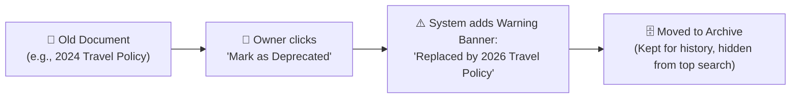

* **What the User Does:** When a policy or project is replaced, the owner marks it as **"Deprecated"** and links to the new document.
* **How the System Helps:**
  * Any employee opening the old link immediately sees a bold warning banner pointing to the new document.
  * When no longer needed, it is archived so company search stays clean and relevant.

---

---

## 4. WF-03: Knowledge Connections & Impact Analysis (Preventing Broken Links)

### 4.1 The Big Picture (How Documents Connect Across Teams)
In modern companies, documents rely on each other (for example, a *Payment Guide* depends on the *Security Policy*). If someone deletes or changes a policy without warning, other teams' work breaks. KBS automatically tracks all connections and warns authors before they make breaking changes.

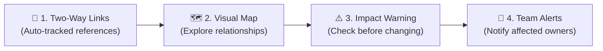

---

### 4.2 Phase-by-Phase Breakdown with Simple Diagrams

---

#### 🔗 Stage 1: Automatic Two-Way Links ("Referenced By" Panel)
**Goal:** Whenever Document A links to Document B, Document B automatically knows and displays that it is being referenced.

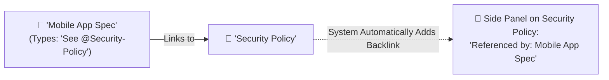

* **What the User Does:** An author simply types `@` to link to any other company document.
* **How the System Helps:** 
  * The target document automatically gains an incoming **Backlink** in its side drawer.
  * Authors always know who is citing their work without doing any manual tracking.

---

#### 🗺️ Stage 2: Visual Knowledge Map (Exploring How Ideas Connect)
**Goal:** Give managers, new hires, and architects a visual birds-eye view of how company policies, projects, and guides connect.

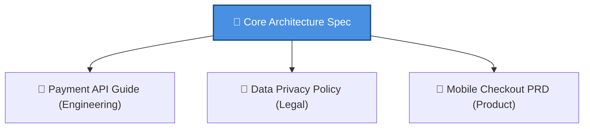

* **What the User Sees:** 
  * An interactive visual roadmap where documents appear as bubbles and links appear as connecting lines.
  * Users can zoom, search, and click any bubble to read a quick preview.
* **Why This Matters to Clients:** Helps new employees onboard in days instead of weeks by visually navigating how everything fits together.

---

#### ⚠️ Stage 3: Impact Check Before Making Major Changes
**Goal:** Prevent accidental disruptions by showing authors a safety warning before they change, rename, or retire a core document.

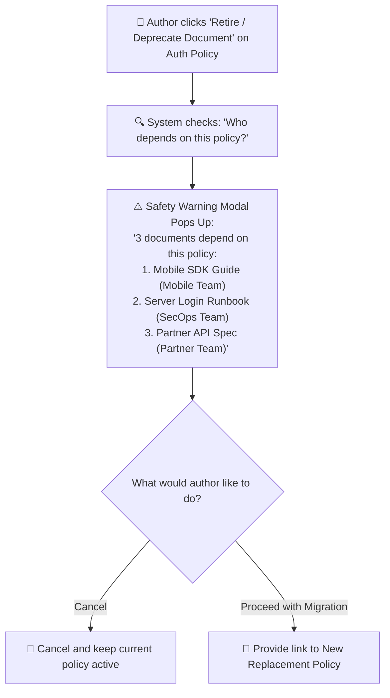

* **The Problem It Solves:** In old tools, someone changes a document and other departments only find out when their systems fail or procedures break.
* **How the System Helps:** 
  * KBS immediately flags all downstream documents and displays the names of the colleagues who own them.

---

#### 🔔 Stage 4: Automated Alerts to Affected Teams
**Goal:** When a foundational document changes or is retired, all teams relying on it are automatically notified with clear action items.

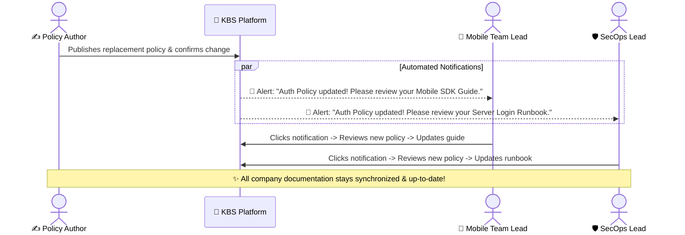

* **What the System Does:**
  * Sends direct notifications to all dependent document owners.
  * Provides a deep link directly to the new replacement document so they can update their instructions immediately.

---

---