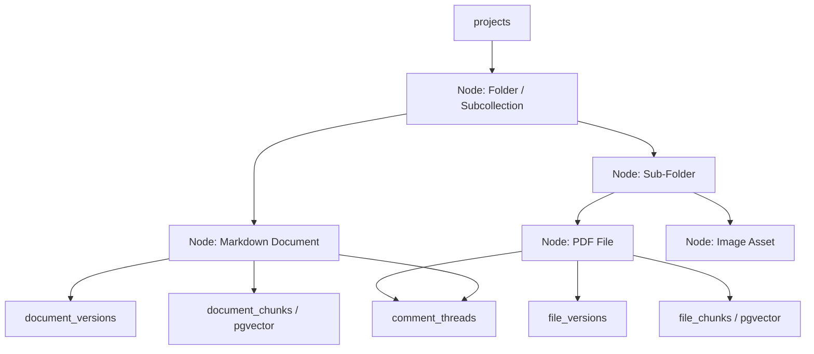
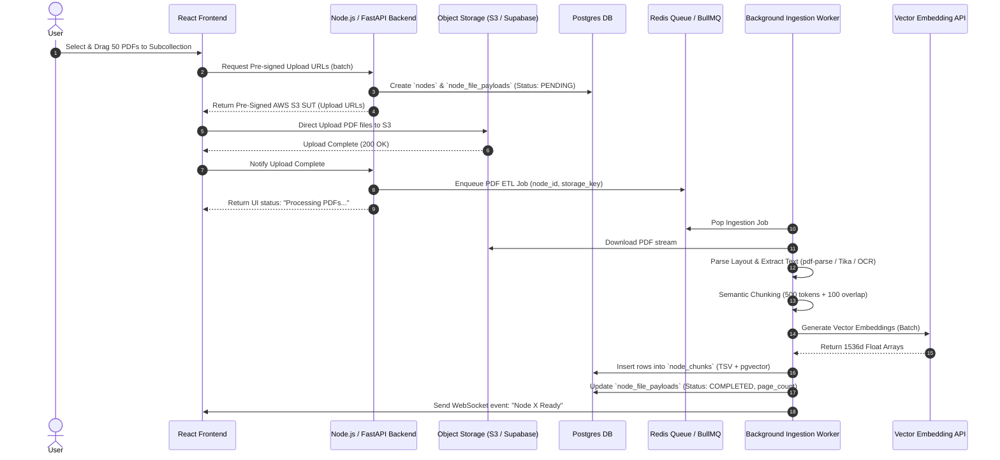

# KBS Platform — File Upload & Subcollection Architectural Overhaul

**Document Version:** 2.0  
**Focus:** Overhauling Markdown-only limitation to support bulk PDF uploads, multi-format files, subcollections/folders, RAG vector search, and media viewer workflows.

---

## 1. Executive Summary & Root Cause Diagnosis

### The Limitation of the Current Schema (v1.0)
The existing schema was designed around a **Markdown-First** assumption:
1. **Attachment Bias (`document_assets`)**: Assets were modeled exclusively as dependent sub-resources attached to a primary Markdown document (`document_id FK NOT NULL`). A standalone PDF (e.g., a 200-page vendor SLA or architecture PDF) cannot exist in a project on its own without creating a dummy markdown document wrapper.
2. **Strict Document Tree Hierarchy**: Folder structure relies on `parent_doc_id` pointing self-referentially to another `documents` row. Folders are pseudo-documents rather than real container nodes.
3. **Markdown-Only Versioning (`document_versions`)**: `document_versions` stores raw Markdown text (`content TEXT`). It cannot represent binary asset revisions, file checksums, page counts, S3 storage keys, or OCR-extracted text chunks.
4. **Search & RAG Blindspot**: Full-text (`tsvector`) and vector search (`pgvector`) assume searchable text inside `draft_content`. Uploaded PDFs, Word documents (`.docx`), presentation decks (`.pptx`), and images are invisible to search engines unless an ETL extraction and chunking pipeline is introduced.

---

## 2. Target Architecture: The Unified Node Model ("Poly-Node")

Instead of maintaining disjoint tables for `documents`, `folders`, and `file_assets`, we consolidate all project entities under a **Unified Node Architecture**.



### Key Concept: Node Types
Every item residing in a project sidebar or folder belongs to the `nodes` table with a `node_type`:
- `FOLDER`: Organizational container (subcollection). Has children, no direct binary file.
- `MARKDOWN_DOC`: Native rich-text / TipTap document.
- `FILE_ASSET`: Binary uploaded file (PDF, Word, Excel, PNG, CAD, Zip, etc.).
- `EXTERNAL_LINK`: Pinned external link (e.g. Figma link, Jira board).

---

## 3. Database Schema Overhaul Blueprint

### 3.1 Consolidated Resource Hierarchy (`nodes`)

Replaces the isolated `documents` table tree with a unified tree using PostgreSQL `ltree` for fast hierarchical path queries.

```sql
CREATE TYPE node_type AS ENUM ('FOLDER', 'MARKDOWN_DOC', 'FILE_ASSET', 'EXTERNAL_LINK');
CREATE TYPE processing_status AS ENUM ('PENDING', 'PROCESSING', 'COMPLETED', 'FAILED');

CREATE TABLE nodes (
  id                  UUID            PRIMARY KEY DEFAULT gen_random_uuid(),
  org_id              UUID            NOT NULL REFERENCES organizations(id) ON DELETE CASCADE,
  project_id          UUID            NOT NULL REFERENCES projects(id) ON DELETE CASCADE,
  parent_node_id      UUID            REFERENCES nodes(id) ON DELETE CASCADE,
  node_type           node_type       NOT NULL,
  title               VARCHAR(512)    NOT NULL,
  position            DOUBLE PRECISION NOT NULL DEFAULT 1.0,
  path                ltree           NOT NULL, -- e.g., 'root.folder_uuid.subfolder_uuid.node_uuid'
  
  -- Metadata
  is_runbook          BOOLEAN         NOT NULL DEFAULT FALSE,
  is_template_source  BOOLEAN         NOT NULL DEFAULT FALSE,
  status              document_status NOT NULL DEFAULT 'PUBLISHED', -- For workflow review
  
  -- Tracking
  created_by          UUID            NOT NULL REFERENCES users(id),
  last_modified_by    UUID            NOT NULL REFERENCES users(id),
  created_at          TIMESTAMPTZ     NOT NULL DEFAULT NOW(),
  updated_at          TIMESTAMPTZ     NOT NULL DEFAULT NOW()
);

-- Index for tree lookups & ltree path searches
CREATE INDEX idx_nodes_tree ON nodes(project_id, parent_node_id, position);
CREATE INDEX idx_nodes_path ON nodes USING gist(path);
```

---

### 3.2 Polymorphic Payload Tables

#### A. Markdown Payload (`node_markdown_payloads`)
Stores live draft text for native markdown documents.

```sql
CREATE TABLE node_markdown_payloads (
  node_id             UUID            PRIMARY KEY REFERENCES nodes(id) ON DELETE CASCADE,
  draft_content       TEXT,           -- Markdown / HTML / TipTap JSON AST
  current_version_id  UUID,           -- FK -> node_versions
  updated_at          TIMESTAMPTZ     NOT NULL DEFAULT NOW()
);
```

#### B. Binary File Payload (`node_file_payloads`)
Stores file metadata for uploaded PDFs, images, and documents.

```sql
CREATE TABLE node_file_payloads (
  node_id             UUID            PRIMARY KEY REFERENCES nodes(id) ON DELETE CASCADE,
  storage_key         TEXT            NOT NULL UNIQUE, -- Object storage path (e.g. s3 key)
  original_filename   VARCHAR(512)    NOT NULL,
  mime_type           VARCHAR(127)    NOT NULL,
  file_size_bytes     BIGINT          NOT NULL,
  file_hash_sha256    VARCHAR(64)     NOT NULL, -- Deduplication check
  page_count          INTEGER,        -- Populated for PDFs / Slides
  
  -- ETL Processing state for PDF / RAG indexing
  processing_status   processing_status NOT NULL DEFAULT 'PENDING',
  processing_error    TEXT,
  extracted_text_at   TIMESTAMPTZ,
  
  updated_at          TIMESTAMPTZ     NOT NULL DEFAULT NOW()
);
```

---

### 3.3 Unified Versioning System (`node_versions`)

Allows versioning both Markdown updates and PDF/file updates (e.g., replacing `SLA_2025.pdf` with `SLA_2026.pdf`).

```sql
CREATE TABLE node_versions (
  id                  UUID            PRIMARY KEY DEFAULT gen_random_uuid(),
  node_id             UUID            NOT NULL REFERENCES nodes(id) ON DELETE CASCADE,
  version_number      INTEGER         NOT NULL,
  
  -- Version payload type check
  content_markdown    TEXT,           -- Non-null if MARKDOWN_DOC
  storage_key         TEXT,           -- Non-null if FILE_ASSET
  file_size_bytes     BIGINT,
  file_hash_sha256    VARCHAR(64),
  
  changelog           TEXT,
  published_by        UUID            NOT NULL REFERENCES users(id),
  published_at        TIMESTAMPTZ     NOT NULL DEFAULT NOW(),

  CONSTRAINT uk_node_version UNIQUE (node_id, version_number)
);
```

---

### 3.4 Search, Chunking & RAG Indexing (`node_chunks`)

Enables Full-Text Search (`tsvector`) & Semantic Vector Search (`pgvector`) across both Markdown documents and uploaded PDF files.

```sql
CREATE TABLE node_chunks (
  id                  UUID            PRIMARY KEY DEFAULT gen_random_uuid(),
  node_id             UUID            NOT NULL REFERENCES nodes(id) ON DELETE CASCADE,
  version_id          UUID            REFERENCES node_versions(id) ON DELETE CASCADE,
  chunk_index         INTEGER         NOT NULL,
  page_number         INTEGER,        -- NULL for Markdown, populated for PDFs
  chunk_content       TEXT            NOT NULL,
  
  -- Vector Embedding & Full-Text Search
  tsv_content         tsvector        GENERATED ALWAYS AS (to_tsvector('english', chunk_content)) STORED,
  embedding           vector(1536)    -- e.g. OpenAI text-embedding-3-small or bge-large-en
);

-- Hybrid Search Indexes
CREATE INDEX idx_node_chunks_tsv ON node_chunks USING gin(tsv_content);
CREATE INDEX idx_node_chunks_vector ON node_chunks USING hnsw (embedding vector_cosine_ops);
CREATE INDEX idx_node_chunks_node ON node_chunks(node_id);
```

---

### 3.5 PDF & Multi-Media Spatial Commentary (`comment_threads`)

Extending comments to support **Spatial PDF Annotations** (bounding boxes, page numbers, coordinates) alongside inline Markdown text anchors.

```sql
ALTER TYPE anchor_type ADD VALUE 'PDF_COORDINATE';
ALTER TYPE anchor_type ADD VALUE 'IMAGE_PIN';

ALTER TABLE comment_threads
  ADD COLUMN page_number INTEGER,
  ADD COLUMN bounding_box JSONB; 
  -- Example bounding_box: {"x": 120.5, "y": 340.2, "width": 200.0, "height": 45.0}
```

---

## 4. End-to-End File Upload & RAG Ingestion Pipeline

When a user drops 50 PDFs into a KBS subcollection, the system follows this automated pipeline:



---

## 5. Technology Stack & Integration Recommendations

| Component | Recommended Technology | Purpose |
| :--- | :--- | :--- |
| **Object Storage** | AWS S3 / Cloudflare R2 / Supabase Storage | Scalable, cost-effective storage for PDFs, images, and attachments |
| **Document ETL / Extraction** | `unstructured.io` / `pdf-parse` / `Apache Tika` | Parse layout, tables, text headers, and metadata from PDFs, DOCX, PPTX |
| **OCR (Scanned PDFs)** | Tesseract.js / AWS Textract | Extract text from scanned image PDFs |
| **Job Queue** | BullMQ (Redis-based) or `pg_boss` (Postgres-native) | Asynchronous background processing for uploads without UI lag |
| **Vector Engine** | `pgvector` extension in PostgreSQL | Hybrid BM25 (full-text) + Cosine similarity vector search inside Postgres |
| **PDF UI Viewer** | `@react-pdf-viewer/core` or `pdfjs-dist` | In-browser PDF rendering with text selection, zoom, and highlight overlay |
| **Chunking Engine** | LangChain / LlamaIndex / Custom TS Chunking | Split large PDFs into semantic sections preserving page numbers |

---

## 6. Migration Strategy: Overhauling Schema v1.0 to v2.0

1. **Step 1: Create `nodes` and `node_*` tables alongside existing schema.**
2. **Step 2: Migration Script**:
   - Map existing `projects` tree to `nodes` (`node_type = 'FOLDER'`).
   - Map existing `documents` rows to `nodes` (`node_type = 'MARKDOWN_DOC'`). Populate `node_markdown_payloads`.
   - Map existing `document_assets` to standalone or child `nodes` (`node_type = 'FILE_ASSET'`). Populate `node_file_payloads`.
3. **Step 3: Update Access Control Grants**:
   - Rename `document_grants` to `node_grants` (or point `resource_id` to `nodes.id`). Permissions now naturally govern Folders, Markdown files, and PDFs identically.
4. **Step 4: Deprecate `documents` & `document_assets` tables**.

---

## 7. Operational & Enterprise Features Unlocked

1. **Folder Subcollections**: True nested folders (`parent_node_id` + `ltree`), allowing arbitrary directory trees containing both Markdown pages and PDF collections.
2. **Universal RAG Search**: Users can ask natural language questions (e.g., *"What is our policy on remote work according to the uploaded PDFs?"*) and retrieve specific PDF page chunks with direct links to the exact PDF page viewer.
3. **File Version Control**: Upload updated versions of PDFs/Word docs with change logs while preserving old versions and annotations.
4. **Unified Access Control**: Inherited permissions flow down through folder trees to both Markdown docs and raw uploaded files cleanly.
