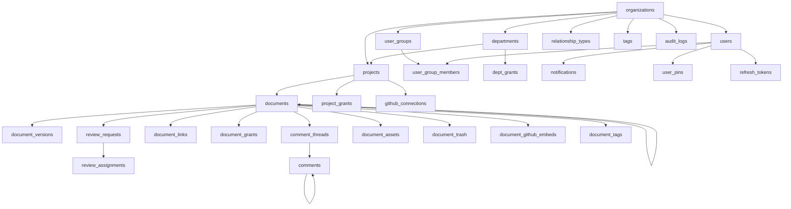

ants # KBS Platform — Database Schema Design
**Version:** 1.0  
**Status:** Draft  
**Derived from:** Refined BRD Suite (v1.0)  
**Covers:** All 11 entity clusters agreed upon in iterative schema review

---

## Design Decisions Summary

| Decision | Choice |
| :--- | :--- |
| Multi-tenancy | Full — `org_id` propagated through all tenant-bound tables |
| Authentication | Custom JWT + refresh tokens (OAuth scope reserved for later) |
| User Groups | Flat, org-scoped. Any org member can be in any group |
| Container hierarchy | Separate `departments` and `projects` tables |
| Standalone projects | `dept_id IS NULL` on `projects` |
| Publishing mode | Stored per-project: `DIRECT` or `REVIEW_REQUIRED` |
| Document content | Two tables: `documents` (metadata + draft) and `document_versions` (immutable snapshots) |
| Sidebar ordering | Fractional float `position` column (no row-shifting on reorder) |
| Document status | `DRAFT → IN_REVIEW → CHANGES_REQUESTED → PUBLISHED → DEPRECATED / ARCHIVED` |
| Permission grantee | Separate nullable `user_id` / `group_id` columns with CHECK constraint |
| Permission tables | Three separate: `dept_grants`, `project_grants`, `document_grants` |
| Explicit deny | `NONE` role in `document_grants` overrides all inherited access |
| Org default access | `default_member_role = NONE` (private by default) |
| Link graph | Directed edges, org-customizable relationship types |
| Broken links | Soft-nullify on target deletion + `target_doc_title_snapshot` preserved |
| Comment anchoring | Block IDs embedded in markdown content (user-invisible) |
| Block IDs exposure | Stripped by API before serving content to clients |
| Review resolution | All reviewers must `APPROVED` for merge; any `CHANGES_REQUESTED` blocks |

---

## Entity Relationship Overview



---

## Cluster 1 — Identity & Authentication

### `organizations`
The root tenant entity. Every data row in the system belongs to an organization.

| Column | Type | Constraints | Notes |
| :--- | :--- | :--- | :--- |
| `id` | UUID | PK, DEFAULT gen_random_uuid() | |
| `name` | VARCHAR(255) | NOT NULL | Display name |
| `slug` | VARCHAR(100) | NOT NULL, UNIQUE | URL-safe identifier |
| `default_member_role` | ENUM | NOT NULL, DEFAULT `'NONE'` | Baseline access for all org members. `NONE` = private by default |
| `settings` | JSONB | DEFAULT `'{}'` | Extensible org-level settings (e.g., session timeout, 2FA enforcement) |
| `created_at` | TIMESTAMPTZ | NOT NULL, DEFAULT now() | |
| `updated_at` | TIMESTAMPTZ | NOT NULL, DEFAULT now() | |

**Role ENUM:** `NONE`, `VIEWER`, `COMMENTER`, `EDITOR`, `REVIEWER`, `PROJECT_LEAD`, `DEPT_HEAD`, `SYSTEM_ADMIN`

---

### `users`
Platform user accounts. Owns authentication credentials (custom JWT model).

| Column | Type | Constraints | Notes |
| :--- | :--- | :--- | :--- |
| `id` | UUID | PK | |
| `org_id` | UUID | NOT NULL, FK → organizations | Tenant binding |
| `email` | VARCHAR(320) | NOT NULL, UNIQUE | Login identifier |
| `password_hash` | TEXT | NOT NULL | bcrypt hash |
| `display_name` | VARCHAR(255) | NOT NULL | |
| `avatar_url` | TEXT | NULLABLE | |
| `platform_role` | ENUM | NOT NULL | User's platform-level role (governs what they can administer) |
| `dept_id` | UUID | NULLABLE, FK → departments | User's home department. NULL = org-level / no dept |
| `is_active` | BOOLEAN | NOT NULL, DEFAULT true | Deactivated users lose all access but data is preserved |
| `last_login_at` | TIMESTAMPTZ | NULLABLE | |
| `created_at` | TIMESTAMPTZ | NOT NULL, DEFAULT now() | |
| `updated_at` | TIMESTAMPTZ | NOT NULL, DEFAULT now() | |

> **Business Rule:** A deactivated user (`is_active = false`) must be evaluated as `NONE` during permission resolution regardless of any grants on record.

---

### `refresh_tokens`
Tracks issued refresh tokens for JWT rotation and session invalidation.

| Column | Type | Constraints | Notes |
| :--- | :--- | :--- | :--- |
| `id` | UUID | PK | |
| `user_id` | UUID | NOT NULL, FK → users ON DELETE CASCADE | |
| `token_hash` | TEXT | NOT NULL, UNIQUE | SHA-256 hash of the raw token |
| `expires_at` | TIMESTAMPTZ | NOT NULL | |
| `revoked_at` | TIMESTAMPTZ | NULLABLE | NULL = still valid |
| `created_at` | TIMESTAMPTZ | NOT NULL, DEFAULT now() | |

> **Business Rule:** On logout, set `revoked_at = now()`. On token rotation, revoke the old record and issue a new one. All tokens with `expires_at < now()` or `revoked_at IS NOT NULL` are invalid.

---

### `user_groups`
Named collections of users, scoped to an organization. Flat — no nested groups.

| Column | Type | Constraints | Notes |
| :--- | :--- | :--- | :--- |
| `id` | UUID | PK | |
| `org_id` | UUID | NOT NULL, FK → organizations | |
| `name` | VARCHAR(255) | NOT NULL | e.g. `security-reviewers`, `backend-engineers` |
| `description` | TEXT | NULLABLE | |
| `created_by` | UUID | NOT NULL, FK → users | Must be an Admin or Dept Head |
| `created_at` | TIMESTAMPTZ | NOT NULL, DEFAULT now() | |
| `updated_at` | TIMESTAMPTZ | NOT NULL, DEFAULT now() | |

**UNIQUE:** `(org_id, name)`

---

### `user_group_members`
Junction table: user <-> group membership.

| Column | Type | Constraints | Notes |
| :--- | :--- | :--- | :--- |
| `id` | UUID | PK | |
| `group_id` | UUID | NOT NULL, FK → user_groups ON DELETE CASCADE | |
| `user_id` | UUID | NOT NULL, FK → users ON DELETE CASCADE | Members can come from any dept |
| `added_by` | UUID | NOT NULL, FK → users | |
| `added_at` | TIMESTAMPTZ | NOT NULL, DEFAULT now() | |

**UNIQUE:** `(group_id, user_id)`

---

## Cluster 2 — Organizational Containers

### `departments`
Organizational divisions within a tenant. Parents of dept-bound projects.

| Column | Type | Constraints | Notes |
| :--- | :--- | :--- | :--- |
| `id` | UUID | PK | |
| `org_id` | UUID | NOT NULL, FK → organizations | |
| `name` | VARCHAR(255) | NOT NULL | |
| `slug` | VARCHAR(100) | NOT NULL | URL-safe name |
| `description` | TEXT | NULLABLE | |
| `head_user_id` | UUID | NULLABLE, FK → users | The designated Dept Head |
| `created_by` | UUID | NOT NULL, FK → users | |
| `created_at` | TIMESTAMPTZ | NOT NULL, DEFAULT now() | |
| `updated_at` | TIMESTAMPTZ | NOT NULL, DEFAULT now() | |
| `deleted_at` | TIMESTAMPTZ | NULLABLE | Soft delete |

**UNIQUE:** `(org_id, slug)`

---

### `projects`
Knowledge spaces. Can be dept-bound or standalone (cross-functional).

| Column | Type | Constraints | Notes |
| :--- | :--- | :--- | :--- |
| `id` | UUID | PK | |
| `org_id` | UUID | NOT NULL, FK → organizations | |
| `dept_id` | UUID | NULLABLE, FK → departments | NULL = standalone/cross-functional project |
| `name` | VARCHAR(255) | NOT NULL | |
| `slug` | VARCHAR(100) | NOT NULL | |
| `description` | TEXT | NULLABLE | |
| `publishing_mode` | ENUM | NOT NULL, DEFAULT `'REVIEW_REQUIRED'` | `DIRECT` or `REVIEW_REQUIRED` |
| `is_public_within_org` | BOOLEAN | NOT NULL, DEFAULT false | If true, all org members get Viewer baseline unless overridden by a NONE grant |
| `is_archived` | BOOLEAN | NOT NULL, DEFAULT false | |
| `github_repo_url` | TEXT | NULLABLE | Linked Git repository |
| `created_by` | UUID | NOT NULL, FK → users | |
| `created_at` | TIMESTAMPTZ | NOT NULL, DEFAULT now() | |
| `updated_at` | TIMESTAMPTZ | NOT NULL, DEFAULT now() | |
| `deleted_at` | TIMESTAMPTZ | NULLABLE | Soft delete |

**UNIQUE:** `(org_id, slug)`

> **Business Rule:** `dept_id IS NULL` designates a standalone project visible at the org root level. It inherits no department-level baseline permissions.

---

## Cluster 3 — Documents & Versioning

### `documents`
Metadata and live draft state of all knowledge documents. Content and published state live in `document_versions`.

| Column | Type | Constraints | Notes |
| :--- | :--- | :--- | :--- |
| `id` | UUID | PK | |
| `org_id` | UUID | NOT NULL, FK → organizations | Denormalized for query performance |
| `project_id` | UUID | NOT NULL, FK → projects | |
| `parent_doc_id` | UUID | NULLABLE, FK → documents(id) | Self-referential. NULL = root document in the project |
| `title` | VARCHAR(512) | NOT NULL | |
| `status` | ENUM | NOT NULL, DEFAULT `'DRAFT'` | See status lifecycle below |
| `draft_content` | TEXT | NULLABLE | Raw markdown with embedded block IDs (user-invisible). NULL for brand-new empty docs |
| `current_version_id` | UUID | NULLABLE, FK → document_versions | Points to latest published version. NULL until first publish |
| `position` | DOUBLE PRECISION | NOT NULL, DEFAULT 1.0 | Fractional index for sidebar ordering within the same parent scope |
| `is_runbook` | BOOLEAN | NOT NULL, DEFAULT false | Tags document as an operational runbook |
| `is_template_source` | BOOLEAN | NOT NULL, DEFAULT false | True if this document has been promoted to a Blueprint source |
| `created_by` | UUID | NOT NULL, FK → users | |
| `last_modified_by` | UUID | NOT NULL, FK → users | |
| `created_at` | TIMESTAMPTZ | NOT NULL, DEFAULT now() | |
| `updated_at` | TIMESTAMPTZ | NOT NULL, DEFAULT now() | |

**Status ENUM:** `DRAFT`, `IN_REVIEW`, `CHANGES_REQUESTED`, `PUBLISHED`, `DEPRECATED`, `ARCHIVED`

> **Status Lifecycle:**
> - `DRAFT` → `IN_REVIEW` (Submit for Review) or `PUBLISHED` (Direct publish, if project mode = `DIRECT`)
> - `IN_REVIEW` → `CHANGES_REQUESTED` (any reviewer requests changes) or `PUBLISHED` (all reviewers approve)
> - `CHANGES_REQUESTED` → `DRAFT` (author acknowledges and begins revision)
> - `PUBLISHED` → `DEPRECATED` (manually marked outdated, still visible)
> - `PUBLISHED` / `DEPRECATED` → `ARCHIVED` (removed from active navigation)

> **Ordering Rule:** `position` is a float. Inserting between positions `2.0` and `3.0` assigns `2.5`. Periodic background re-normalization resets all positions to integers when fragmentation threshold is exceeded.

> **Block ID Convention:** `draft_content` stores markdown with stable block-level anchors: `## Section Heading {#blk_uuid}`. These IDs are stripped by the API layer before rendering to clients. They are preserved in `document_versions.content` for historic comment anchor resolution.

---

### `document_versions`
Immutable published snapshots. The authoritative published record. Never updated after creation.

| Column | Type | Constraints | Notes |
| :--- | :--- | :--- | :--- |
| `id` | UUID | PK | |
| `document_id` | UUID | NOT NULL, FK → documents ON DELETE CASCADE | |
| `version_number` | INTEGER | NOT NULL | Monotonically increasing. Starts at 1 |
| `content` | TEXT | NOT NULL | Full markdown content at publish time, with block IDs preserved |
| `changelog` | TEXT | NULLABLE | Author-provided summary of changes |
| `published_by` | UUID | NOT NULL, FK → users | |
| `approved_by` | UUID | NULLABLE, FK → users | NULL for DIRECT mode publishes |
| `review_request_id` | UUID | NULLABLE, FK → review_requests | Links back to the review that approved this version |
| `published_at` | TIMESTAMPTZ | NOT NULL, DEFAULT now() | |

**UNIQUE:** `(document_id, version_number)`

> **Immutability Rule:** No UPDATE or DELETE is ever issued against this table in normal operation. Rows are only ever INSERTed. The content of a version represents exactly what was published at that moment in time.

---

## Cluster 4 — Access Control (Dynamic Access Control)

### Permission Resolution Precedence (Highest to Lowest)
1. Individual `document_grants` (user-level explicit grant, including NONE deny)
2. Group `document_grants` (group-level explicit grant on document)
3. Individual `project_grants` (user-level project membership)
4. Group `project_grants` (group-level project membership)
5. Individual `dept_grants` (user-level department baseline)
6. Group `dept_grants` (group-level department baseline)
7. `organizations.default_member_role` (org-wide floor, default: `NONE`)

> **Grantee Constraint (applies to all three grant tables):**
> Exactly one of `user_id` / `group_id` must be set. The other must be NULL.
> ```
> CHECK (
>   (user_id IS NOT NULL AND group_id IS NULL) OR
>   (user_id IS NULL AND group_id IS NOT NULL)
> )
> ```

---

### `dept_grants`
Role assignments at the department level.

| Column | Type | Constraints | Notes |
| :--- | :--- | :--- | :--- |
| `id` | UUID | PK | |
| `dept_id` | UUID | NOT NULL, FK → departments ON DELETE CASCADE | |
| `user_id` | UUID | NULLABLE, FK → users ON DELETE CASCADE | |
| `group_id` | UUID | NULLABLE, FK → user_groups ON DELETE CASCADE | |
| `role` | ENUM | NOT NULL | `VIEWER`, `COMMENTER`, `EDITOR`, `REVIEWER`, `DEPT_HEAD` |
| `granted_by` | UUID | NOT NULL, FK → users | |
| `created_at` | TIMESTAMPTZ | NOT NULL, DEFAULT now() | |

**UNIQUE:** `(dept_id, user_id)` where user_id IS NOT NULL  
**UNIQUE:** `(dept_id, group_id)` where group_id IS NOT NULL

---

### `project_grants`
Role assignments at the project level.

| Column | Type | Constraints | Notes |
| :--- | :--- | :--- | :--- |
| `id` | UUID | PK | |
| `project_id` | UUID | NOT NULL, FK → projects ON DELETE CASCADE | |
| `user_id` | UUID | NULLABLE, FK → users ON DELETE CASCADE | |
| `group_id` | UUID | NULLABLE, FK → user_groups ON DELETE CASCADE | |
| `role` | ENUM | NOT NULL | `VIEWER`, `COMMENTER`, `EDITOR`, `REVIEWER`, `PROJECT_LEAD` |
| `is_default_for_new_docs` | BOOLEAN | NOT NULL, DEFAULT false | If true, this grant is automatically applied to newly created documents in the project |
| `granted_by` | UUID | NOT NULL, FK → users | |
| `created_at` | TIMESTAMPTZ | NOT NULL, DEFAULT now() | |

**UNIQUE:** `(project_id, user_id)` where user_id IS NOT NULL  
**UNIQUE:** `(project_id, group_id)` where group_id IS NOT NULL

---

### `document_grants`
Explicit per-document role overrides. Highest precedence in the resolution chain. The only level where `NONE` (explicit deny) is valid.

| Column | Type | Constraints | Notes |
| :--- | :--- | :--- | :--- |
| `id` | UUID | PK | |
| `document_id` | UUID | NOT NULL, FK → documents ON DELETE CASCADE | |
| `user_id` | UUID | NULLABLE, FK → users ON DELETE CASCADE | |
| `group_id` | UUID | NULLABLE, FK → user_groups ON DELETE CASCADE | |
| `role` | ENUM | NOT NULL | `NONE`, `VIEWER`, `COMMENTER`, `EDITOR`, `REVIEWER`, `OWNER` |
| `granted_by` | UUID | NOT NULL, FK → users | |
| `created_at` | TIMESTAMPTZ | NOT NULL, DEFAULT now() | |

**UNIQUE:** `(document_id, user_id)` where user_id IS NOT NULL  
**UNIQUE:** `(document_id, group_id)` where group_id IS NOT NULL

> **NONE Semantics:** A `NONE` grant in this table acts as an explicit deny. The permission resolver short-circuits on `NONE` at this level — no lower-precedence grant can override it for that document.

---

### `access_requests`
Tracks user-initiated requests for access to a resource they cannot currently view.

| Column | Type | Constraints | Notes |
| :--- | :--- | :--- | :--- |
| `id` | UUID | PK | |
| `org_id` | UUID | NOT NULL, FK → organizations | |
| `requester_id` | UUID | NOT NULL, FK → users | |
| `resource_type` | ENUM | NOT NULL | `PROJECT` or `DOCUMENT` |
| `resource_id` | UUID | NOT NULL | ID of the project or document being requested |
| `requested_role` | ENUM | NOT NULL | The role the user is asking for |
| `message` | TEXT | NULLABLE | Optional justification from requester |
| `status` | ENUM | NOT NULL, DEFAULT `'PENDING'` | `PENDING`, `APPROVED`, `DENIED` |
| `reviewed_by` | UUID | NULLABLE, FK → users | |
| `reviewed_at` | TIMESTAMPTZ | NULLABLE | |
| `created_at` | TIMESTAMPTZ | NOT NULL, DEFAULT now() | |

---

## Cluster 5 — Knowledge Graph

### `relationship_types`
Org-defined vocabulary for semantic document link labels. System-seeded defaults are provided (`is_system = true`) and cannot be deleted.

| Column | Type | Constraints | Notes |
| :--- | :--- | :--- | :--- |
| `id` | UUID | PK | |
| `org_id` | UUID | NOT NULL, FK → organizations | |
| `label` | VARCHAR(100) | NOT NULL | e.g. `References`, `Depends On`, `Supersedes`, `Implements`, `Governed By` |
| `description` | TEXT | NULLABLE | |
| `is_system` | BOOLEAN | NOT NULL, DEFAULT false | System-seeded types cannot be deleted |
| `created_by` | UUID | NULLABLE, FK → users | NULL for system-seeded types |
| `created_at` | TIMESTAMPTZ | NOT NULL, DEFAULT now() | |

**UNIQUE:** `(org_id, label)`

**System-seeded defaults (inserted at org creation):** `References`, `Depends On`, `Supersedes`, `Implements`, `Related To`

---

### `document_links`
Directed edges in the knowledge graph. One row per link direction.

| Column | Type | Constraints | Notes |
| :--- | :--- | :--- | :--- |
| `id` | UUID | PK | |
| `source_doc_id` | UUID | NOT NULL, FK → documents ON DELETE CASCADE | The document containing the link |
| `target_doc_id` | UUID | NULLABLE, FK → documents ON DELETE SET NULL | NULL when target has been deleted |
| `link_type_id` | UUID | NOT NULL, FK → relationship_types | Semantic label |
| `target_doc_title_snapshot` | VARCHAR(512) | NOT NULL | Preserved title of target at link creation time. Shown as fallback when `target_doc_id` is NULL |
| `is_broken` | BOOLEAN | NOT NULL, DEFAULT false | Set to true when `target_doc_id` is set to NULL on deletion |
| `created_by` | UUID | NOT NULL, FK → users | |
| `created_at` | TIMESTAMPTZ | NOT NULL, DEFAULT now() | |

**UNIQUE:** `(source_doc_id, target_doc_id)` — prevents duplicate links between the same two documents

> **Backlink Query:** "Who references Document X?" = `SELECT * FROM document_links WHERE target_doc_id = X`  
> **Outbound Query:** "What does Document X reference?" = `SELECT * FROM document_links WHERE source_doc_id = X`  
> **Orphan Detection:** Documents with no rows in either direction = isolated nodes in the knowledge graph

---

## Cluster 6 — Comments & Discussions

### `comment_threads`
A thread is the anchor unit — it holds the context (where in the document) and the lifecycle status. Individual messages are in `comments`.

| Column | Type | Constraints | Notes |
| :--- | :--- | :--- | :--- |
| `id` | UUID | PK | |
| `document_id` | UUID | NOT NULL, FK → documents ON DELETE CASCADE | |
| `author_id` | UUID | NOT NULL, FK → users | Thread opener |
| `anchor_type` | ENUM | NOT NULL | `INLINE` (attached to text) or `DOCUMENT_LEVEL` (feedback panel) |
| `selected_text_snapshot` | TEXT | NULLABLE | The highlighted text at thread creation. Preserved for display even if content is later edited |
| `anchor_block_id` | VARCHAR(64) | NULLABLE | The block ID this comment is anchored to. NULL for `DOCUMENT_LEVEL` threads |
| `is_anchor_broken` | BOOLEAN | NOT NULL, DEFAULT false | Set true when the referenced block ID no longer exists in draft content |
| `status` | ENUM | NOT NULL, DEFAULT `'OPEN'` | `OPEN` or `RESOLVED` |
| `resolved_by` | UUID | NULLABLE, FK → users | |
| `resolved_at` | TIMESTAMPTZ | NULLABLE | |
| `created_at` | TIMESTAMPTZ | NOT NULL, DEFAULT now() | |

---

### `comments`
Individual messages within a thread. Supports nested replies via self-reference.

| Column | Type | Constraints | Notes |
| :--- | :--- | :--- | :--- |
| `id` | UUID | PK | |
| `thread_id` | UUID | NOT NULL, FK → comment_threads ON DELETE CASCADE | |
| `author_id` | UUID | NOT NULL, FK → users | |
| `content` | TEXT | NOT NULL | Supports `@mentions` (resolved at render time) |
| `parent_comment_id` | UUID | NULLABLE, FK → comments(id) | NULL = top-level reply in thread. Non-null = reply to a reply |
| `created_at` | TIMESTAMPTZ | NOT NULL, DEFAULT now() | |
| `updated_at` | TIMESTAMPTZ | NOT NULL, DEFAULT now() | |
| `deleted_at` | TIMESTAMPTZ | NULLABLE | Soft delete. Content replaced with `[deleted]` in UI |

---

## Cluster 7 — Review & Sign-Off Workflow

### `review_requests`
A formal submission of a document draft for multi-reviewer sign-off.

| Column | Type | Constraints | Notes |
| :--- | :--- | :--- | :--- |
| `id` | UUID | PK | |
| `document_id` | UUID | NOT NULL, FK → documents | |
| `submitted_by` | UUID | NOT NULL, FK → users | |
| `submitted_version_snapshot` | TEXT | NOT NULL | Full content snapshot of the draft at submission time. Reviewers diff against this |
| `status` | ENUM | NOT NULL, DEFAULT `'PENDING'` | `PENDING`, `APPROVED`, `CHANGES_REQUESTED`, `CANCELLED` |
| `created_at` | TIMESTAMPTZ | NOT NULL, DEFAULT now() | |
| `resolved_at` | TIMESTAMPTZ | NULLABLE | |

> **Resolution Rules:**
> - If **all** assignments are `APPROVED` → request becomes `APPROVED` → document may be published
> - If **any** assignment is `CHANGES_REQUESTED` → request becomes `CHANGES_REQUESTED` → document status set to `CHANGES_REQUESTED`
> - Author must address feedback and re-submit (a new `review_requests` row is created)

---

### `review_assignments`
Individual reviewer sign-off records within a review request.

| Column | Type | Constraints | Notes |
| :--- | :--- | :--- | :--- |
| `id` | UUID | PK | |
| `review_request_id` | UUID | NOT NULL, FK → review_requests ON DELETE CASCADE | |
| `reviewer_id` | UUID | NOT NULL, FK → users | |
| `status` | ENUM | NOT NULL, DEFAULT `'PENDING'` | `PENDING`, `APPROVED`, `CHANGES_REQUESTED` |
| `feedback` | TEXT | NULLABLE | Required when status is `CHANGES_REQUESTED` |
| `reviewed_at` | TIMESTAMPTZ | NULLABLE | |

**UNIQUE:** `(review_request_id, reviewer_id)`

---

## Cluster 8 — Blueprints & Templates

### `blueprints`
Reusable document templates. Governed at org/dept/project scope.

| Column | Type | Constraints | Notes |
| :--- | :--- | :--- | :--- |
| `id` | UUID | PK | |
| `org_id` | UUID | NOT NULL, FK → organizations | |
| `name` | VARCHAR(255) | NOT NULL | |
| `description` | TEXT | NULLABLE | |
| `category` | VARCHAR(100) | NULLABLE | e.g. `Engineering`, `Product`, `Operations`, `Security` |
| `template_content` | TEXT | NOT NULL | Frozen markdown content at promotion time. Block IDs preserved |
| `scope` | ENUM | NOT NULL | `PROJECT`, `DEPARTMENT`, `ORGANIZATION` |
| `scope_dept_id` | UUID | NULLABLE, FK → departments | Populated when `scope = DEPARTMENT` |
| `scope_project_id` | UUID | NULLABLE, FK → projects | Populated when `scope = PROJECT` |
| `created_by` | UUID | NOT NULL, FK → users | |
| `approval_status` | ENUM | NOT NULL, DEFAULT `'PENDING'` | `PENDING`, `APPROVED`, `REJECTED` |
| `approved_by` | UUID | NULLABLE, FK → users | |
| `approved_at` | TIMESTAMPTZ | NULLABLE | |
| `rejection_reason` | TEXT | NULLABLE | |
| `is_archived` | BOOLEAN | NOT NULL, DEFAULT false | |
| `created_at` | TIMESTAMPTZ | NOT NULL, DEFAULT now() | |
| `updated_at` | TIMESTAMPTZ | NOT NULL, DEFAULT now() | |

> **Scope Rules:**
> - `PROJECT` scope: visible only within that project's new document menu
> - `DEPARTMENT` scope: visible to all projects within the department. Requires Dept Head approval
> - `ORGANIZATION` scope: visible org-wide. Requires System Admin approval
> - A lower scope can be promoted to a higher scope (triggers a new approval cycle)

---

## Cluster 9 — Developer Integrations

### `github_connections`
Registered GitHub repository integrations per project.

| Column | Type | Constraints | Notes |
| :--- | :--- | :--- | :--- |
| `id` | UUID | PK | |
| `org_id` | UUID | NOT NULL, FK → organizations | |
| `project_id` | UUID | NULLABLE, FK → projects | NULL = org-level connection (admin-managed) |
| `repo_owner` | VARCHAR(255) | NOT NULL | GitHub org or user name |
| `repo_name` | VARCHAR(255) | NOT NULL | Repository name |
| `access_token_encrypted` | TEXT | NOT NULL | Encrypted OAuth app token or GitHub App installation token |
| `webhook_secret_encrypted` | TEXT | NULLABLE | For receiving push/PR event webhooks |
| `docs_path` | VARCHAR(512) | NOT NULL, DEFAULT `'/docs'` | Root path within the repo for Docs-as-Code sync |
| `sync_direction` | ENUM | NOT NULL, DEFAULT `'BIDIRECTIONAL'` | `KBS_TO_GH`, `GH_TO_KBS`, `BIDIRECTIONAL` |
| `last_sync_at` | TIMESTAMPTZ | NULLABLE | |
| `created_by` | UUID | NOT NULL, FK → users | |
| `created_at` | TIMESTAMPTZ | NOT NULL, DEFAULT now() | |
| `updated_at` | TIMESTAMPTZ | NOT NULL, DEFAULT now() | |

**UNIQUE:** `(org_id, repo_owner, repo_name)`

---

### `document_github_embeds`
Live embed cards and code snippets linked from GitHub, rendered within document content.

| Column | Type | Constraints | Notes |
| :--- | :--- | :--- | :--- |
| `id` | UUID | PK | |
| `document_id` | UUID | NOT NULL, FK → documents ON DELETE CASCADE | |
| `embed_type` | ENUM | NOT NULL | `PR_CARD`, `ISSUE_CARD`, `CODE_SNIPPET`, `ISSUE_BOARD` |
| `repo_owner` | VARCHAR(255) | NOT NULL | |
| `repo_name` | VARCHAR(255) | NOT NULL | |
| `resource_number` | INTEGER | NULLABLE | PR or Issue number. NULL for `CODE_SNIPPET` |
| `file_path` | VARCHAR(1024) | NULLABLE | File path within repo. Populated for `CODE_SNIPPET` |
| `line_start` | INTEGER | NULLABLE | Start line for code snippet range |
| `line_end` | INTEGER | NULLABLE | End line for code snippet range |
| `git_ref` | VARCHAR(255) | NULLABLE | Branch name or tag (e.g. `main`, `v3.2.0`). Pinned snippets use a commit SHA |
| `cached_status` | VARCHAR(50) | NULLABLE | Last known status: `OPEN`, `MERGED`, `CLOSED` |
| `cached_title` | VARCHAR(512) | NULLABLE | Last known title of the PR or Issue |
| `last_synced_at` | TIMESTAMPTZ | NULLABLE | When the cache was last refreshed |
| `created_by` | UUID | NOT NULL, FK → users | |
| `created_at` | TIMESTAMPTZ | NOT NULL, DEFAULT now() | |

> **Rendering Rule:** Embeds are rendered from the cached values. A background sync job polls open PRs/Issues for status changes and updates cached fields. Merged PRs trigger a `PR_MERGED_PROMPT` notification to document owners.

---

## Cluster 10 — Assets & Media

### `document_assets`
Uploaded files (images, PDFs, attachments) associated with a document.

| Column | Type | Constraints | Notes |
| :--- | :--- | :--- | :--- |
| `id` | UUID | PK | |
| `document_id` | UUID | NOT NULL, FK → documents ON DELETE CASCADE | |
| `org_id` | UUID | NOT NULL, FK → organizations | Denormalized for scoped storage cleanup |
| `original_filename` | VARCHAR(512) | NOT NULL | |
| `storage_key` | TEXT | NOT NULL, UNIQUE | Path/key in object storage. Used to construct the signed access URL |
| `mime_type` | VARCHAR(127) | NOT NULL | |
| `size_bytes` | BIGINT | NOT NULL | |
| `is_orphaned` | BOOLEAN | NOT NULL, DEFAULT false | Set true when asset is no longer referenced in `draft_content`. Eligible for cleanup |
| `uploaded_by` | UUID | NOT NULL, FK → users | |
| `uploaded_at` | TIMESTAMPTZ | NOT NULL, DEFAULT now() | |

> **Access Control:** Assets inherit the access permissions of their parent `document`. A user who cannot read the document cannot access its assets (enforced at the API layer via signed URL generation gating).

---

## Cluster 11 — Lifecycle, Discovery & Audit

### `document_trash`
Soft-delete recovery bin. Documents remain recoverable for 30 days before permanent purge.

| Column | Type | Constraints | Notes |
| :--- | :--- | :--- | :--- |
| `id` | UUID | PK | |
| `document_id` | UUID | NOT NULL, FK → documents | |
| `org_id` | UUID | NOT NULL, FK → organizations | |
| `original_project_id` | UUID | NOT NULL | Preserved for restoration routing |
| `original_parent_doc_id` | UUID | NULLABLE | Preserved for restoration into the correct tree position |
| `original_position` | DOUBLE PRECISION | NOT NULL | Preserved fractional position for restoration |
| `deleted_by` | UUID | NOT NULL, FK → users | |
| `deleted_at` | TIMESTAMPTZ | NOT NULL, DEFAULT now() | |
| `permanent_purge_at` | TIMESTAMPTZ | NOT NULL | Computed as `deleted_at + 30 days` at insert time |
| `restored_by` | UUID | NULLABLE, FK → users | |
| `restored_at` | TIMESTAMPTZ | NULLABLE | |

> **Cascade Rule:** Deleting a parent document trashes all descendant child pages in a single operation, each receiving their own `document_trash` row. Restoring a parent does NOT automatically restore children — each is restored individually or via batch UI action.

---

### `tags`
Organization-level tag taxonomy for document classification.

| Column | Type | Constraints | Notes |
| :--- | :--- | :--- | :--- |
| `id` | UUID | PK | |
| `org_id` | UUID | NOT NULL, FK → organizations | |
| `label` | VARCHAR(100) | NOT NULL | |
| `color` | VARCHAR(7) | NULLABLE | Hex color code for UI rendering (e.g. `#E86C4D`) |
| `created_by` | UUID | NOT NULL, FK → users | |
| `created_at` | TIMESTAMPTZ | NOT NULL, DEFAULT now() | |

**UNIQUE:** `(org_id, label)`

---

### `document_tags`
Junction table: document <-> tag.

| Column | Type | Constraints | Notes |
| :--- | :--- | :--- | :--- |
| `document_id` | UUID | NOT NULL, FK → documents ON DELETE CASCADE | |
| `tag_id` | UUID | NOT NULL, FK → tags ON DELETE CASCADE | |
| `tagged_by` | UUID | NOT NULL, FK → users | |
| `tagged_at` | TIMESTAMPTZ | NOT NULL, DEFAULT now() | |

**PRIMARY KEY:** `(document_id, tag_id)`

---

### `user_pins`
User-specific pinned shortcuts to frequently accessed documents or projects.

| Column | Type | Constraints | Notes |
| :--- | :--- | :--- | :--- |
| `id` | UUID | PK | |
| `user_id` | UUID | NOT NULL, FK → users ON DELETE CASCADE | |
| `resource_type` | ENUM | NOT NULL | `DOCUMENT` or `PROJECT` |
| `resource_id` | UUID | NOT NULL | ID of the pinned document or project |
| `pinned_at` | TIMESTAMPTZ | NOT NULL, DEFAULT now() | |

**UNIQUE:** `(user_id, resource_type, resource_id)`

---

### `notifications`
Per-user notification inbox. All system events that require user attention produce a row here.

| Column | Type | Constraints | Notes |
| :--- | :--- | :--- | :--- |
| `id` | UUID | PK | |
| `user_id` | UUID | NOT NULL, FK → users ON DELETE CASCADE | Recipient |
| `org_id` | UUID | NOT NULL, FK → organizations | |
| `type` | ENUM | NOT NULL | See notification types below |
| `title` | VARCHAR(255) | NOT NULL | Short display title |
| `body` | TEXT | NULLABLE | Full notification message |
| `deep_link_url` | VARCHAR(1024) | NULLABLE | In-app URL to the relevant resource |
| `is_read` | BOOLEAN | NOT NULL, DEFAULT false | |
| `source_type` | VARCHAR(100) | NULLABLE | Entity type that produced this notification |
| `source_id` | UUID | NULLABLE | ID of the source entity |
| `created_at` | TIMESTAMPTZ | NOT NULL, DEFAULT now() | |

**Notification Type ENUM:**
- `MENTION` — user was @mentioned in a comment
- `COMMENT_REPLY` — someone replied to the user's comment thread
- `REVIEW_ASSIGNED` — user has been added as a reviewer on a document
- `REVIEW_RESOLVED` — a review the user submitted has been resolved
- `ACCESS_GRANTED` — a user's access request was approved
- `ACCESS_REQUESTED` — a resource owner received an access request
- `ACCESS_REVOKED` — user's access to a resource was removed
- `PR_MERGED_PROMPT` — a linked PR was merged; doc owner prompted to review for update
- `DOWNSTREAM_IMPACT_ALERT` — a document this doc depends on has been updated or deprecated
- `BLUEPRINT_APPROVAL_REQUESTED` — an Admin or Dept Head has a blueprint pending approval
- `DOC_DEPRECATED` — a document the user follows has been deprecated

---

### `audit_logs`
Immutable, append-only record of all significant system events. Never updated or deleted.

| Column | Type | Constraints | Notes |
| :--- | :--- | :--- | :--- |
| `id` | UUID | PK | |
| `org_id` | UUID | NOT NULL, FK → organizations | |
| `actor_id` | UUID | NULLABLE, FK → users | NULL for system-generated events |
| `action` | VARCHAR(100) | NOT NULL | Namespaced verb. See examples below |
| `resource_type` | ENUM | NOT NULL | `DOCUMENT`, `DOCUMENT_VERSION`, `PROJECT`, `DEPARTMENT`, `PERMISSION`, `GROUP`, `USER`, `BLUEPRINT`, `REVIEW_REQUEST` |
| `resource_id` | UUID | NOT NULL | ID of the primary entity affected |
| `payload` | JSONB | NOT NULL, DEFAULT `'{}'` | Event-specific metadata (e.g. old role, new role, reviewer IDs, version number) |
| `ip_address` | INET | NULLABLE | For security audit trail |
| `created_at` | TIMESTAMPTZ | NOT NULL, DEFAULT now() | |

> **Immutability Rule:** No UPDATE or DELETE is ever issued against `audit_logs`. Rows are append-only. Retention purge jobs are themselves logged before execution.

**Example `action` values:**
```
doc.created            doc.published          doc.deprecated         doc.deleted
doc.restored           doc.moved              doc.version.rollback
permission.granted     permission.revoked     permission.denied
review.submitted       review.approved        review.changes_requested
user.invited           user.deactivated       group.member_added
blueprint.promoted     blueprint.approved     blueprint.rejected
github.pr_linked       github.sync_completed
```

---

## Indexing Strategy (Recommended)

| Table | Index Columns | Rationale |
| :--- | :--- | :--- |
| `users` | `(org_id, email)` | Login lookups |
| `documents` | `(project_id, parent_doc_id, position)` | Sidebar tree fetch |
| `documents` | `(org_id, status)` | Dashboard views filtered by status |
| `document_links` | `(target_doc_id)` | Backlink panel queries |
| `document_links` | `(source_doc_id)` | Outbound link panel queries |
| `document_grants` | `(document_id, user_id)` | Permission resolution — individual |
| `document_grants` | `(document_id, group_id)` | Permission resolution — group |
| `project_grants` | `(project_id, user_id)` | Permission resolution — individual |
| `notifications` | `(user_id, is_read, created_at)` | Inbox unread feed |
| `audit_logs` | `(org_id, resource_type, resource_id)` | Resource audit trail |
| `audit_logs` | `(org_id, actor_id, created_at)` | User activity timeline |
| `document_trash` | `(org_id, permanent_purge_at)` | Scheduled purge job |
| `document_versions` | `(document_id, version_number DESC)` | Version history list |
| `comment_threads` | `(document_id, status)` | Open comments panel |

---

## Table Count Summary

| Cluster | Tables |
| :--- | :--- |
| Identity & Auth | `organizations`, `users`, `refresh_tokens`, `user_groups`, `user_group_members` |
| Containers | `departments`, `projects` |
| Documents | `documents`, `document_versions` |
| Access Control | `dept_grants`, `project_grants`, `document_grants`, `access_requests` |
| Knowledge Graph | `relationship_types`, `document_links` |
| Comments | `comment_threads`, `comments` |
| Review Workflow | `review_requests`, `review_assignments` |
| Blueprints | `blueprints` |
| Developer Integrations | `github_connections`, `document_github_embeds` |
| Assets | `document_assets` |
| Lifecycle & Audit | `document_trash`, `tags`, `document_tags`, `user_pins`, `notifications`, `audit_logs` |
| **Total** | **30 tables** |
